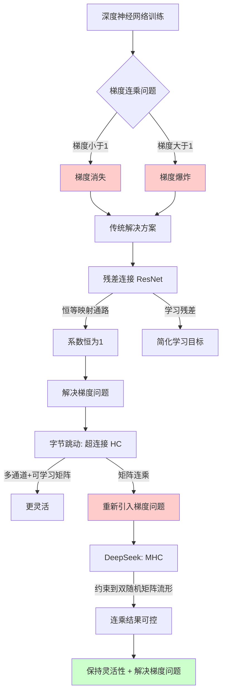

# 流形约束的超连接 (MHC) 学习笔记

---

## 快速摘要 (TL;DR)

这节课讲的是 DeepSeek 提出的"流形约束的超连接"(MHC)技术。核心问题是：深度学习中梯度消失/爆炸会导致训练不稳定。残差连接能缓解，但字节跳动的"超连接"(HC)虽然更灵活，却重新引入了梯度问题。MHC 的解决方案是：给学习矩阵加约束，让它们映射到"双随机矩阵"上，保持灵活性的同时确保累乘结果可控。

---

## 知识骨架 (Knowledge Tree)

```
深度学习训练稳定性问题
├── 1. 根本问题：梯度消失与梯度爆炸
│   ├── 梯度 < 1 → 连乘后趋近于0 → 梯度消失
│   └── 梯度 > 1 → 连乘后指数增长 → 梯度爆炸
│
├── 2. 解决方案演进
│   ├── 传统方法：梯度裁剪、正则化、合理初始化、优化激活函数
│   │
│   ├── 残差连接 (Residual Connection)
│   │   ├── 做法：输出 = F(x) + x（把原始输入加回来）
│   │   ├── 好处①：缓解梯度消失（恒等映射通路）
│   │   └── 好处②：让网络学习"残差"而非完整函数，更简单
│   │
│   ├── 超连接 (Hyper Connections, HC) —— 字节跳动2024
│   │   ├── 做法：扩展通道宽度N倍 + 引入可学习变换矩阵
│   │   ├── 好处：更灵活，性能提升
│   │   └── 问题：矩阵累乘重新引入梯度消失/爆炸风险
│   │
│   └── 流形约束的超连接 (MHC) —— DeepSeek 2025
│       ├── 做法：约束学习矩阵 → 映射到双随机矩阵流形
│       ├── 核心：累乘结果仍是双随机矩阵，保持可控
│       └── 效果：传播稳定性提升3个数量级
```

---

## 核心概念深挖 (Deep Dive)

### 1. 梯度 (Gradient)
**费曼式解释**：想象你在调音响的音量旋钮。梯度就是"你转一圈旋钮，音量会变多少"。如果梯度是0.5，你转一圈，音量只变半格；如果梯度是2，你转一圈，音量变两格。

### 2. 梯度消失 (Vanishing Gradient)
**费曼式解释**：假设你有10个串联的旋钮，每个旋钮的传动比是0.5。你转第一个旋钮一圈，第二个转0.5圈，第三个转0.25圈……到第10个旋钮时，它几乎纹丝不动（0.5^10 ≈ 0.001）。这就是梯度消失——你的调整信号传不到深层。

### 3. 梯度爆炸 (Exploding Gradient)
**费曼式解释**：同样10个旋钮，但传动比是2。你轻轻转第一个旋钮，第10个旋钮直接"起飞"（2^10 = 1024倍）。参数调整完全失控。

### 4. 残差连接 (Residual Connection)
**费曼式解释**：原本你要教AI画一幅完整的画。残差连接相当于说："我先给你一张草稿，你只需要告诉我哪里需要修改。"学习"修改量"比学习"完整作品"简单得多。

**数学本质**：输出 = F(x) + x，其中F(x)学习的是"残差"（目标与输入的差值）。

### 5. 超连接 (Hyper Connections, HC)
**费曼式解释**：残差连接是单车道公路，超连接把它拓宽成多车道，还加了可调节的"换道规则"（可学习矩阵）。更灵活，但规则太复杂可能导致混乱。

### 6. 双随机矩阵 (Doubly Stochastic Matrix)
**费曼式解释**：想象一个分配任务的表格，每行代表一个人，每列代表一个任务。双随机矩阵的规则是：
- 每个人分配到的任务总量 = 1（行和为1）
- 每个任务被分配的总量 = 1（列和为1）
- 所有数字都是非负的

**关键特性**：双随机矩阵乘以双随机矩阵，结果还是双随机矩阵！这意味着无论连乘多少次，结果都在可控范围内。

### 7. 流形约束 (Manifold Constraint)
**费曼式解释**：想象你在一个球面上行走，无论怎么走都不会离开球面。流形约束就是给矩阵画了一个"活动范围"——你可以在这个范围内自由学习，但不能跑出去。MHC把这个范围设定为"双随机矩阵"这个特殊的空间。

---

## 方法论与步骤 (Actionable Steps)

### 理解这项技术的思维路径：

**Step 1：识别问题**
- 深度神经网络层数加深 → 梯度连乘 → 消失或爆炸

**Step 2：理解残差连接的解决思路**
- 加入恒等映射通路（+x）
- 系数始终为1，不参与连乘，避免梯度问题

**Step 3：理解超连接的改进与新问题**
- 改进：多通道 + 可学习矩阵 → 更灵活
- 新问题：矩阵连乘 → 重新引入梯度问题

**Step 4：理解MHC的解决方案**
- 核心思想：找一种"连乘后仍可控"的矩阵
- 答案：双随机矩阵（连乘结果仍是双随机矩阵）
- 做法：将原始矩阵映射到双随机矩阵流形上

---

### 避坑指南 / 注意事项

> **警惕不恰当的比喻**：视频作者特别指出，网上很多用"高速公路""电梯"做的比喻是不恰当的，容易误导理解。理解数学本质比记住比喻更重要。

> **不要过度纠结数学细节**：对于非专业人士，不需要理解"如何将矩阵映射到流形上"的具体算法，但要理解"为什么要这样做"的逻辑链条。

> **区分"顺便"和"核心"**：残差连接解决梯度消失只是"顺便"的，它的核心价值是让学习目标变简单（学残差而非完整函数）。

---

## 批判性思考 (Q&A)

### Q1：为什么"学习残差"比"学习完整函数"更简单？

**参考答案**：视频中用数列举例：直接找 [4, 7, 10, 13] 的规律比找 [1, 4, 7, 10] 难（后者是前者减3）。本质上，残差通常比原始目标更"平滑"、变化更小。神经网络学习小幅度的调整，比从零开始学习完整映射更容易收敛。这也是为什么深度残差网络（ResNet）能训练上百层而不崩溃。

---

### Q2：MHC选择"双随机矩阵"作为约束目标，是否有其他选择？为什么选它？

**参考答案**：理论上可以选择其他具有"闭合性"的矩阵集合（如正交矩阵）。选择双随机矩阵的原因可能包括：
1. 数学性质好：连乘封闭，结果可控
2. 约束相对宽松：比正交矩阵更容易优化
3. 实践效果好：论文显示稳定性提升3个数量级

这也提示我们：深度学习很多时候是"实践驱动"的，理论解释往往是事后的。

---

### Q3：如果梯度消失/爆炸问题已经有这么多解决方案，为什么还需要MHC？

**参考答案**：不同方案解决的是不同场景下的问题：
- 传统方法（梯度裁剪等）：治标不治本，是"打补丁"
- 残差连接：解决了基础问题，但灵活性有限
- 超连接：增加了灵活性，但引入新问题
- MHC：在保持灵活性的同时解决新问题

这是一个典型的"技术演进"过程：每一代方案解决上一代的问题，同时可能引入新问题，推动下一代方案的诞生。

---

## 思维逻辑流程图



---

## 一句话总结

**MHC的本质**：在"灵活性"和"稳定性"之间找到平衡——让神经网络既能学到复杂的东西，又不会在训练过程中"失控"。
