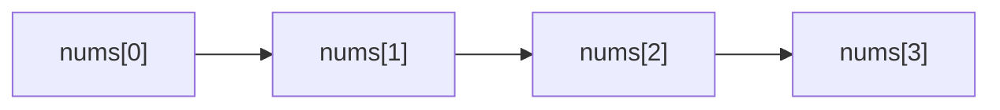
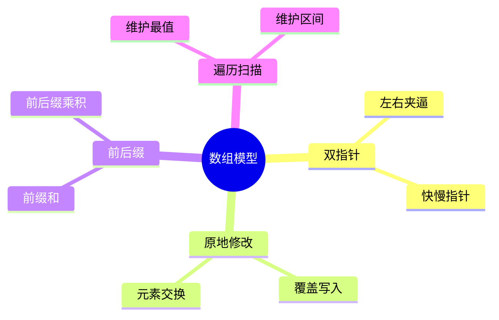
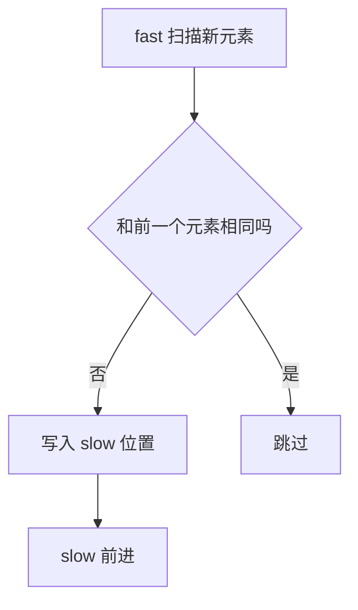
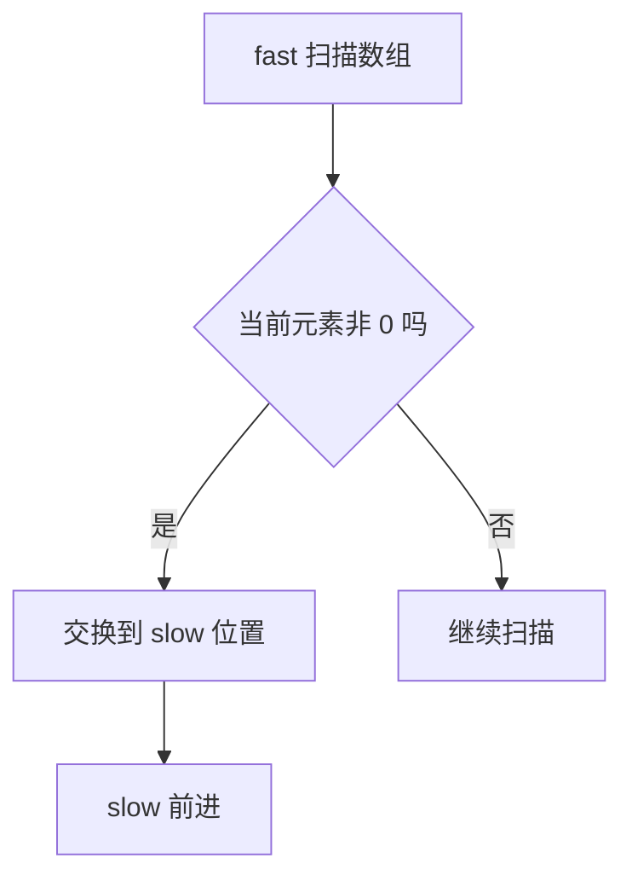
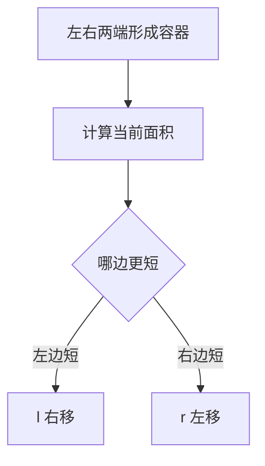
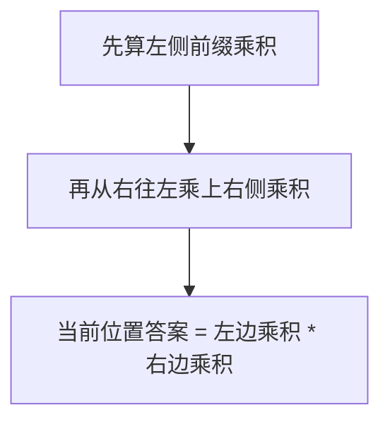
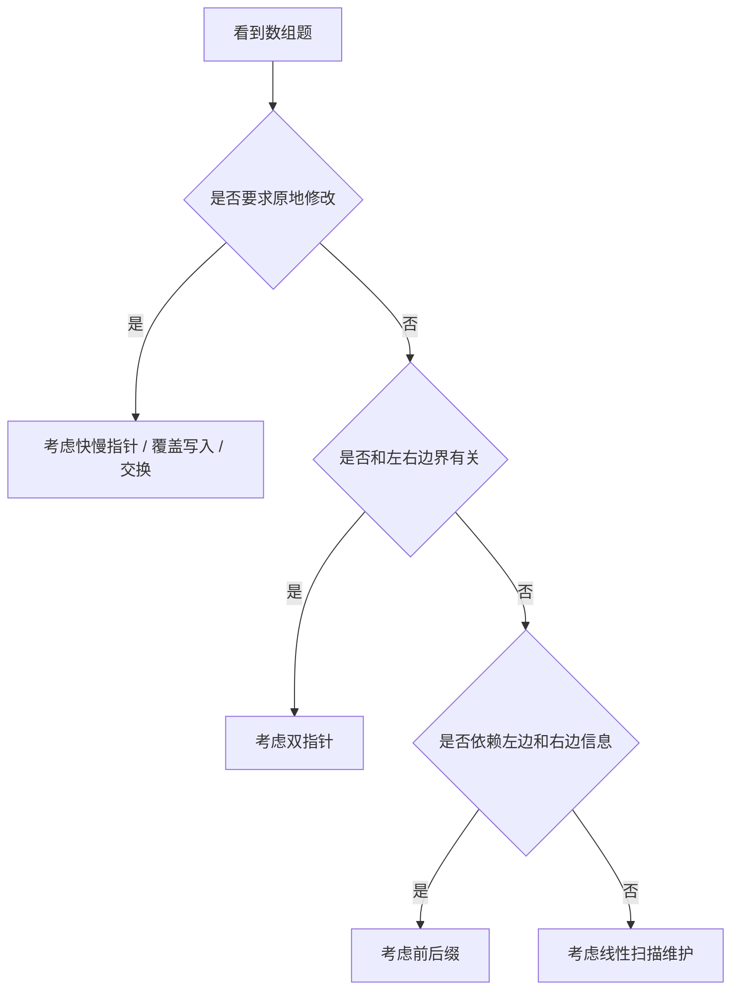
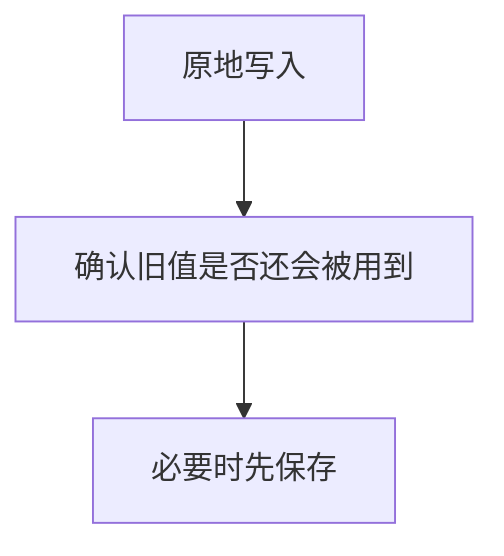
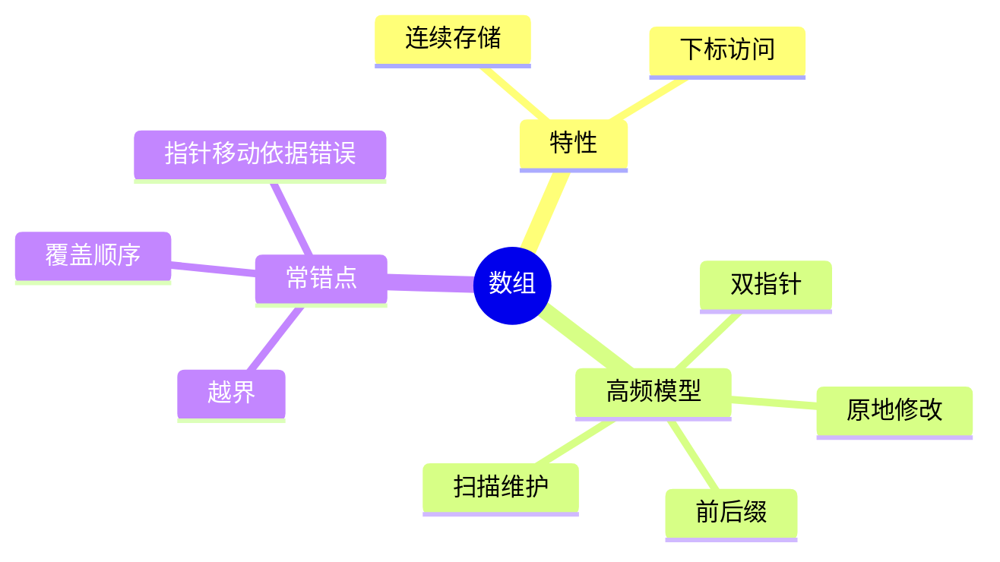

数组是算法题里最基础、也最容易被忽视的一类结构。

很多中高频题，看起来像字符串、双指针、滑动窗口、前缀和，底层其实都建立在数组的下标访问能力上。

这篇文章继续用 Mermaid 图解的方式，把数组题里最常见的下标访问、原地修改、双指针和前后缀处理模型讲清楚，再用 4 道 LeetCode 题把高频套路串起来。

> 学习目标：
> 1. 理解数组的核心特性：随机访问和连续存储。
> 2. 掌握数组题中的双指针、原地修改、前后缀处理。
> 3. 理解数组题为什么特别强调边界和下标。
> 4. 用 4 道 LeetCode 题覆盖数组高频模型。
> 5. 用一张知识卡片形成数组题的判断框架。

---

## 一、数组的本质：连续空间 + 下标访问

数组最大的优势是：

- 支持 O(1) 下标访问
- 结构简单，适合原地修改



这决定了数组题的高频重点通常是：

- 下标边界
- 原地覆盖
- 前后关系
- 左右指针移动

---

## 二、数组题最常见的 4 种模型



### 1. 双指针

数组有序时尤其常见。

### 2. 原地修改

很多题要求 `O(1)` 额外空间，本质是用已有数组位置覆盖写入。

### 3. 前后缀

把当前位置的答案拆成“左边部分”和“右边部分”。

### 4. 扫描维护

在线性遍历中维护当前最优量。

---

## 三、数组题为什么特别容易写错边界

因为数组题几乎所有 bug 都集中在：

- 下标越界
- 左右指针交错
- 原地写入顺序

```mermaid
flowchart TD
    A[访问 nums[i]] --> B{下标合法吗}
    B -->|否| C[越界 bug]
    B -->|是| D[继续处理]
```

所以数组题最重要的工程意识是：

**先想下标范围，再想逻辑。**

---

## 四、4 道 LeetCode 题目打通数组专题

## 1）LeetCode 26. 删除有序数组中的重复项

题型定位：快慢指针 / 原地覆盖。

```cpp
class Solution {
public:
    int removeDuplicates(vector<int>& nums) {
        if (nums.empty()) return 0;
        int slow = 1;
        for (int fast = 1; fast < static_cast<int>(nums.size()); ++fast) {
            if (nums[fast] != nums[fast - 1]) {
                nums[slow++] = nums[fast];
            }
        }
        return slow;
    }
};
```



这题练的是：

- 快慢指针
- 原地覆盖写入

## 2）LeetCode 283. 移动零

题型定位：数组稳定重排。

```cpp
class Solution {
public:
    void moveZeroes(vector<int>& nums) {
        int slow = 0;
        for (int fast = 0; fast < static_cast<int>(nums.size()); ++fast) {
            if (nums[fast] != 0) {
                swap(nums[slow++], nums[fast]);
            }
        }
    }
};
```



这题训练的是：

- 原地重排
- 保持相对顺序

## 3）LeetCode 11. 盛最多水的容器

题型定位：左右双指针。

```cpp
class Solution {
public:
    int maxArea(vector<int>& height) {
        int l = 0, r = static_cast<int>(height.size()) - 1;
        int ans = 0;
        while (l < r) {
            ans = max(ans, (r - l) * min(height[l], height[r]));
            if (height[l] < height[r]) ++l;
            else --r;
        }
        return ans;
    }
};
```



这题最重要的是理解：

- 决定面积上限的是短板
- 移动长板没有意义，必须尝试抬高短板

## 4）LeetCode 238. 除自身以外数组的乘积

题型定位：前后缀。

```cpp
class Solution {
public:
    vector<int> productExceptSelf(vector<int>& nums) {
        int n = static_cast<int>(nums.size());
        vector<int> res(n, 1);
        for (int i = 1; i < n; ++i) {
            res[i] = res[i - 1] * nums[i - 1];
        }
        int right = 1;
        for (int i = n - 1; i >= 0; --i) {
            res[i] *= right;
            right *= nums[i];
        }
        return res;
    }
};
```



这题训练的是：

- 前后缀拆分思维
- 不用除法的数组处理技巧

---

## 五、数组题怎么快速判断模型



---

## 六、数组常见错误

## 1）下标越界

数组题最基础、也最常见。

## 2）原地覆盖顺序错

先写还是先读，会影响后续数据是否被污染。

## 3）双指针移动依据不清

很多题不是“随便动一边”，而是必须依据某个性质移动。

## 4）前后缀信息拆不清

如果左边和右边依赖关系没分清，很容易写乱。



---

## 七、数组知识卡片



复习版要点：

- 数组题的核心是下标和边界
- 要求原地修改时，优先想快慢指针和覆盖写入
- 左右边界类题常用双指针
- 当前位置依赖左右信息时常用前后缀
- 写代码前先明确下标范围

---

## 八、最后总结

如果只记一句话，请记这个：

**数组题的关键，不是遍历数组，而是“如何利用下标关系高效维护状态”。**

做题时先判断：

- 是否需要原地修改
- 是否需要左右夹逼
- 是否依赖前后缀信息

把这篇里的 4 道题做透，数组题的高频套路就会很稳。
