回溯题最容易让人产生一种错觉：代码好像不长，但一写就乱。

原因通常不是语法不会，而是脑中没有一棵明确的搜索树。你不知道：

- 当前这层在选什么
- 路径里保存的是什么
- 什么时候该撤销选择
- 为什么有些分支可以直接剪掉

这篇文章延续上一篇的 Mermaid 图解风格，直接把回溯题最核心的结构画出来，再用 4 道 LeetCode 题把“子集、组合、排列、剪枝”这几类高频模型串起来。

> 学习目标：
> 1. 理解回溯的本质：在搜索树上做深度优先枚举。
> 2. 掌握回溯三件事：路径、选择列表、结束条件。
> 3. 理解剪枝的作用与常见策略。
> 4. 用 4 道 LeetCode 题覆盖回溯高频模型。
> 5. 用一张知识卡片快速复习回溯模板与性能要点。

---

## 一、回溯的本质：在搜索树上试错

回溯并不神秘，本质上就是：

**在一棵隐式搜索树上进行 DFS，走得通就继续走，走不通就退回来换一条路。**

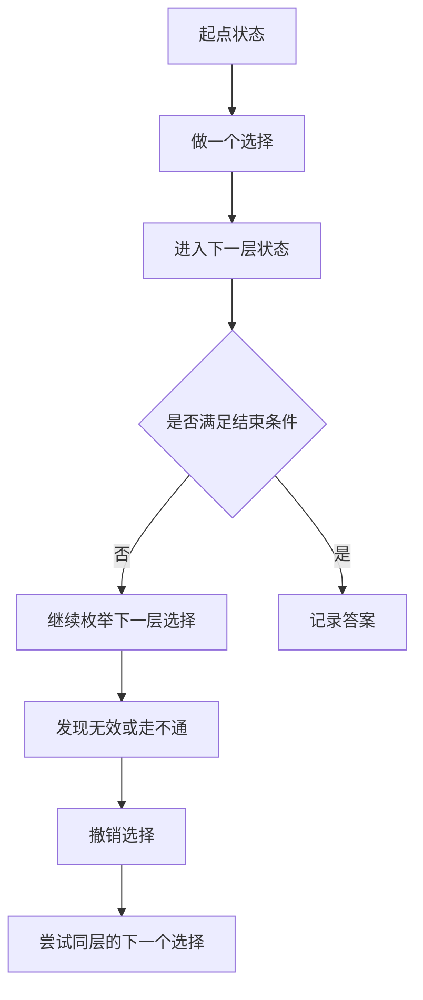

这就是“回溯”两个字的含义：

- 向前：做选择，深入一层
- 向后：撤销选择，回到上一层

所以回溯的关键词从来不是“递归”，而是：

- 搜索树
- 枚举
- 试错
- 撤销选择

---

## 二、回溯三要素：路径、选择列表、结束条件

大多数回溯题，本质都能拆成这三个问题。

### 1. 路径 `path`

表示你当前已经做出的选择。

### 2. 选择列表 `choices`

表示当前这一层还可以选什么。

### 3. 结束条件 `end condition`

表示什么时候这一条路径已经构成一个完整答案。

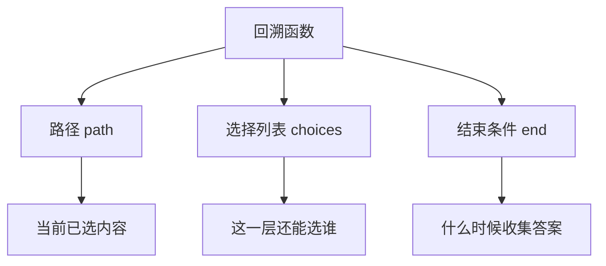

### 一句话模板

**做选择 -> 递归进入下一层 -> 撤销选择**

这是回溯题最核心的一行注释。

---

## 三、为什么回溯通常用递归

回溯本质上是在树上做深度优先遍历，而递归天然适合描述“进入下一层、返回上一层”的结构。

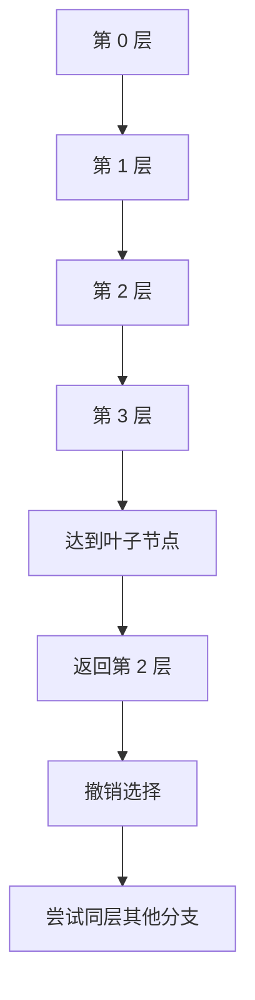

所以回溯可以理解成：

- 递归负责“进”和“退”
- `path` 负责记录当前路径
- 循环负责枚举同层分支

---

## 四、回溯模板：真正要背的是结构，不是代码

最通用的回溯模板如下：

```cpp
void backtrack(/* ?? */) {
    if (??????) {
        ????;
        return;
    }

    for (auto choice : ???????) {
        ???;
        backtrack(/* ????? */);
        ????;
    }
}
```

用 Mermaid 画出来就是：

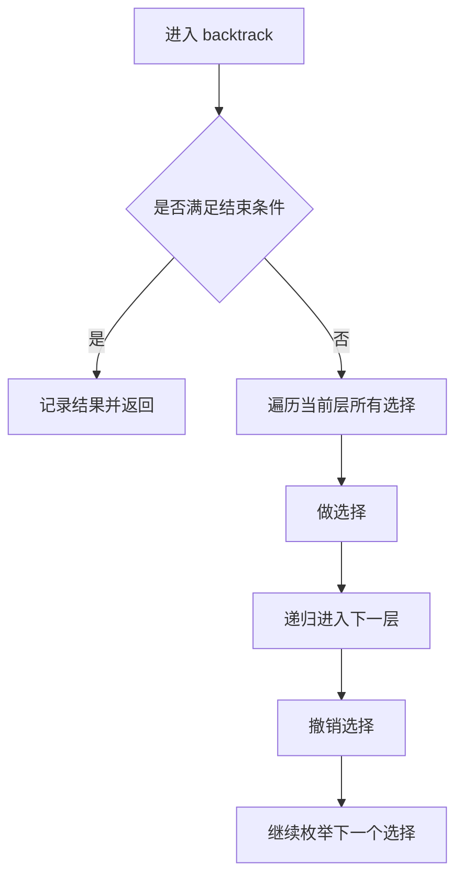

真正写题时，你只需要把三样东西补进去：

- 结束条件是什么
- 当前层能选什么
- 做选择和撤销选择分别怎么写

---

## 五、搜索树视角：为什么有些题是子集，有些是排列

很多人刷回溯题时，明明模板长得差不多，却总觉得题和题之间跳跃很大。原因是没有从“搜索树结构”去分型。

### 1. 子集型

每个元素只有“选”或“不选”两种状态。

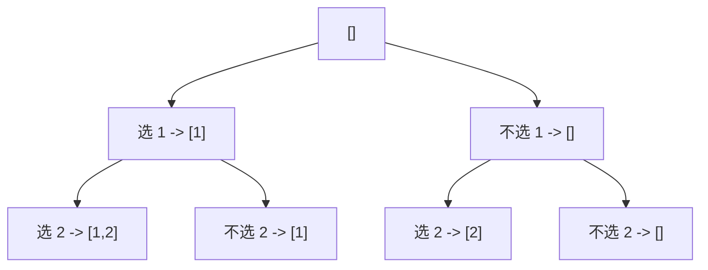

### 2. 组合型

关心“选哪些”，不关心顺序，通常通过 `startIndex` 避免重复。

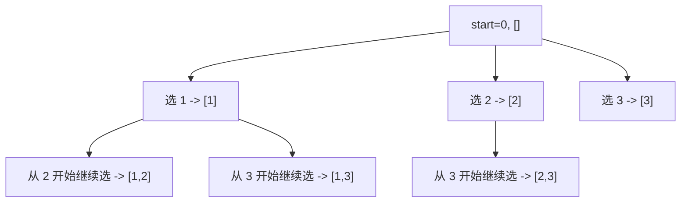

### 3. 排列型

关心顺序，所以每一层都要从“还没用过的元素”里选。

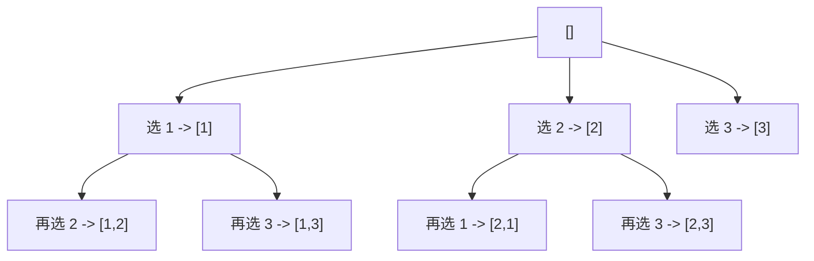

你把题先判成“子集 / 组合 / 排列”中的哪一类，回溯会好写很多。

---

## 六、剪枝：为什么回溯可以从暴力变得可用

回溯本质是枚举，所以理论上很容易爆炸。真正让回溯题可做的关键，是**剪枝**。

剪枝就是：

**提前判断这条路不可能产生合法答案，于是立刻停止往下搜。**

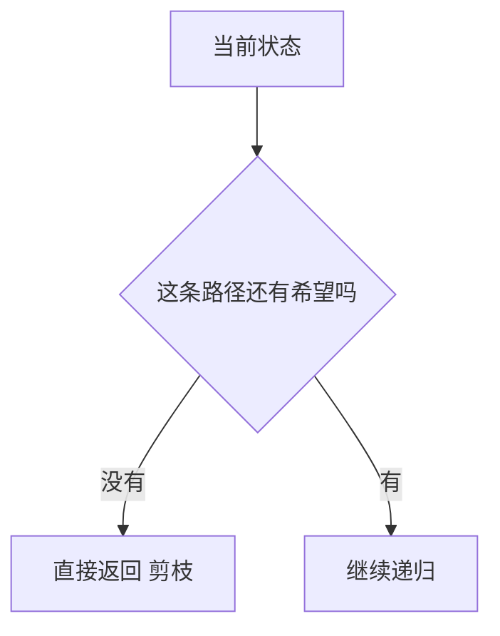

### 常见剪枝方式

### 1. 越界剪枝

例如组合总和里，当前和已经大于目标值，就没必要继续往下搜。

### 2. 有序数组剪枝

如果数组已经排序，而当前值已经让结果超标，后面更大的值也不可能成立，可以直接 `break`。

### 3. 重复元素剪枝

在同一层中，跳过相同元素，避免重复答案。

### 4. 约束冲突剪枝

例如 N 皇后里，同列、同对角线冲突时立即返回。

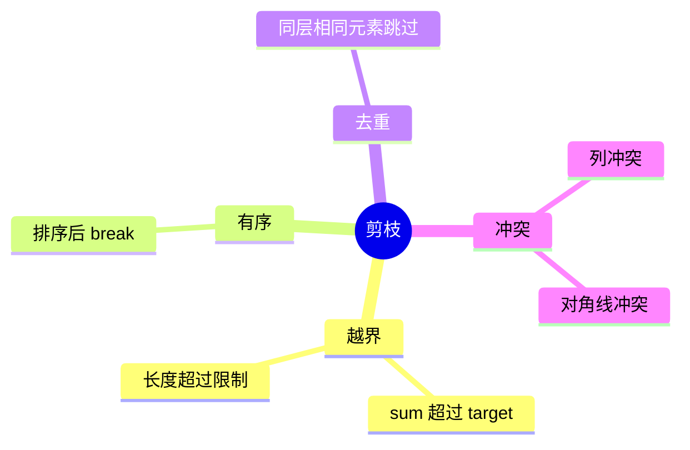

---

## 七、4 道 LeetCode 题目打通回溯专题

下面这 4 题分别对应子集、组合、排列、强约束回溯四种核心模型。

## 1）LeetCode 78. 子集

题型定位：子集型回溯。

核心：每到一个节点，当前路径本身就是一个答案。

```cpp
class Solution {
public:
    vector<vector<int>> subsets(vector<int>& nums) {
        vector<vector<int>> res;
        vector<int> path;
        function<void(int)> dfs = [&](int start) {
            res.push_back(path);
            for (int i = start; i < static_cast<int>(nums.size()); ++i) {
                path.push_back(nums[i]);
                dfs(i + 1);
                path.pop_back();
            }
        };
        dfs(0);
        return res;
    }
};
```

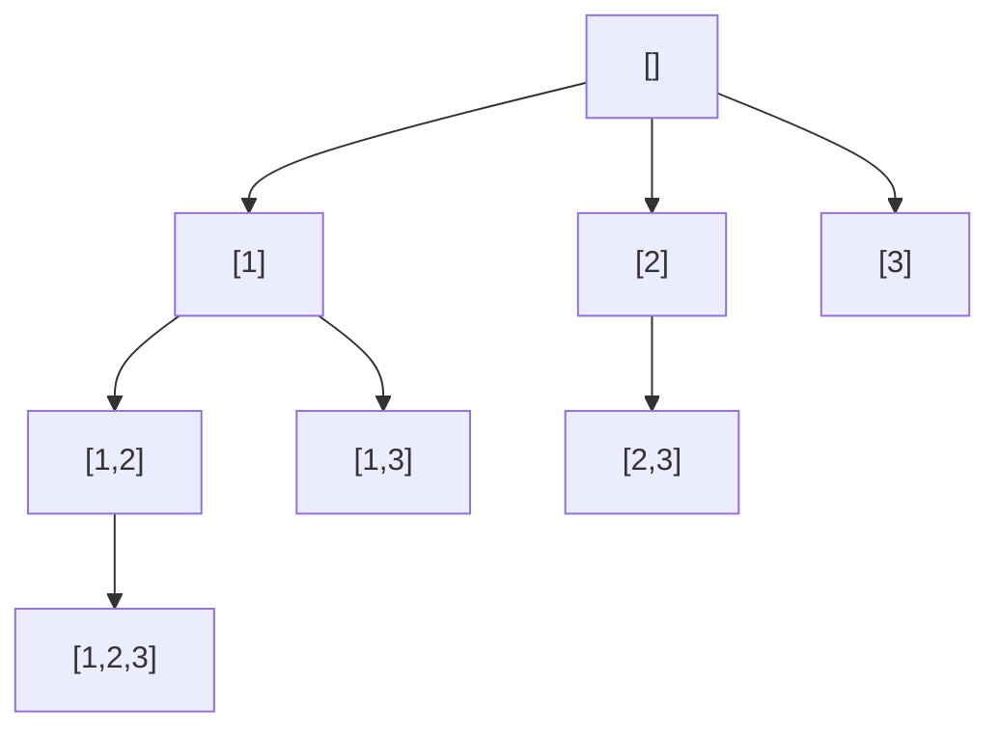

这题训练的是：

- `path` 的含义
- 为什么“每个节点都是答案”
- 为什么要用 `start` 防止回头选

## 2）LeetCode 77. 组合

题型定位：组合型回溯。

核心：从 `[1..n]` 中选出 `k` 个数，不关心顺序。

```cpp
class Solution {
public:
    vector<vector<int>> combine(int n, int k) {
        vector<vector<int>> res;
        vector<int> path;
        function<void(int)> dfs = [&](int start) {
            if (static_cast<int>(path.size()) == k) {
                res.push_back(path);
                return;
            }
            for (int i = start; i <= n; ++i) {
                path.push_back(i);
                dfs(i + 1);
                path.pop_back();
            }
        };
        dfs(1);
        return res;
    }
};
```

### 组合题的经典剪枝

如果当前还需要选 `need = k - path.size()` 个数，而从 `i` 到 `n` 剩余元素个数都不够，就可以剪掉。

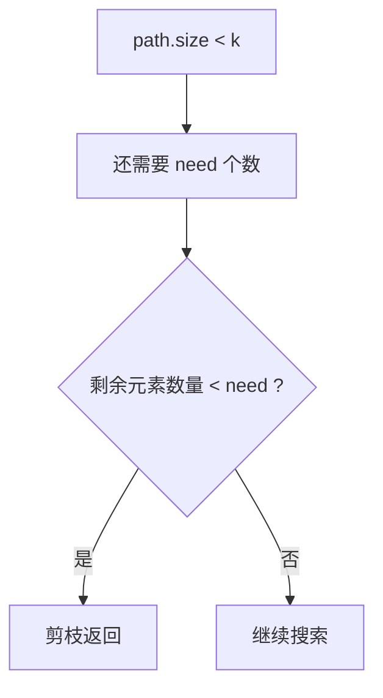

这题训练的是：

- `startIndex` 的作用
- 组合与排列的区别
- 剪枝如何减少分支

## 3）LeetCode 46. 全排列

题型定位：排列型回溯。

核心：顺序不同就是不同答案，因此每一层都从未使用元素里选。

```cpp
class Solution {
public:
    vector<vector<int>> permute(vector<int>& nums) {
        vector<vector<int>> res;
        vector<int> path;
        vector<bool> used(nums.size(), false);
        function<void()> dfs = [&]() {
            if (path.size() == nums.size()) {
                res.push_back(path);
                return;
            }
            for (int i = 0; i < static_cast<int>(nums.size()); ++i) {
                if (used[i]) continue;
                used[i] = true;
                path.push_back(nums[i]);
                dfs();
                path.pop_back();
                used[i] = false;
            }
        };
        dfs();
        return res;
    }
};
```

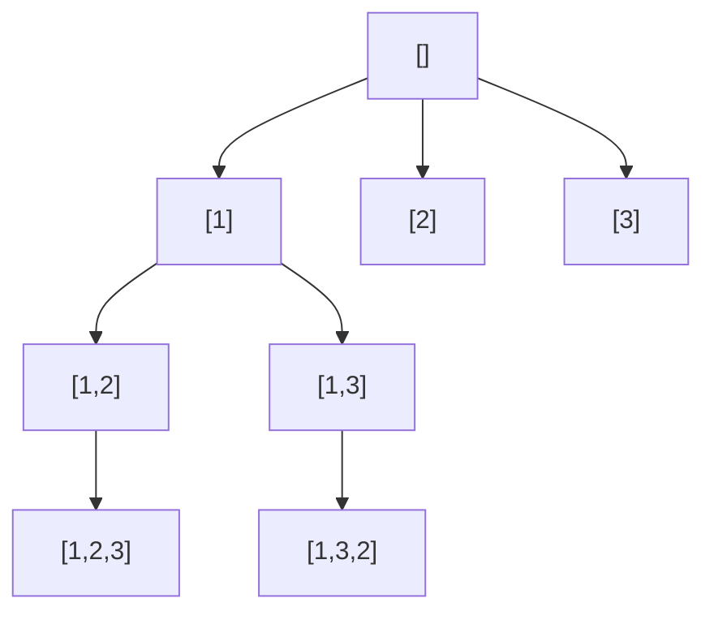

这题训练的是：

- 为什么排列必须有 `used[]`
- 为什么不能只靠 `startIndex`
- 顺序敏感与顺序不敏感题型的区别

## 4）LeetCode 39. 组合总和

题型定位：带剪枝的组合型回溯。

核心：元素可重复使用，但路径和不能超过 `target`。

```cpp
class Solution {
public:
    vector<vector<int>> combinationSum(vector<int>& candidates, int target) {
        sort(candidates.begin(), candidates.end());
        vector<vector<int>> res;
        vector<int> path;
        function<void(int, int)> dfs = [&](int start, int sum) {
            if (sum == target) {
                res.push_back(path);
                return;
            }
            for (int i = start; i < static_cast<int>(candidates.size()); ++i) {
                if (sum + candidates[i] > target) break;
                path.push_back(candidates[i]);
                dfs(i, sum + candidates[i]);
                path.pop_back();
            }
        };
        dfs(0, 0);
        return res;
    }
};
```

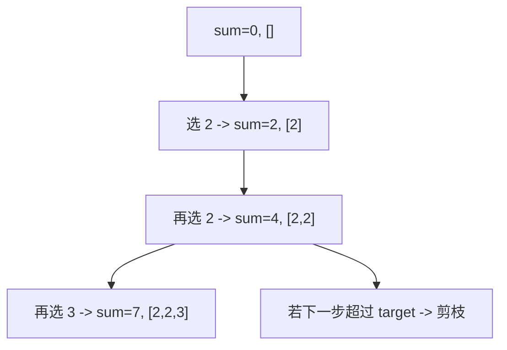

这题最重要的不是模板，而是理解两件事：

- 为什么可以重复选，所以递归还是从 `i` 开始
- 为什么排序后可以直接 `break`，而不是 `continue`

---

## 八、回溯题怎么快速分类

做题时可以按下面这个流程判断。

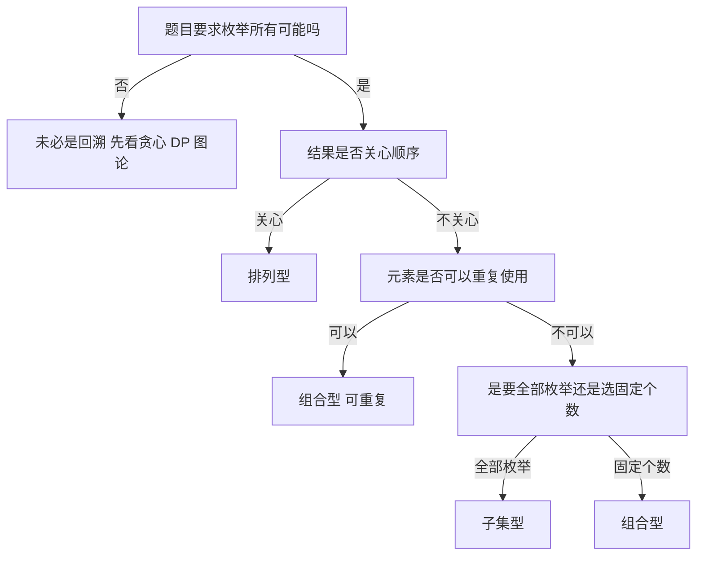

这个分类框架非常实用，能快速决定：

- 要不要 `used[]`
- 要不要 `startIndex`
- 下一层是从 `i + 1` 还是 `i` 开始

---

## 九、回溯常见错误

## 1）忘记撤销选择

这是最典型的问题。你做了选择却没撤销，`path` 状态就会污染兄弟分支。

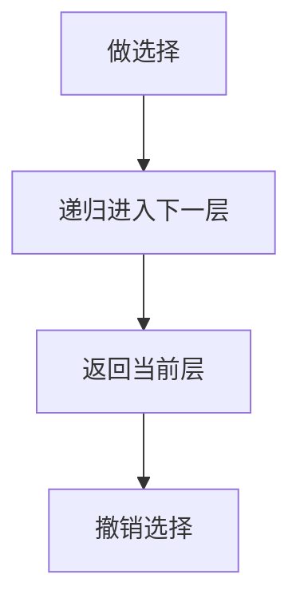

少了最后一步，整棵搜索树都会错。

## 2）把“树层去重”和“树枝去重”混在一起

尤其是包含重复元素的题，同层去重和同一路径去重不是一回事。

## 3）组合题和排列题写混

组合题通常用 `startIndex`，排列题通常用 `used[]`。

## 4）不会剪枝，导致超时

回溯如果不剪枝，很多题理论能做，实际跑不完。

## 5）结果集直接存 `path`

必须存 `path` 的拷贝，例如 `res.push_back(path)`，否则后续回溯会把结果改掉。

---

## 十、回溯知识卡片

下面这张图适合单独复习。

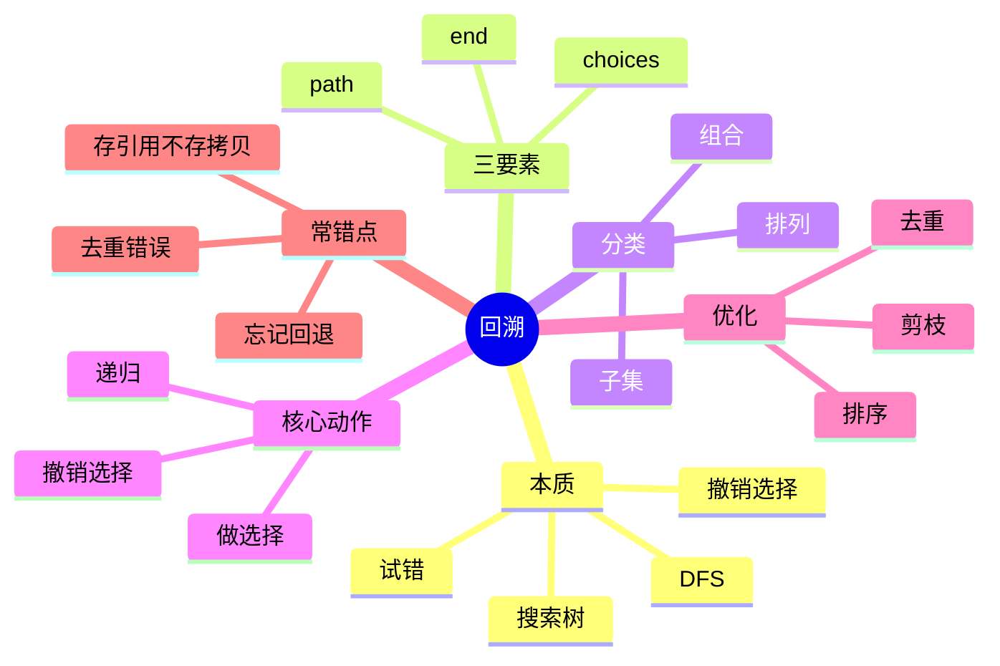

复习版要点：

- 回溯是在隐式搜索树上做 DFS
- 模板核心是“做选择 -> 递归 -> 撤销选择”
- 子集、组合、排列三类题的搜索树结构不同
- 剪枝是让回溯真正可用的关键
- 组合题常见 `startIndex`，排列题常见 `used[]`

---

## 十一、最后总结

如果只记一句话，请记这个：

**回溯不是在“写递归”，而是在“管理搜索树”。**

你真正要训练的是：

- 这题的路径是什么
- 这层还能选什么
- 什么时候收集答案
- 哪些分支可以提前剪掉

把这篇里的 4 道题做透，再把“回溯知识卡片”反复看几遍，回溯专题就能真正建立起稳定框架。
