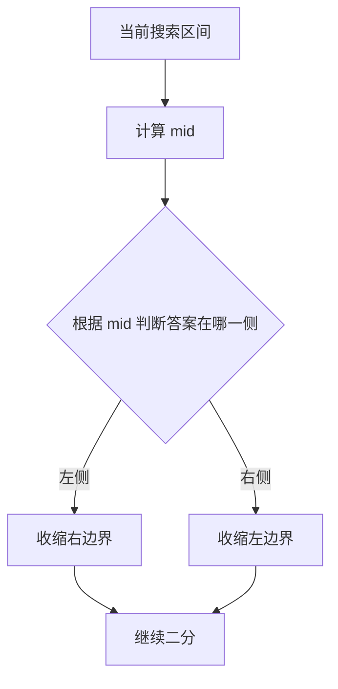
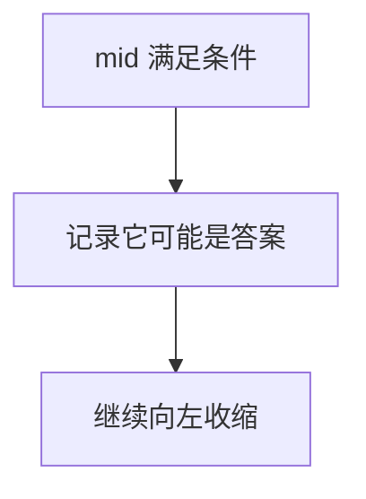
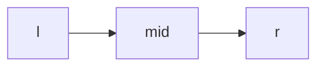
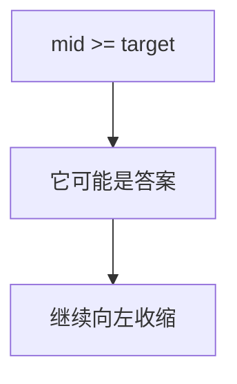
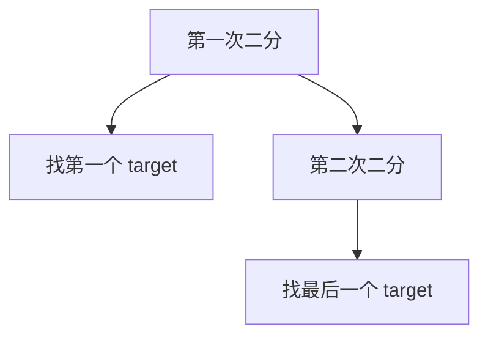
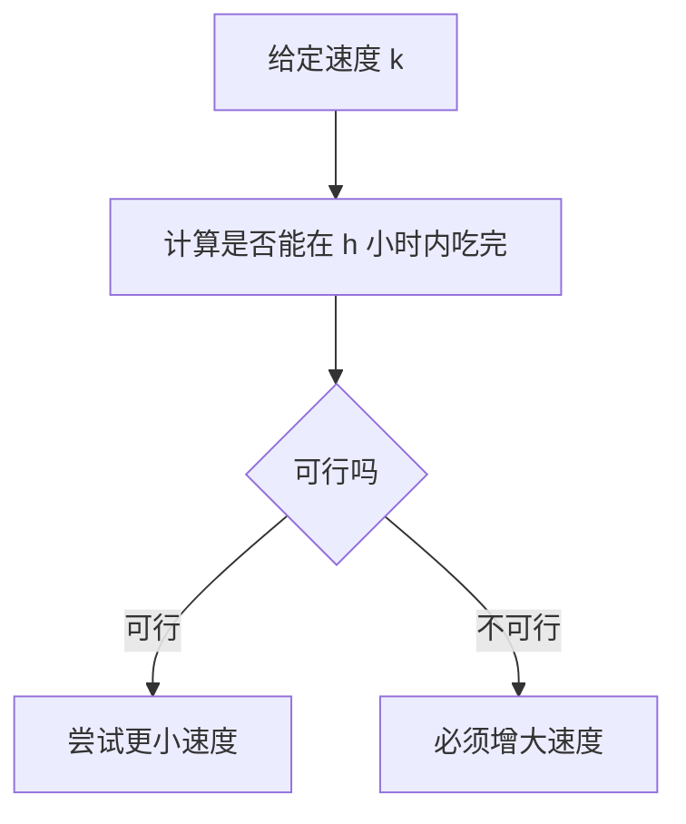
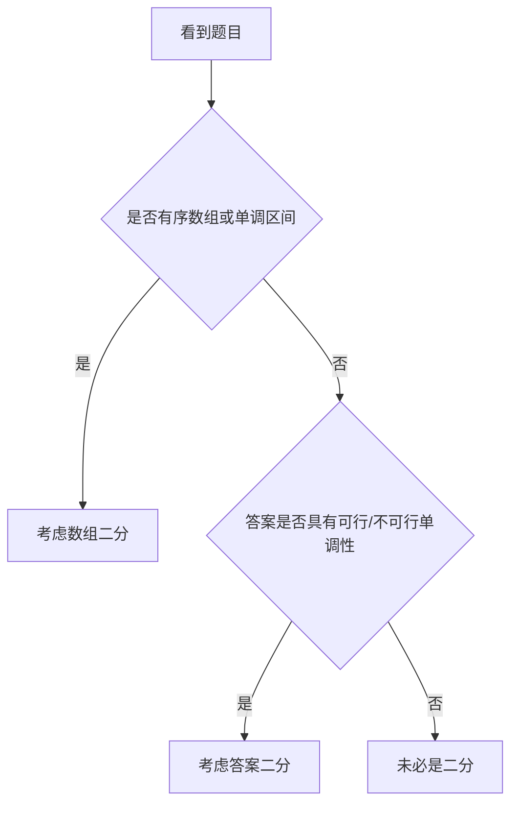
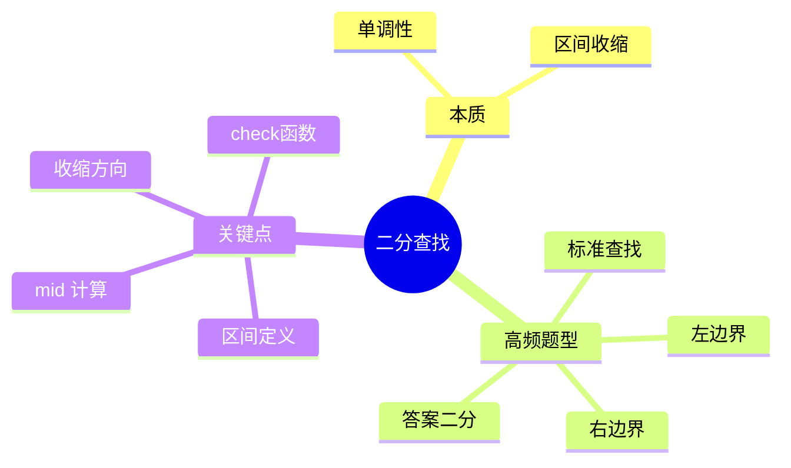

二分查找最常见的误区是：很多人以为自己会，但一遇到边界题就开始犹豫。

真正难的通常不是“二分的模板”，而是：

- 当前要找的是哪个边界
- 区间定义是左闭右闭还是左闭右开
- 条件满足时该收左边还是右边
- 这题到底是在数组上二分，还是在答案空间上二分

这篇文章继续用 Mermaid 图解，把二分查找最核心的“边界收缩”思维讲清楚，再用 4 道 LeetCode 题把基础查找、边界查找和答案二分串起来。

> 学习目标：
> 1. 理解二分查找的本质是对单调性做区间收缩。
> 2. 掌握常见边界问题的写法。
> 3. 理解“数组二分”和“答案二分”的区别。
> 4. 用 4 道 LeetCode 题覆盖二分高频模型。
> 5. 用一张知识卡片形成二分题的判断框架。

---

## 一、二分查找的本质：利用单调性，不断缩小范围

二分查找不是“在中间查一下”，而是：

**每次通过中点判断，把不可能存在答案的一半区间直接排除。**



二分能成立的前提通常是：

- 有序
- 或者答案具有单调性

---

## 二、二分真正难的是边界，不是 mid

很多题本质都是在找：

- 第一个满足条件的位置
- 最后一个满足条件的位置


如果你在找“第一个满足”，那么：

- 一旦 `mid` 满足条件，答案可能在更左边
- 所以要继续收缩右边界



---

## 三、区间定义一定要先统一

二分查找最怕“脑子里区间定义不一致”。

最常见的两种写法：

- 左闭右闭：`[l, r]`
- 左闭右开：`[l, r)`

这篇统一用更直观的左闭右闭写法：

```java
while (l <= r) {
    int mid = l + (r - l) / 2;
    ...
}
```



只要你区间定义统一，边界更新才不会乱。

---

## 四、答案二分：不是在数组里找，而是在“可能答案”里找

很多题虽然没给有序数组，依然能二分。原因是：

**答案本身具有单调性。**

例如：

- 容量足够大时可以完成任务
- 速度足够快时可以在时限内完成


这类题的核心是构造一个判定函数：

> 给定某个答案 `x`，能否成立？

---

## 五、4 道 LeetCode 题目打通二分查找专题

## 1）LeetCode 704. 二分查找

题型定位：标准有序数组二分。

```java
class Solution {
    public int search(int[] nums, int target) {
        int l = 0, r = nums.length - 1;
        while (l <= r) {
            int mid = l + (r - l) / 2;
            if (nums[mid] == target) return mid;
            if (nums[mid] < target) l = mid + 1;
            else r = mid - 1;
        }
        return -1;
    }
}
```

```mermaid
flowchart TD
    A[比较 nums[mid] 和 target] --> B{相等吗}
    B -->|是| C[直接返回]
    B -->|否 且 mid 太小| D[l = mid + 1]
    B -->|否 且 mid 太大| E[r = mid - 1]
```

这题练的是：

- 最基础的区间收缩逻辑

## 2）LeetCode 35. 搜索插入位置

题型定位：找第一个大于等于目标的位置。

```java
class Solution {
    public int searchInsert(int[] nums, int target) {
        int l = 0, r = nums.length - 1;
        int ans = nums.length;
        while (l <= r) {
            int mid = l + (r - l) / 2;
            if (nums[mid] >= target) {
                ans = mid;
                r = mid - 1;
            } else {
                l = mid + 1;
            }
        }
        return ans;
    }
}
```



这题训练的是：

- 第一个满足条件的位置
- 为什么找到后不能立刻停

## 3）LeetCode 34. 在排序数组中查找元素的第一个和最后一个位置

题型定位：左右边界二分。

思路：

- 先找左边界
- 再找右边界



```java
class Solution {
    public int[] searchRange(int[] nums, int target) {
        return new int[]{leftBound(nums, target), rightBound(nums, target)};
    }
}
```

这题训练的是：

- 左右边界二分的对称关系
- 为什么“相等”时左右边界收缩方向不同

## 4）LeetCode 875. 爱吃香蕉的珂珂

题型定位：答案二分。

题意：求最小吃香蕉速度，使得在 `h` 小时内吃完。

```java
class Solution {
    public int minEatingSpeed(int[] piles, int h) {
        int l = 1, r = Arrays.stream(piles).max().getAsInt();
        while (l < r) {
            int mid = l + (r - l) / 2;
            if (canFinish(piles, h, mid)) {
                r = mid;
            } else {
                l = mid + 1;
            }
        }
        return l;
    }
}
```



这题最重要的是理解：

- 二分的对象不是数组下标
- 二分的是“可行速度”这段答案空间

---

## 六、二分查找题怎么快速判断



### 一个很实用的问题

你可以先问自己：

> 如果我猜一个答案 `x`，能不能快速判断它是否可行？

如果可以，而且可行性呈单调变化，这题很可能就是答案二分。

---

## 七、二分查找常见错误

## 1）区间定义不统一

写 `[l, r]` 却更新成 `[l, r)` 的逻辑，是最常见 bug 来源。

## 2）边界题里找到答案就停

如果题目要的是“第一个”或“最后一个”，找到后通常还要继续缩边界。

## 3）mid 计算不安全

更稳的写法是：

```java
int mid = l + (r - l) / 2;
```

## 4）答案二分没写判定函数

答案二分的核心不是模板，而是 `check(mid)`。

```mermaid
flowchart TD
    A[二分答案] --> B[设计 check(mid)]
    B --> C[根据可行性收缩边界]
```

---

## 八、二分查找知识卡片



复习版要点：

- 二分的前提是有序或单调性
- 边界题的关键是“满足时向哪边继续收缩”
- 答案二分本质是在可行性空间里找最优值
- 先统一区间定义，再写更新逻辑
- `check(mid)` 是答案二分的核心

---

## 九、最后总结

如果只记一句话，请记这个：

**二分查找不是模板题，而是“利用单调性持续排除不可能答案”的思维题。**

做题时先判断：

- 单调性在哪
- 目标是普通查找、边界查找，还是答案二分
- 条件满足时边界该往哪边缩

把这篇里的 4 道题做透，二分查找这一专题就会非常稳定。
