二叉树是算法面试里最典型的一类题。

它难的地方通常不在代码量，而在于你是否建立了稳定的“树感”：

- 看到一棵树，能不能第一时间想到递归定义
- 看到遍历题，能不能区分前序、中序、后序、层序
- 看到路径题、深度题、构造题，能不能迅速落到固定套路

这篇文章直接把二叉树最核心的结构图画出来，再用 4 道 LeetCode 题把递归、遍历和树上信息汇总的常见模型串起来。

> 学习目标：
> 1. 理解二叉树为什么天然适合递归。
> 2. 掌握前序、中序、后序、层序遍历的差异。
> 3. 理解树题的通用递归套路：定义函数含义。
> 4. 用 4 道 LeetCode 题覆盖二叉树高频模型。
> 5. 用一张知识卡片形成二叉树题的判断框架。

---

## 一、二叉树为什么天然适合递归

因为树本身就是递归定义的：

- 一棵树由根节点组成
- 根节点下面是左子树和右子树
- 子树本身又是树

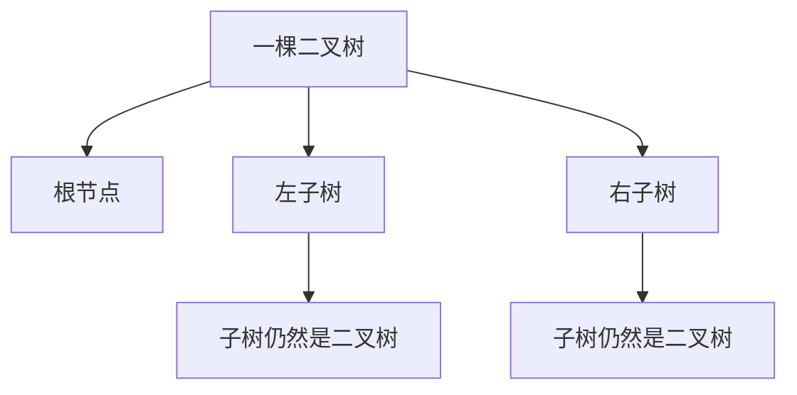

所以二叉树题最重要的思维不是“怎么遍历”，而是：

**这个函数对一棵树的定义是什么。**

例如：

- `maxDepth(root)`：返回以 `root` 为根的树高
- `isSameTree(p, q)`：返回两棵树是否相同
- `invertTree(root)`：返回翻转后的树根节点

---

## 二、二叉树的 4 种基础遍历

遍历顺序的差别，本质上是“根节点在什么时候被处理”。

设树结构如下：

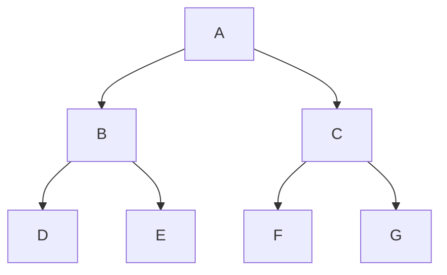

### 1. 前序遍历：根 -> 左 -> 右

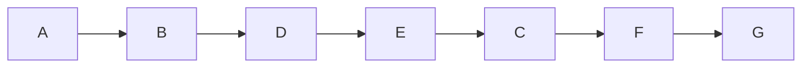

前序适合：

- 复制树
- 序列化
- 路径构造

### 2. 中序遍历：左 -> 根 -> 右

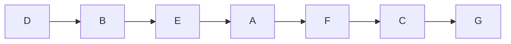

中序在 BST 里特别重要，因为：

**二叉搜索树的中序遍历结果是有序的。**

### 3. 后序遍历：左 -> 右 -> 根

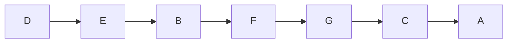

后序适合：

- 先拿到左右子树结果，再汇总当前答案
- 树高、平衡树、路径和等问题

### 4. 层序遍历：按层从上到下

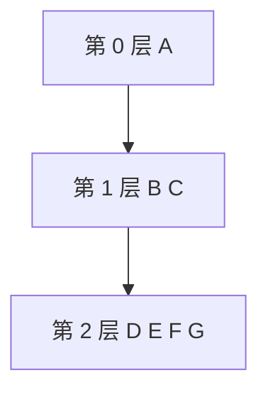

层序遍历通常用 BFS。

---

## 三、树题最重要的套路：先定义函数语义

很多树题写不出来，不是不会递归，而是没有先定义函数含义。

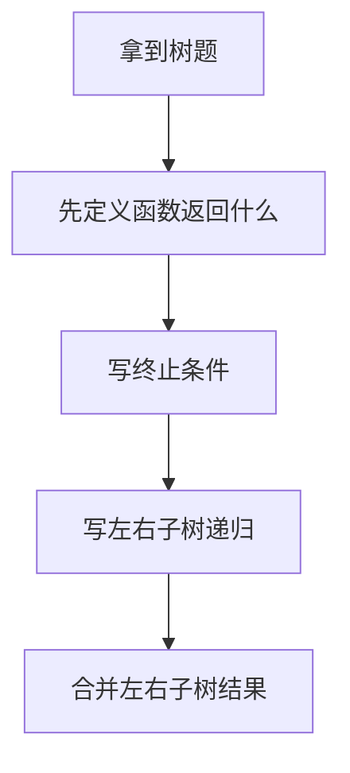

### 一个经典例子：最大深度

如果定义：

> `maxDepth(root)` 返回以 `root` 为根的树的最大深度

那么代码几乎自动出来：

```cpp
int maxDepth(TreeNode* root) {
    if (root == nullptr) return 0;
    return max(maxDepth(root->left), maxDepth(root->right)) + 1;
}
```

树题最怕的是“边遍历边想函数意义”，这样很容易乱。

---

## 四、二叉树题型，其实都在问这几件事

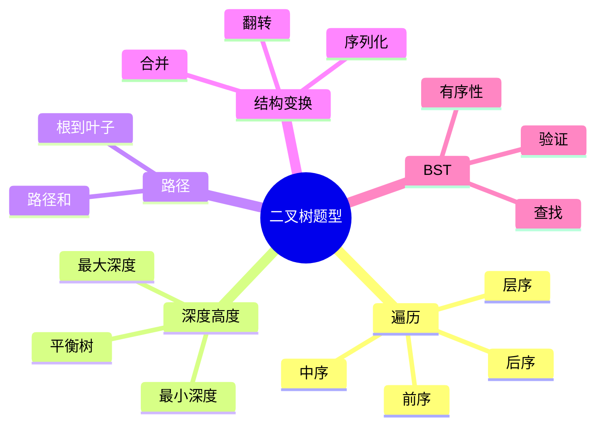

把树题放进这个分类框架里，基本都能迅速定位解法方向。

---

## 五、4 道 LeetCode 题目打通二叉树专题

## 1）LeetCode 104. 二叉树的最大深度

题型定位：树高 / 后序汇总。

```cpp
class Solution {
public:
    int maxDepth(TreeNode* root) {
        if (root == nullptr) return 0;
        return max(maxDepth(root->left), maxDepth(root->right)) + 1;
    }
};
```

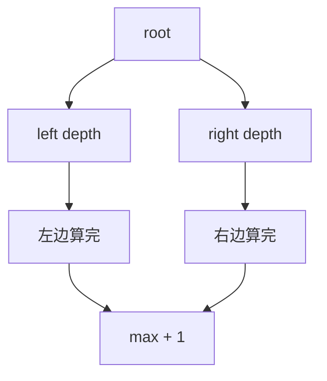

这题练的是：

- 递归定义
- 后序处理
- 空节点边界

## 2）LeetCode 226. 翻转二叉树

题型定位：树的结构变换。

```cpp
class Solution {
public:
    TreeNode* invertTree(TreeNode* root) {
        if (root == nullptr) return nullptr;
        TreeNode* left = invertTree(root->left);
        TreeNode* right = invertTree(root->right);
        root->left = right;
        root->right = left;
        return root;
    }
};
```

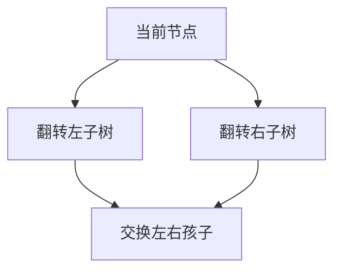

这题训练的是：

- 结构修改题如何递归
- “处理当前节点”和“递归子树”的关系

## 3）LeetCode 102. 二叉树的层序遍历

题型定位：树的 BFS。

```cpp
class Solution {
public:
    vector<vector<int>> levelOrder(TreeNode* root) {
        vector<vector<int>> res;
        if (root == nullptr) return res;
        queue<TreeNode*> q;
        q.push(root);
        while (!q.empty()) {
            int size = static_cast<int>(q.size());
            vector<int> level;
            for (int i = 0; i < size; ++i) {
                TreeNode* node = q.front(); q.pop();
                level.push_back(node->val);
                if (node->left != nullptr) q.push(node->left);
                if (node->right != nullptr) q.push(node->right);
            }
            res.push_back(level);
        }
        return res;
    }
};
```

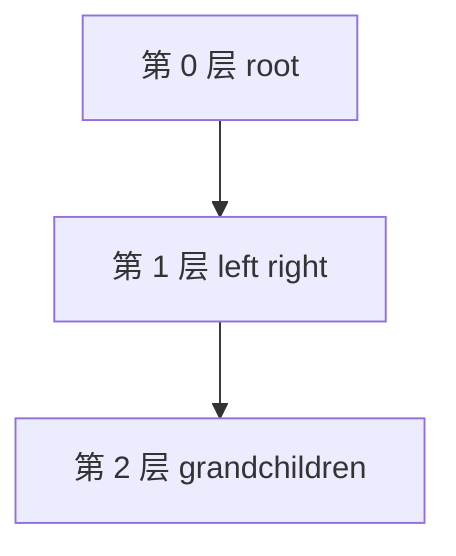

这题训练的是：

- 层序遍历的 BFS 模型
- 每层如何单独收集结果

## 4）LeetCode 98. 验证二叉搜索树

题型定位：BST 性质 / 中序有序。

解法一可以用上下界递归；这里展示更直观的中序有序思路。

```cpp
class Solution {
public:
    bool isValidBST(TreeNode* root) {
        long long prev = LLONG_MIN;
        bool first = true;
        return inorder(root, first, prev);
    }

private:
    bool inorder(TreeNode* node, bool& first, long long& prev) {
        if (node == nullptr) return true;
        if (!inorder(node->left, first, prev)) return false;
        if (!first && node->val <= prev) return false;
        first = false;
        prev = node->val;
        return inorder(node->right, first, prev);
    }
};
```

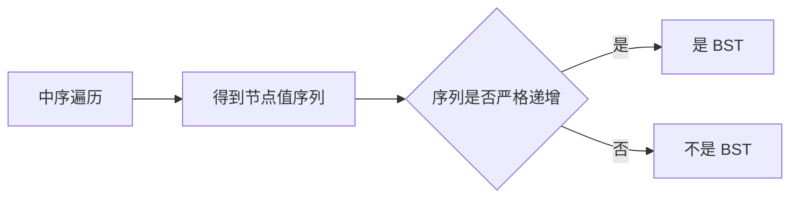

这题训练的是：

- BST 的关键性质
- 为什么中序遍历在 BST 里非常重要

---

## 六、二叉树题怎么快速判断解法

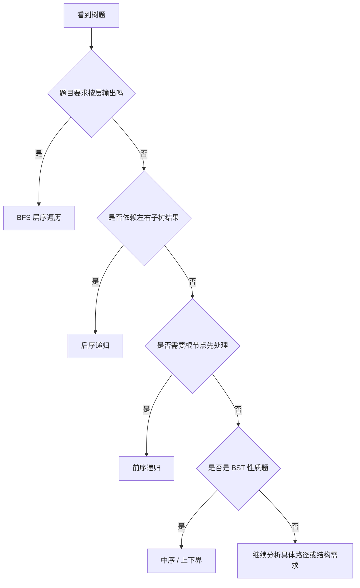

这个流程非常实用，因为大部分树题本质上都能先归到：

- 前序
- 中序
- 后序
- 层序

---

## 七、二叉树常见错误

## 1）没有先定义函数语义

树题最稳定的写法，是先定义函数“返回什么”。

## 2）前中后序分不清

本质看的是：根节点在什么时候处理。

## 3）把树题写成图题

普通二叉树通常天然无环，不需要额外 `visited`。

## 4）边界条件漏掉 `null`

空树、空子树是树题最常见边界。

## 5）BST 性质理解不完整

很多人误以为“左孩子小于根、右孩子大于根”就够了，其实是整棵左子树都要小于根，整棵右子树都要大于根。

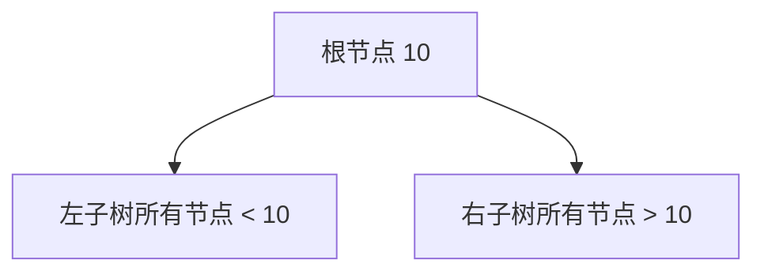

---

## 八、二叉树知识卡片

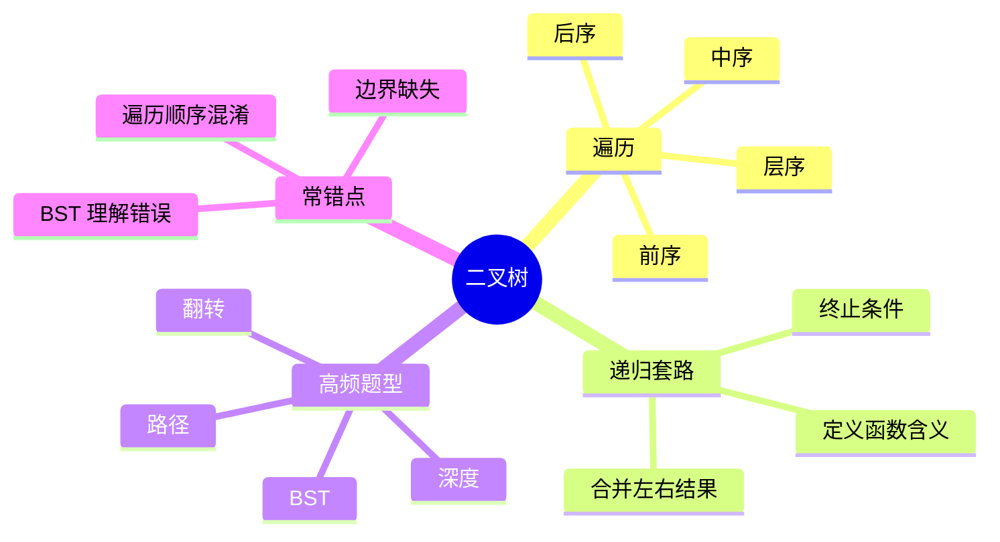

复习版要点：

- 二叉树天然适合递归，因为子树本身还是树
- 树题最重要的不是代码，而是先定义函数语义
- 前中后序的区别在于根节点处理时机
- 层序遍历通常用 BFS
- BST 的中序遍历结果是有序的

---

## 九、最后总结

如果只记一句话，请记这个：

**二叉树题的关键，不是“会不会遍历”，而是“会不会用递归定义子树问题”。**

做题时先想清：

- 这题属于哪种遍历或哪种树上信息汇总
- 根节点应该在什么时候处理
- 左右子树的结果如何合并

把这篇里的 4 道题做透，二叉树专题就能形成稳定的递归框架。
