很多人把 DFS 和 BFS 背成一句话：

- DFS 是深度优先
- BFS 是广度优先

这当然没错，但还不够做题。

真正做题时，你更需要知道：

- 为什么 DFS 看起来像“一条路走到底”
- 为什么 BFS 天然适合最短步数
- 树、图、网格题里，什么时候该选 DFS，什么时候该选 BFS
- 递归 DFS、栈 DFS、队列 BFS，它们的本质关系是什么

这篇文章直接用 Mermaid 图把这些结构画出来，再用 4 道 LeetCode 题把 DFS / BFS 的核心考点串起来。

> 学习目标：
> 1. 理解 DFS / BFS 的搜索顺序与数据结构本质。
> 2. 掌握树、图、网格中的 DFS / BFS 统一建模方式。
> 3. 理解 BFS 为什么天然适合无权最短路。
> 4. 用 4 道 LeetCode 题覆盖 DFS / BFS 高频题型。
> 5. 用一张知识卡片复习 DFS / BFS 的选择框架。

---

## 一、DFS / BFS 的本质：都是在遍历状态空间

无论是树、图、矩阵还是隐式状态图，DFS 和 BFS 本质上都在做一件事：

**从起点状态出发，系统性地访问所有可达状态。**

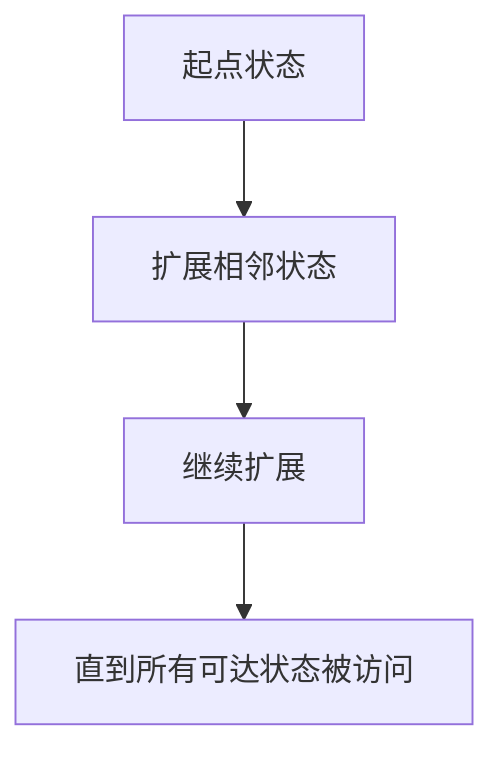

区别不在“遍历不遍历”，而在于：

- DFS：先尽量往深处走
- BFS：先按层向外扩

---

## 二、DFS：一条路走到底，再回头

DFS 的关键词是：

- 深入
- 回退
- 栈

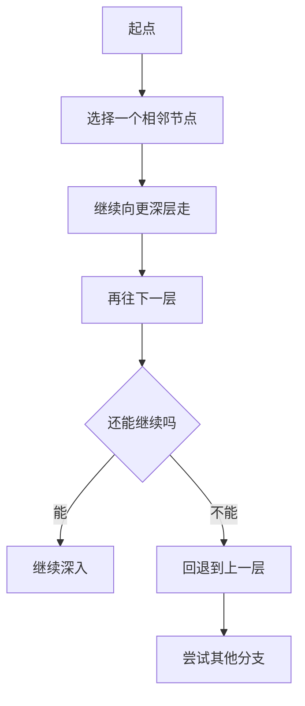

DFS 看起来像：

> 一条路走到底，走不通再回来换路。

### DFS 为什么常用递归

因为递归天然自带调用栈，正好适合“深入”和“回退”的过程。

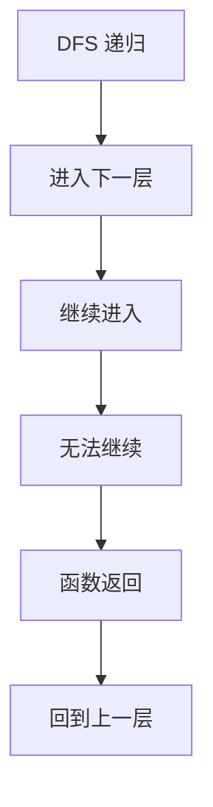

当然，DFS 也可以手写栈。

---

## 三、BFS：一层一层向外扩展

BFS 的关键词是：

- 按层
- 队列
- 最短步数

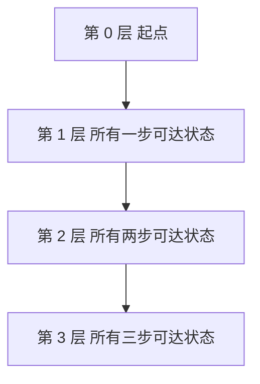

BFS 看起来像：

> 先把离起点最近的一圈全部访问完，再访问更远的一圈。

这就是为什么在**无权图**里，BFS 第一次到达终点时，得到的就是最短步数。


---

## 四、DFS 与 BFS 的数据结构本质

这两个算法经常被讲成两套东西，其实底层差异非常直接。

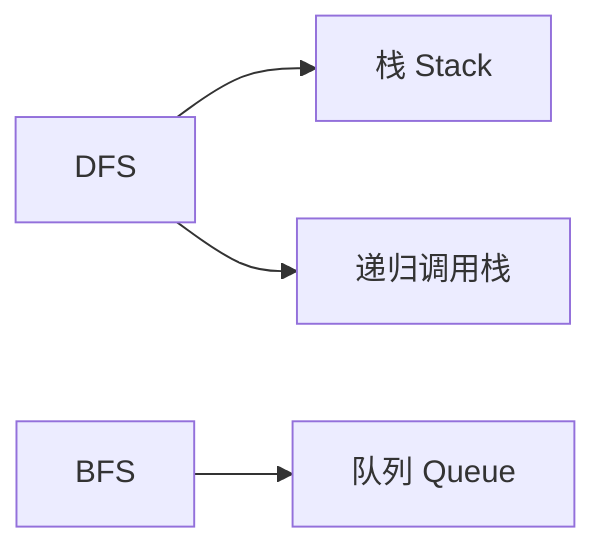

### 一句话对比

- DFS：后进先出，优先深入
- BFS：先进先出，优先按层

### 常见适用场景

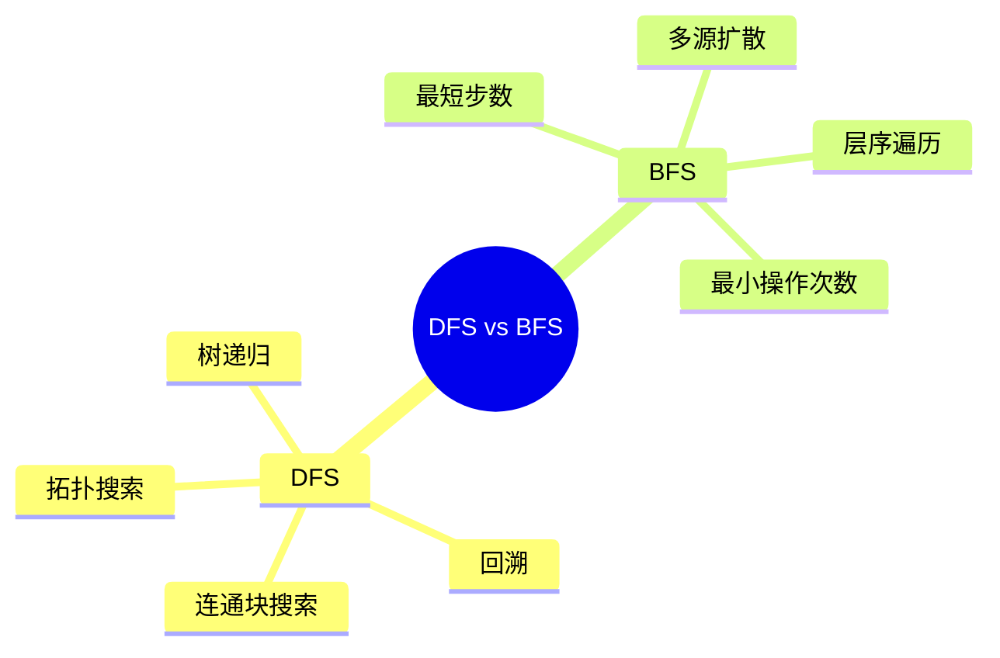

---

## 五、树、图、网格，其实是一套统一模型

很多人觉得树、图、矩阵是三类题。做 DFS / BFS 时，其实可以统一看成：

**当前节点 + 相邻节点扩展规则**

### 树

- 当前节点：树节点
- 相邻节点：左孩子、右孩子

### 图

- 当前节点：图节点
- 相邻节点：邻接表中的节点

### 网格

- 当前节点：坐标 `(i, j)`
- 相邻节点：上下左右四个方向

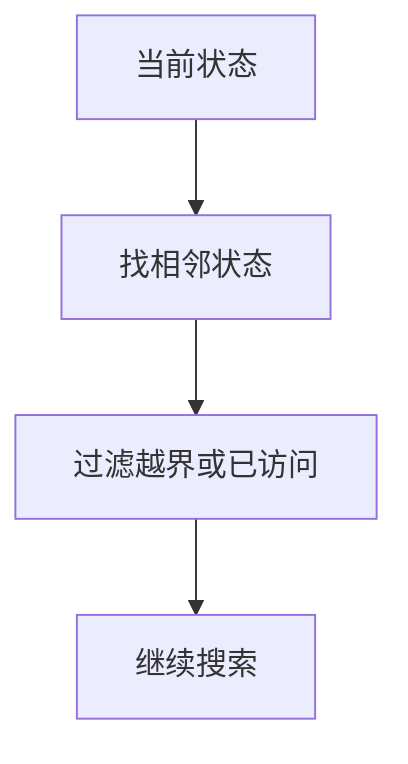

一旦把它们统一成这套框架，DFS / BFS 的代码就会稳定很多。

---

## 六、4 道 LeetCode 题目打通 DFS / BFS 专题

## 1）LeetCode 104. 二叉树的最大深度

题型定位：树的 DFS。

```cpp
class Solution {
public:
    int maxDepth(TreeNode* root) {
        if (root == nullptr) return 0;
        return max(maxDepth(root->left), maxDepth(root->right)) + 1;
    }
};
```

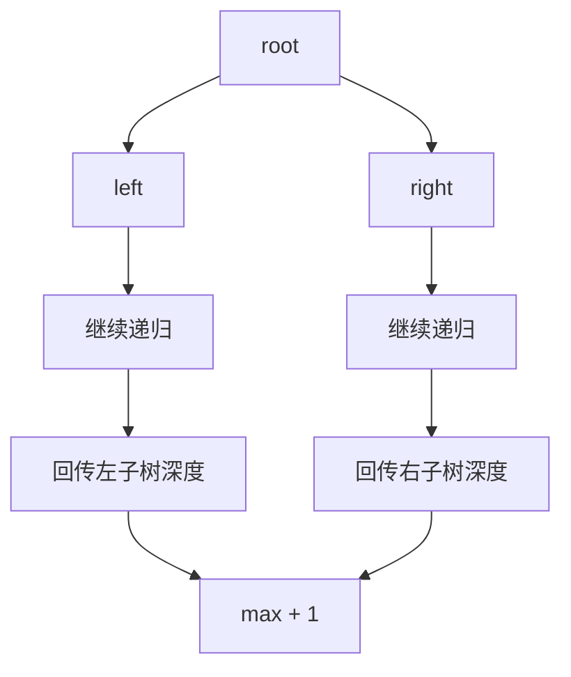

这题练的是：

- 树的 DFS 递归定义
- 先深入子树，再向上返回答案

## 2）LeetCode 200. 岛屿数量

题型定位：网格 DFS / BFS。

DFS 写法：

```cpp
class Solution {
public:
    int numIslands(vector<vector<char>>& grid) {
        int m = static_cast<int>(grid.size()), n = static_cast<int>(grid[0].size());
        int count = 0;
        for (int i = 0; i < m; ++i) {
            for (int j = 0; j < n; ++j) {
                if (grid[i][j] == '1') {
                    ++count;
                    dfs(grid, i, j);
                }
            }
        }
        return count;
    }

private:
    void dfs(vector<vector<char>>& grid, int i, int j) {
        if (i < 0 || i >= static_cast<int>(grid.size()) ||
            j < 0 || j >= static_cast<int>(grid[0].size()) ||
            grid[i][j] != '1') {
            return;
        }
        grid[i][j] = '0';
        dfs(grid, i + 1, j);
        dfs(grid, i - 1, j);
        dfs(grid, i, j + 1);
        dfs(grid, i, j - 1);
    }
};
```

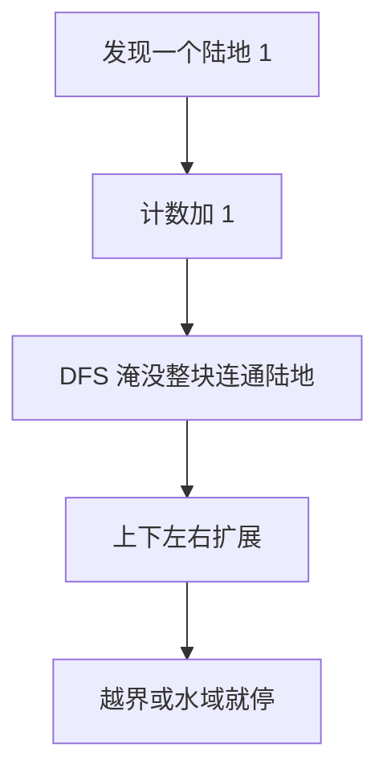

这题练的是：

- 网格搜索统一模型
- 连通块计数
- 访问标记的重要性

## 3）LeetCode 102. 二叉树的层序遍历

题型定位：树的 BFS。

```cpp
class Solution {
public:
    vector<vector<int>> levelOrder(TreeNode* root) {
        vector<vector<int>> res;
        if (root == nullptr) return res;
        queue<TreeNode*> q;
        q.push(root);
        while (!q.empty()) {
            int size = static_cast<int>(q.size());
            vector<int> level;
            for (int i = 0; i < size; ++i) {
                TreeNode* node = q.front(); q.pop();
                level.push_back(node->val);
                if (node->left != nullptr) q.push(node->left);
                if (node->right != nullptr) q.push(node->right);
            }
            res.push_back(level);
        }
        return res;
    }
};
```

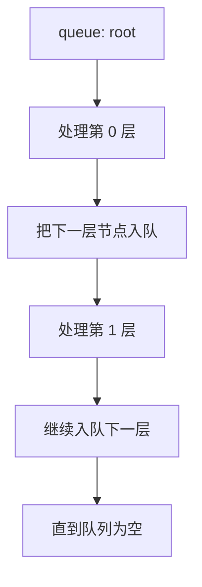

这题练的是：

- BFS 的层概念
- 为什么每层要先记录 `size`

## 4）LeetCode 752. 打开转盘锁

题型定位：无权图最短步数 BFS。

```cpp
class Solution {
public:
    int openLock(vector<string>& deadends, string target) {
        unordered_set<string> dead(deadends.begin(), deadends.end());
        if (dead.count("0000")) return -1;

        queue<string> q;
        unordered_set<string> visited;
        q.push("0000");
        visited.insert("0000");
        int steps = 0;

        while (!q.empty()) {
            int size = static_cast<int>(q.size());
            for (int i = 0; i < size; ++i) {
                string cur = q.front(); q.pop();
                if (cur == target) return steps;
                if (dead.count(cur)) continue;
                for (string next : neighbors(cur)) {
                    if (visited.insert(next).second) q.push(next);
                }
            }
            ++steps;
        }
        return -1;
    }

private:
    vector<string> neighbors(const string& s) {
        vector<string> res;
        for (int i = 0; i < 4; ++i) {
            string up = s, down = s;
            up[i] = (s[i] == '9') ? '0' : s[i] + 1;
            down[i] = (s[i] == '0') ? '9' : s[i] - 1;
            res.push_back(up);
            res.push_back(down);
        }
        return res;
    }
};
```

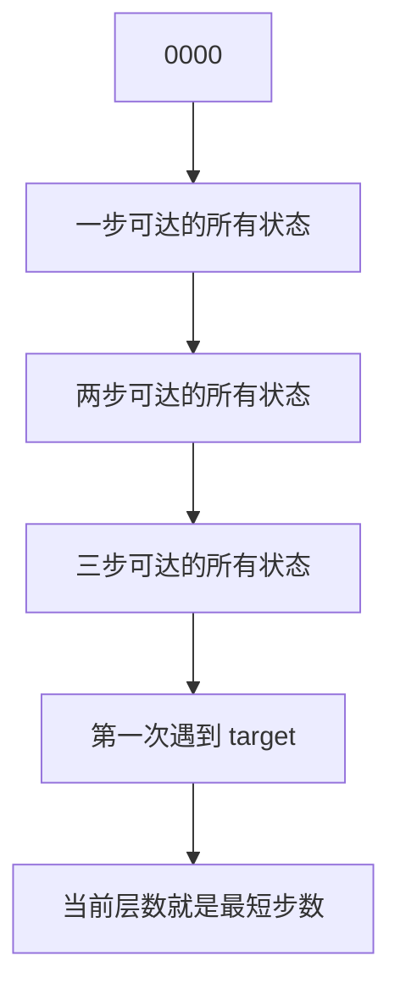

这题最重要的是理解：

- BFS 不是为了“遍历得整齐”
- BFS 是因为它按步数一层层扩展

---

## 七、什么时候该选 DFS，什么时候该选 BFS

可以按下面这个流程判断。

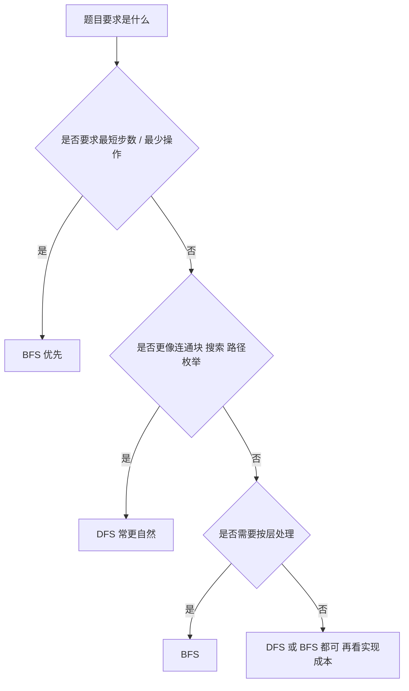

### 一个很实用的经验

- 找最短步数：优先 BFS
- 找所有路径 / 连通块 / 是否存在：常见 DFS
- 层序输出：BFS
- 深度、递归结构：DFS

---

## 八、DFS / BFS 常见错误

## 1）忘记标记访问

图和网格里如果不标记 `visited`，很容易死循环或重复搜索。

## 2）BFS 中没有按层处理

如果题目要最短步数，却没有按层统计步数，结果通常会错。

## 3）DFS 递归边界不完整

尤其是网格题，越界判断和障碍判断很容易漏。

## 4）把树和图混了

树通常天然无环；图通常必须考虑去重访问。

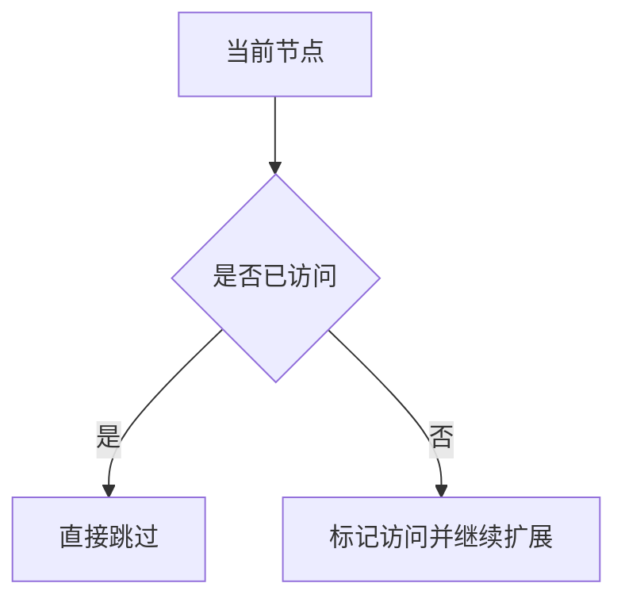

---

## 九、DFS / BFS 知识卡片

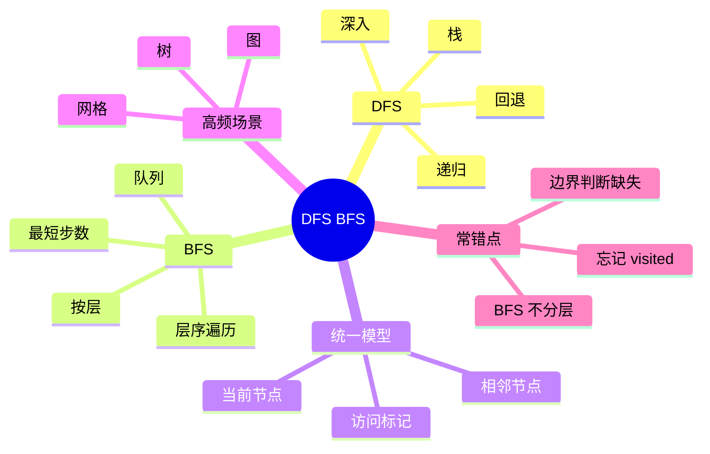

复习版要点：

- DFS 像“一条路走到底，再回头”
- BFS 像“一层一层向外扩”
- BFS 在无权图里天然适合最短步数
- 树、图、网格都可以统一成“当前状态 + 相邻状态扩展”
- 图题和网格题通常必须考虑 `visited`

---

## 十、最后总结

如果只记一句话，请记这个：

**DFS 和 BFS 的区别，不是都会不会遍历，而是“状态扩展顺序不同”。**

做题时你真正要先判断的是：

- 这题是在树、图还是网格上搜索
- 要的是最短步数，还是只要搜到 / 统计 / 枚举
- 该用栈思路，还是队列思路

把这篇里的 4 道题吃透，DFS / BFS 这一专题就会形成非常稳定的判断框架。
