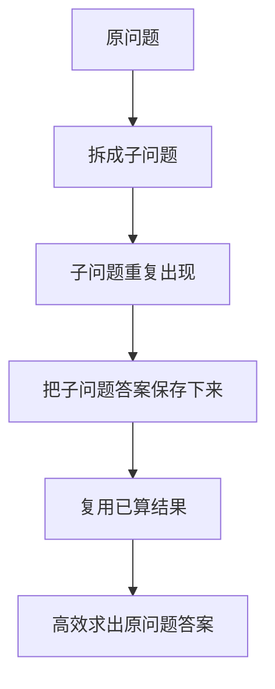
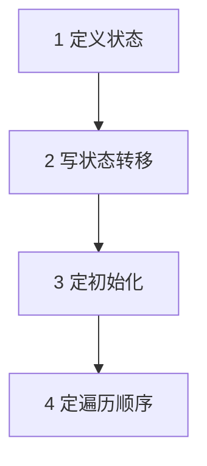
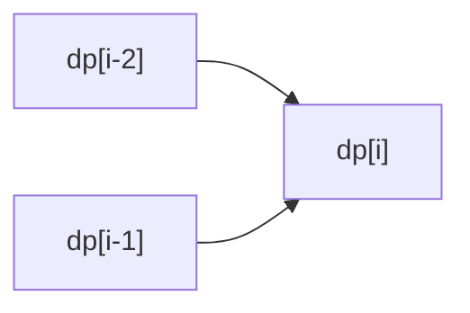
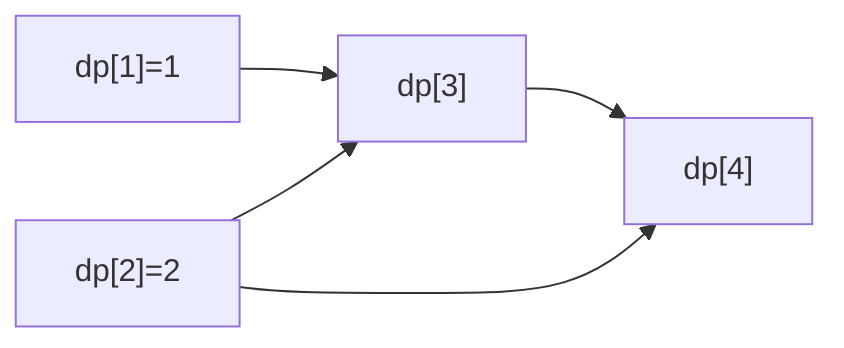
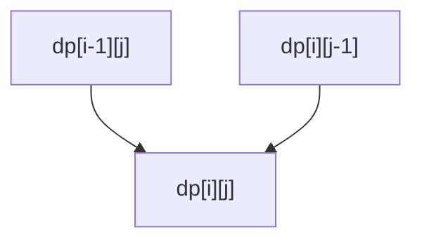
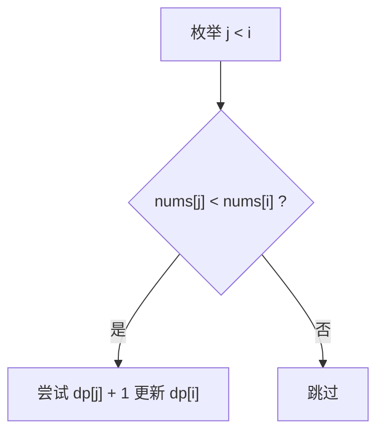
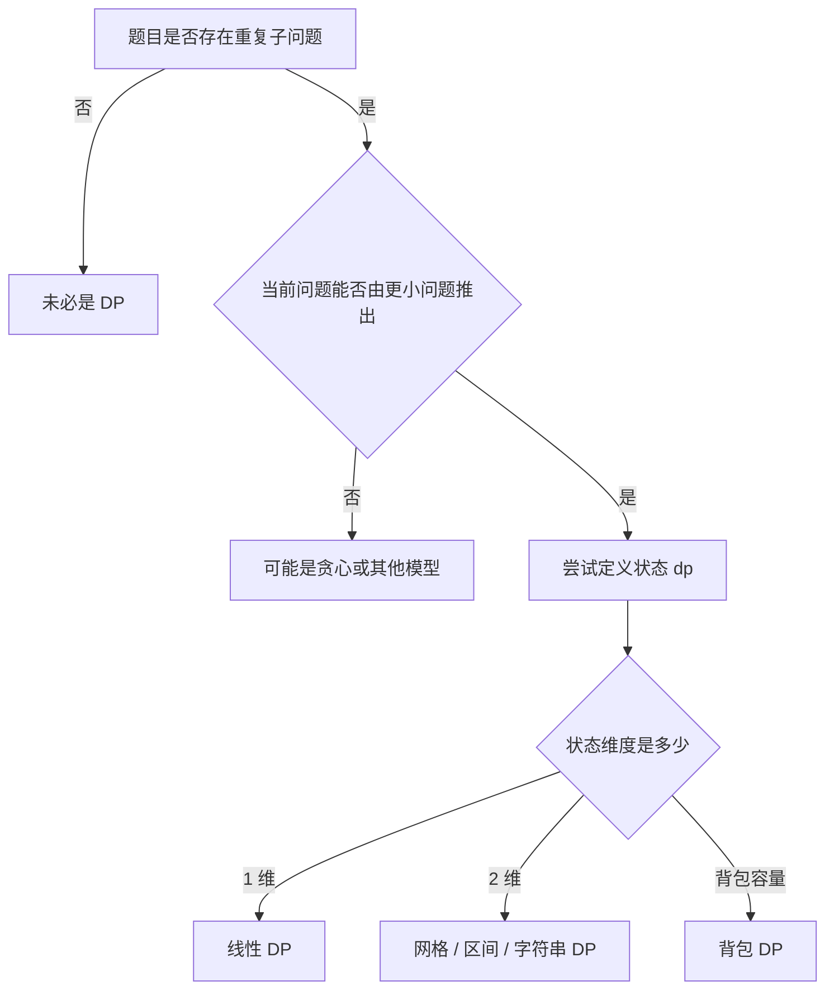
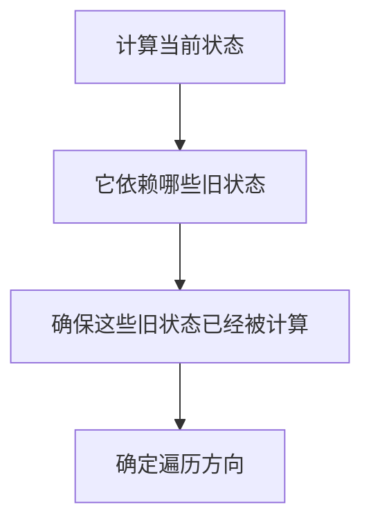
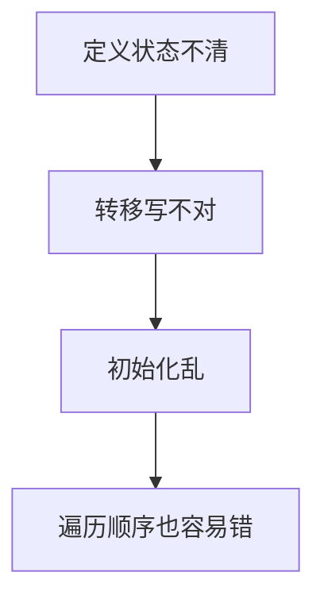
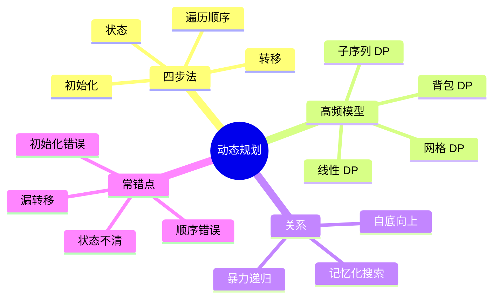

动态规划是很多人刷题时最容易“看懂题解，但自己写不出来”的专题。

原因通常不是公式背得少，而是没有真正掌握下面这套思考顺序：

- 状态是什么
- 状态转移从哪来
- 初始条件怎么定
- 遍历顺序为什么这样写

这篇文章就用 Mermaid 图把这套思考流程画出来，再用 4 道 LeetCode 题串起一维 DP、路径 DP、背包 DP 和子序列 DP 这几类最核心模型。

> 学习目标：
> 1. 理解动态规划的本质：用已解子问题推出更大问题。
> 2. 掌握 DP 四步法：状态、转移、初始化、遍历顺序。
> 3. 理解 DP 与递归、记忆化搜索的关系。
> 4. 用 4 道 LeetCode 题覆盖动态规划高频模型。
> 5. 用一张知识卡片形成 DP 题的判断框架。

---

## 一、动态规划的本质：把重复子问题变成可复用状态

动态规划解决的问题通常有两个特征：

- 存在重复子问题
- 最优解可以由子问题结果推出



所以 DP 的本质不是“背公式”，而是：

**找到一个可以复用的状态表示。**

---

## 二、DP 四步法：最稳定的做题框架



这四步缺任何一步，代码都容易飘。

### 1. 定义状态

先回答：

> `dp[i]` 或 `dp[i][j]` 到底表示什么？

### 2. 写状态转移

回答：

> 当前状态由哪些更小状态推出来？

### 3. 定初始化

回答：

> 最小子问题的答案是什么？

### 4. 定遍历顺序

回答：

> 为了算当前状态，依赖的更小状态是否已经算好了？

---

## 三、DP 与递归、记忆化搜索的关系

很多人把它们分成三套知识，其实关系非常近。


可以这样理解：

- 暴力递归：会重复算很多相同状态
- 记忆化搜索：递归 + 缓存
- 动态规划：显式地按顺序填表

所以如果你能写出记忆化搜索，通常离 DP 已经不远了。

---

## 四、先看一个最小例子：爬楼梯

题意：爬到第 `n` 阶，每次可爬 1 或 2 阶，有多少种方法？

### 状态定义

`dp[i]` 表示到达第 `i` 阶的方法数。

### 状态转移

到第 `i` 阶，只可能从：

- `i - 1` 走一步来
- `i - 2` 走两步来

所以：

`dp[i] = dp[i - 1] + dp[i - 2]`



### 初始化

- `dp[1] = 1`
- `dp[2] = 2`

### 遍历顺序

从小到大。

```cpp
class Solution {
public:
    int climbStairs(int n) {
        if (n <= 2) return n;
        vector<int> dp(n + 1, 0);
        dp[1] = 1;
        dp[2] = 2;
        for (int i = 3; i <= n; ++i) {
            dp[i] = dp[i - 1] + dp[i - 2];
        }
        return dp[n];
    }
};
```

这题几乎就是动态规划四步法的标准模板。

---

## 五、4 道 LeetCode 题目打通动态规划专题

## 1）LeetCode 70. 爬楼梯

题型定位：一维线性 DP。



这题练的是：

- 什么是状态
- 什么是从小问题推大问题

## 2）LeetCode 62. 不同路径

题型定位：二维网格 DP。

题意：机器人只能向右或向下走，从左上角走到右下角有多少种路径。

### 状态定义

`dp[i][j]` 表示走到格子 `(i, j)` 的路径数。

### 转移

走到 `(i, j)` 只可能来自：

- 上方 `(i - 1, j)`
- 左方 `(i, j - 1)`



```cpp
class Solution {
public:
    int uniquePaths(int m, int n) {
        vector<vector<int>> dp(m, vector<int>(n, 1));
        for (int i = 1; i < m; ++i) {
            for (int j = 1; j < n; ++j) {
                dp[i][j] = dp[i - 1][j] + dp[i][j - 1];
            }
        }
        return dp[m - 1][n - 1];
    }
};
```

这题练的是：

- 二维状态定义
- 边界初始化
- 按行或按列遍历

## 3）LeetCode 416. 分割等和子集

题型定位：0/1 背包 DP。

题意：能否从数组中选一些数，使其和为总和的一半。

这题本质是：

> 每个数只能选一次，能否恰好装满容量为 `sum / 2` 的背包？

### 状态定义

`dp[j]` 表示容量为 `j` 的背包，当前是否可以恰好装满。

```mermaid
flowchart TD
    A[遍历一个物品 num] --> B[从大到小更新容量 j]
    B --> C{dp[j - num] 是否可达}
    C -->|是| D[dp[j] = true]
    C -->|否| E[保持原值]
```

```cpp
class Solution {
public:
    bool canPartition(vector<int>& nums) {
        int sum = accumulate(nums.begin(), nums.end(), 0);
        if (sum % 2 != 0) return false;
        int target = sum / 2;
        vector<bool> dp(target + 1, false);
        dp[0] = true;
        for (int num : nums) {
            for (int j = target; j >= num; --j) {
                dp[j] = dp[j] || dp[j - num];
            }
        }
        return dp[target];
    }
};
```

这题练的是：

- 背包模型识别
- 为什么 0/1 背包要倒序遍历

## 4）LeetCode 300. 最长递增子序列

题型定位：子序列 DP。

### 状态定义

`dp[i]` 表示以 `nums[i]` 结尾的最长递增子序列长度。

### 转移

枚举所有 `j < i`：

- 如果 `nums[j] < nums[i]`
- 那么 `dp[i] = max(dp[i], dp[j] + 1)`



```cpp
class Solution {
public:
    int lengthOfLIS(vector<int>& nums) {
        int n = static_cast<int>(nums.size());
        vector<int> dp(n, 1);
        int ans = 1;
        for (int i = 1; i < n; ++i) {
            for (int j = 0; j < i; ++j) {
                if (nums[j] < nums[i]) {
                    dp[i] = max(dp[i], dp[j] + 1);
                }
            }
            ans = max(ans, dp[i]);
        }
        return ans;
    }
};
```

这题练的是：

- “以某个位置结尾”这种状态定义
- 子序列 DP 常见转移写法

---

## 六、动态规划题怎么快速判断



### 一个很实用的判断

如果你发现：

- 暴力递归会重复算很多状态
- 这些状态可以用下标、容量、位置、区间等变量表示

那它就很可能是 DP。

---

## 七、遍历顺序为什么这么重要

很多 DP 题不是不会转移，而是遍历顺序写错了。



典型例子：

- 一维前向依赖：从左到右
- 二维依赖上方和左方：从上到下、从左到右
- 0/1 背包：容量倒序
- 完全背包：容量正序

这一步如果想不清，DP 很容易写错。

---

## 八、动态规划常见错误

## 1）状态定义含糊

如果 `dp[i]` 是什么都说不清，后面全会乱。

## 2）初始化不完整

很多题不是转移错，而是 base case 没设对。

## 3）遍历顺序错误

尤其是背包问题，正序和倒序差别非常大。

## 4）把“选或不选”写漏

背包和子序列题经常漏掉“不选当前元素”的情况。

## 5）一上来就背模板，不先想状态

DP 最忌讳“题没看懂，先套模板”。



---

## 九、动态规划知识卡片



复习版要点：

- DP 的本质是把重复子问题变成可复用状态
- 做题最稳的框架是：状态、转移、初始化、遍历顺序
- 记忆化搜索和 DP 不是两套东西，本质非常接近
- 背包题最常考遍历顺序
- 不要背答案，先定义 `dp` 的含义

---

## 十、最后总结

如果只记一句话，请记这个：

**动态规划不是在背公式，而是在设计状态。**

做题时你真正要逼自己先回答的是：

- `dp` 到底表示什么
- 当前状态从哪些更小状态转移而来
- 最小问题的答案是什么
- 为了先算依赖项，遍历顺序该怎么写

把这篇里的 4 道题做透，动态规划专题就会从“会抄题解”变成“能自己推状态”。
