图论题经常给人一种“类型很多、套路很多”的感觉。

但真正做题时，图论高频题大多还是围绕这几件事：

- 图怎么表示
- 节点之间怎么连
- 如何遍历整张图
- 是否有环
- 是否存在依赖顺序
- 连通性如何维护

这篇文章继续用 Mermaid 图解的方式，把图论里最常见的 DFS、BFS、拓扑排序和并查集串起来，再用 4 道 LeetCode 题把核心模型落地。

> 学习目标：
> 1. 理解图的基本表示方式与搜索方式。
> 2. 掌握 DFS / BFS 在图中的作用。
> 3. 理解拓扑排序和并查集的典型应用。
> 4. 用 4 道 LeetCode 题覆盖图论高频模型。
> 5. 用一张知识卡片建立图论题的判断框架。

---

## 一、图的本质：节点 + 边

图由节点和边组成。

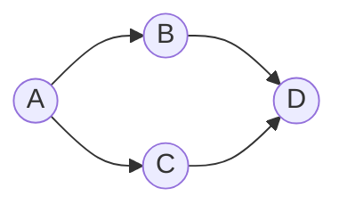

图题和树题最大的不同是：

- 树通常默认无环
- 图可能有环、可能不连通

所以图题几乎总会多出两个意识：

- `visited`
- 连通关系

---

## 二、图怎么表示

高频写法通常是邻接表。

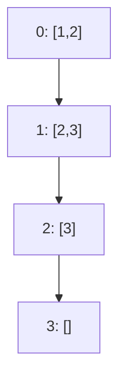

你可以把它理解成：

- 每个节点都维护一个“它能走到哪些节点”的列表

这样 DFS / BFS 就自然变成：

1. 取出当前节点
2. 遍历相邻节点
3. 对还没访问过的节点继续处理

---

## 三、图搜索：DFS 与 BFS

### DFS

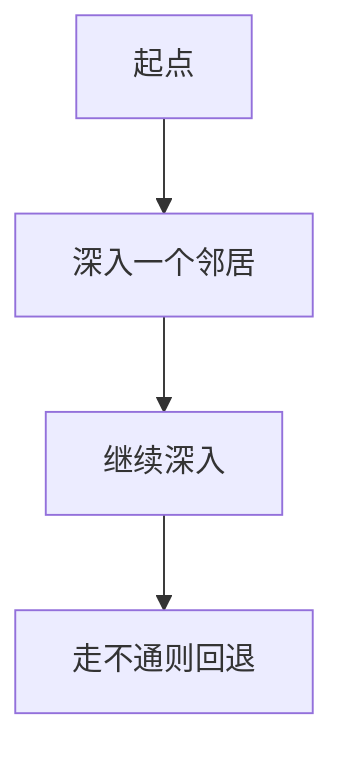

适合：

- 连通块搜索
- 是否可达
- 路径枚举

### BFS

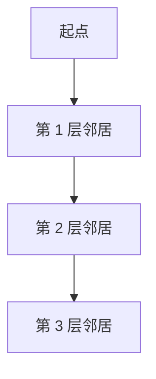

适合：

- 无权图最短路
- 最少步数
- 分层扩展

---

## 四、拓扑排序：处理依赖关系

如果图表示“先做 A，才能做 B”这种依赖关系，那么它通常是有向图问题。

拓扑排序适用于：

**有向无环图（DAG）中的依赖顺序。**

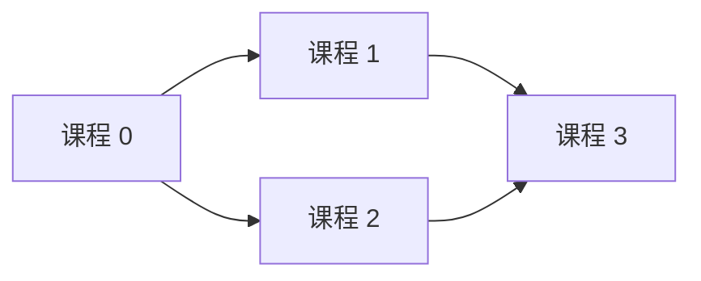

拓扑排序的关键是入度：

- 入度为 0 的点，说明当前没有前置依赖，可以先处理

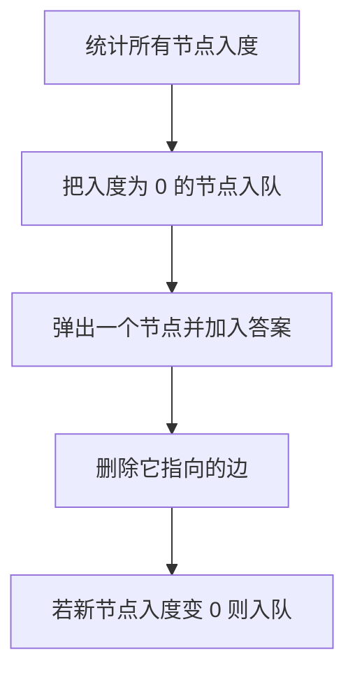

---

## 五、并查集：维护连通性

并查集适合处理：

- 两个节点是否连通
- 多次合并连通块
- 动态维护集合归属

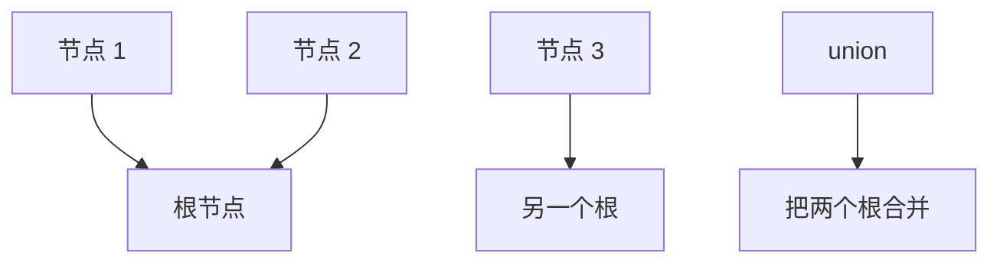

并查集核心只有两件事：

- `find(x)`：找根
- `union(a, b)`：合并两个集合

---

## 六、4 道 LeetCode 题目打通图论专题

## 1）LeetCode 200. 岛屿数量

题型定位：网格图 DFS / BFS。

```java
class Solution {
    public int numIslands(char[][] grid) {
        int m = grid.length, n = grid[0].length, count = 0;
        for (int i = 0; i < m; i++) {
            for (int j = 0; j < n; j++) {
                if (grid[i][j] == '1') {
                    count++;
                    dfs(grid, i, j);
                }
            }
        }
        return count;
    }

    private void dfs(char[][] grid, int i, int j) {
        if (i < 0 || i >= grid.length || j < 0 || j >= grid[0].length || grid[i][j] != '1') {
            return;
        }
        grid[i][j] = '0';
        dfs(grid, i + 1, j);
        dfs(grid, i - 1, j);
        dfs(grid, i, j + 1);
        dfs(grid, i, j - 1);
    }
}
```

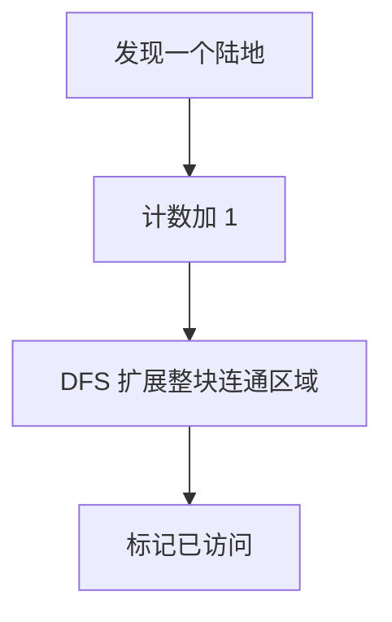

这题练的是：

- 把网格看成图
- 连通块计数

## 2）LeetCode 994. 腐烂的橘子

题型定位：多源 BFS。

```java
class Solution {
    public int orangesRotting(int[][] grid) {
        int m = grid.length, n = grid[0].length;
        Queue<int[]> queue = new LinkedList<>();
        int fresh = 0;

        for (int i = 0; i < m; i++) {
            for (int j = 0; j < n; j++) {
                if (grid[i][j] == 2) queue.offer(new int[]{i, j});
                if (grid[i][j] == 1) fresh++;
            }
        }

        int minutes = 0;
        int[][] dirs = {{1,0},{-1,0},{0,1},{0,-1}};

        while (!queue.isEmpty() && fresh > 0) {
            int size = queue.size();
            for (int i = 0; i < size; i++) {
                int[] cur = queue.poll();
                for (int[] d : dirs) {
                    int x = cur[0] + d[0], y = cur[1] + d[1];
                    if (x >= 0 && x < m && y >= 0 && y < n && grid[x][y] == 1) {
                        grid[x][y] = 2;
                        fresh--;
                        queue.offer(new int[]{x, y});
                    }
                }
            }
            minutes++;
        }
        return fresh == 0 ? minutes : -1;
    }
}
```

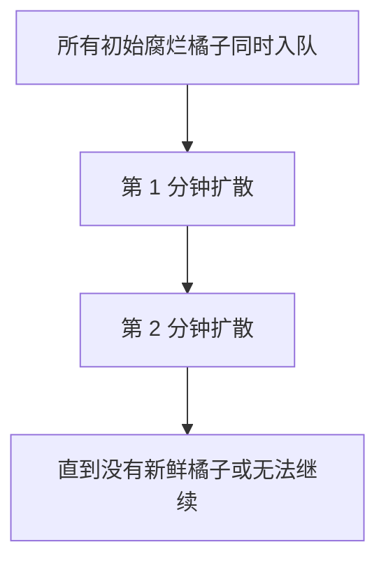

这题训练的是：

- 多源 BFS
- “按层推进 = 时间推进”

## 3）LeetCode 207. 课程表

题型定位：拓扑排序 / 判环。

```java
class Solution {
    public boolean canFinish(int numCourses, int[][] prerequisites) {
        List<List<Integer>> graph = new ArrayList<>();
        for (int i = 0; i < numCourses; i++) graph.add(new ArrayList<>());
        int[] indegree = new int[numCourses];

        for (int[] p : prerequisites) {
            graph.get(p[1]).add(p[0]);
            indegree[p[0]]++;
        }

        Queue<Integer> queue = new LinkedList<>();
        for (int i = 0; i < numCourses; i++) {
            if (indegree[i] == 0) queue.offer(i);
        }

        int count = 0;
        while (!queue.isEmpty()) {
            int cur = queue.poll();
            count++;
            for (int next : graph.get(cur)) {
                if (--indegree[next] == 0) queue.offer(next);
            }
        }
        return count == numCourses;
    }
}
```

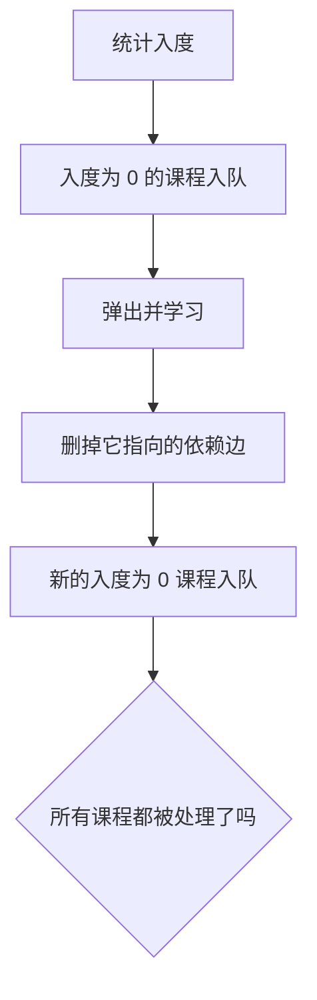

这题训练的是：

- 有向图依赖关系
- 拓扑排序判环

## 4）LeetCode 547. 省份数量

题型定位：并查集 / 连通块。

```java
class Solution {
    public int findCircleNum(int[][] isConnected) {
        int n = isConnected.length;
        UnionFind uf = new UnionFind(n);

        for (int i = 0; i < n; i++) {
            for (int j = i + 1; j < n; j++) {
                if (isConnected[i][j] == 1) {
                    uf.union(i, j);
                }
            }
        }
        return uf.count;
    }
}
```

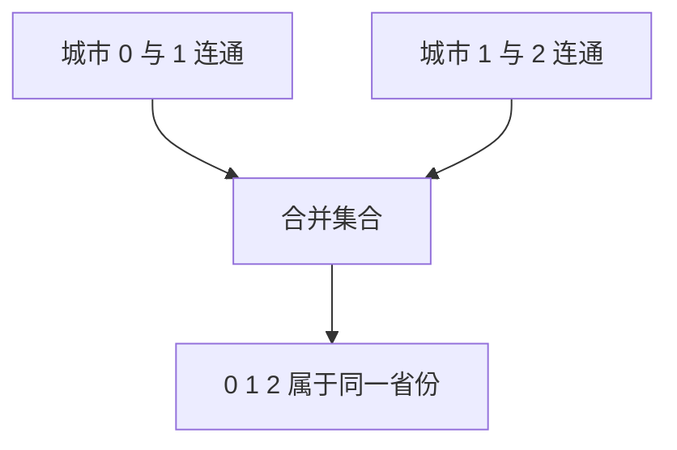

这题练的是：

- 连通块概念
- 并查集维护集合数量

---

## 七、图论题怎么快速判断模型

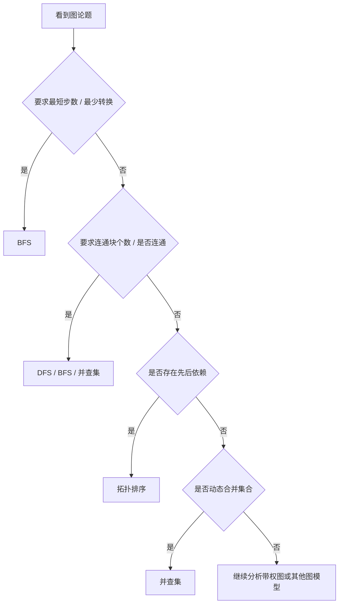

---

## 八、图论常见错误

## 1）忘记 `visited`

图可能有环，不标记访问很容易无限绕圈。

## 2）把树题习惯带到图题

树天然无环，图不一定。

## 3）拓扑排序忘了入度更新

如果出队后不更新邻居入度，整套流程就断了。

## 4）并查集只会 `union` 不会维护根

路径压缩和按秩合并虽然不是必须，但会显著提升效率。

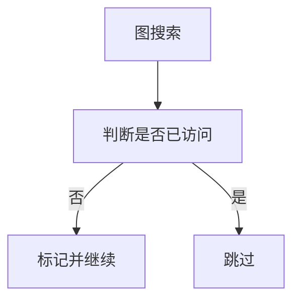

---

## 九、图论知识卡片

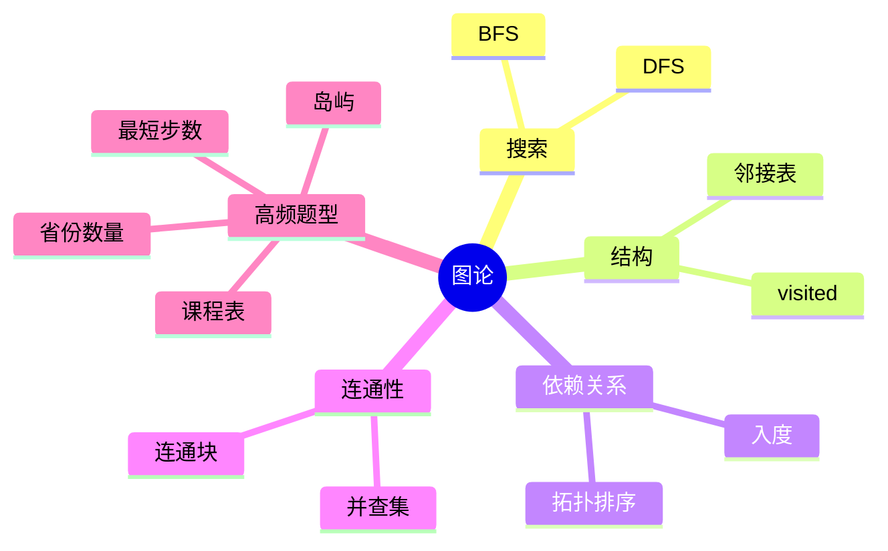

复习版要点：

- 图题本质是节点和边的关系处理
- 图和树的关键区别是：图可能有环
- 最短步数优先想到 BFS
- 依赖顺序优先想到拓扑排序
- 动态连通性优先想到并查集

---

## 十、最后总结

如果只记一句话，请记这个：

**图论高频题看起来多，实质上大多还是在做“搜索、判环、排依赖、维护连通性”。**

做题时先判断：

- 这是搜索问题、最短路问题，还是依赖问题
- 图里有没有环
- 是否需要维护连通块

把这篇里的 4 道题做透，图论的高频主干就基本搭起来了。
