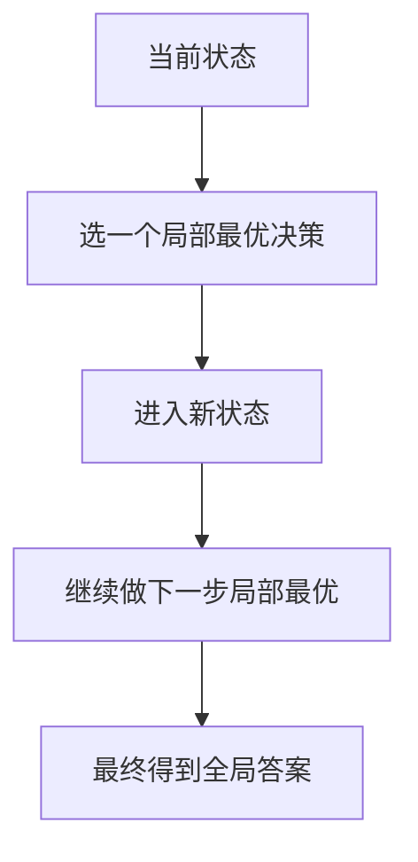
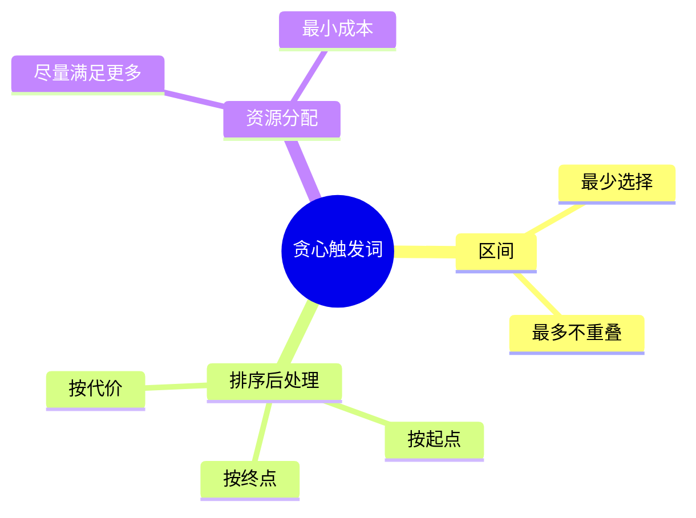
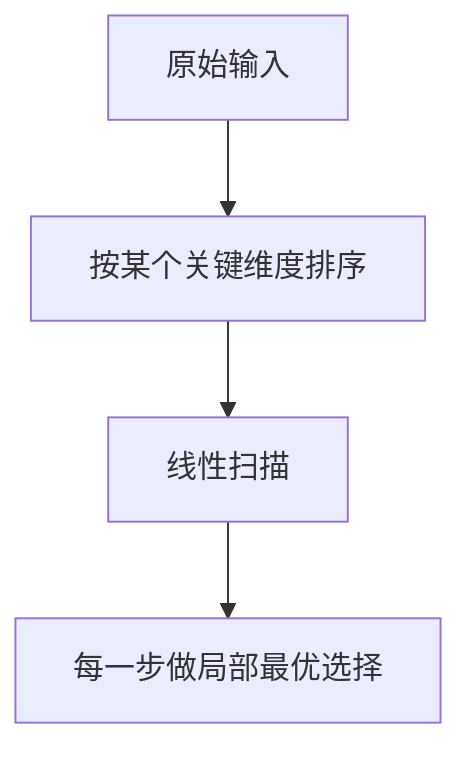
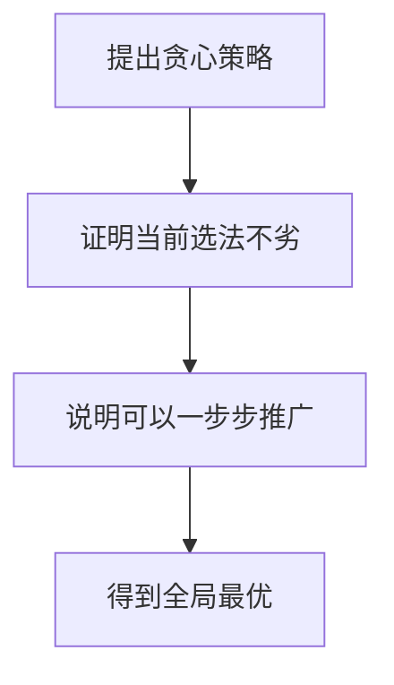
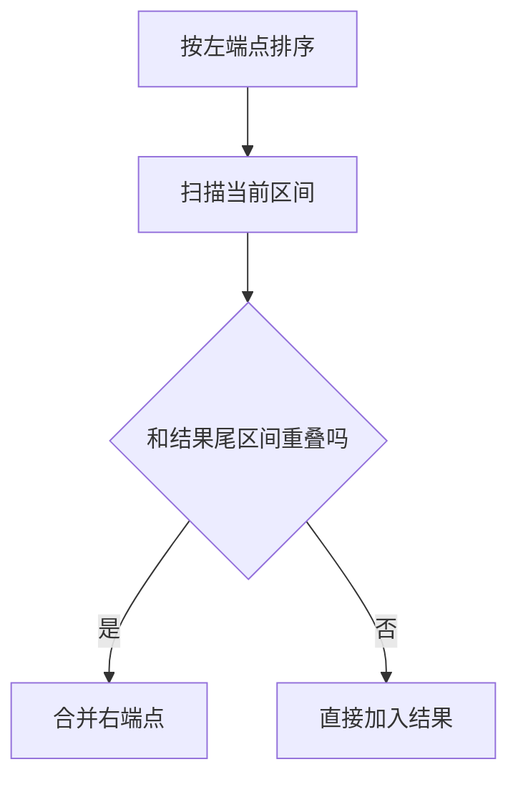
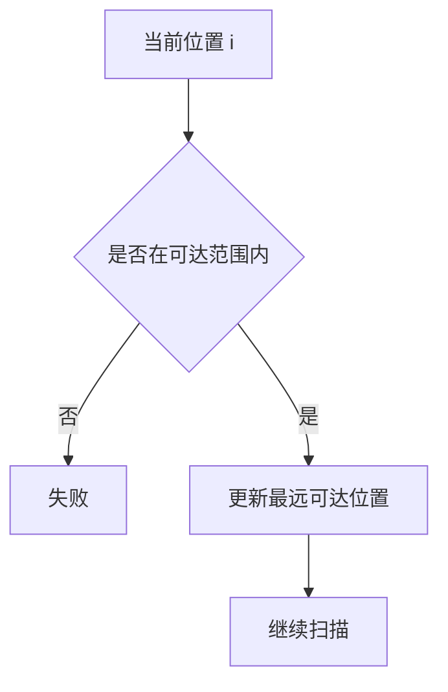
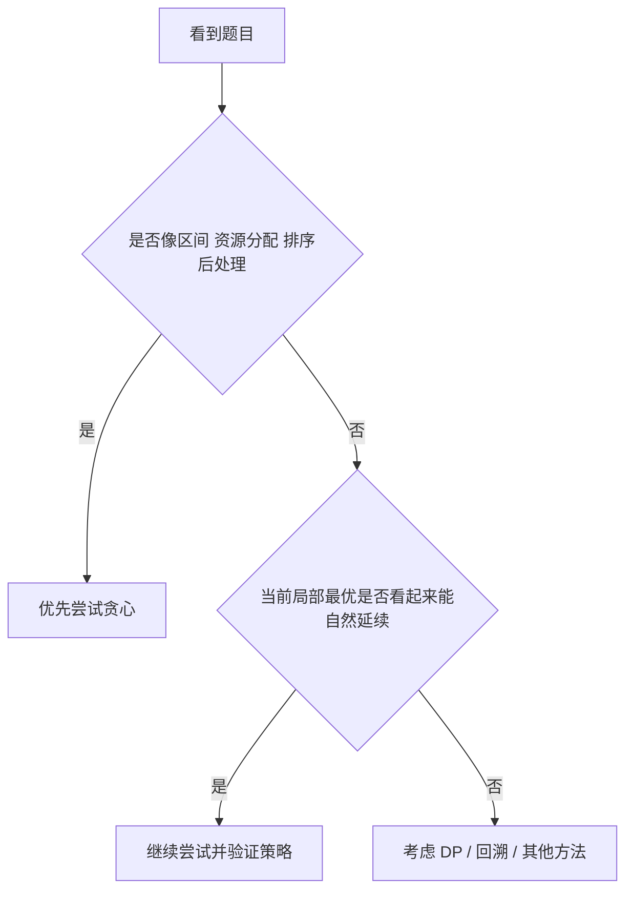
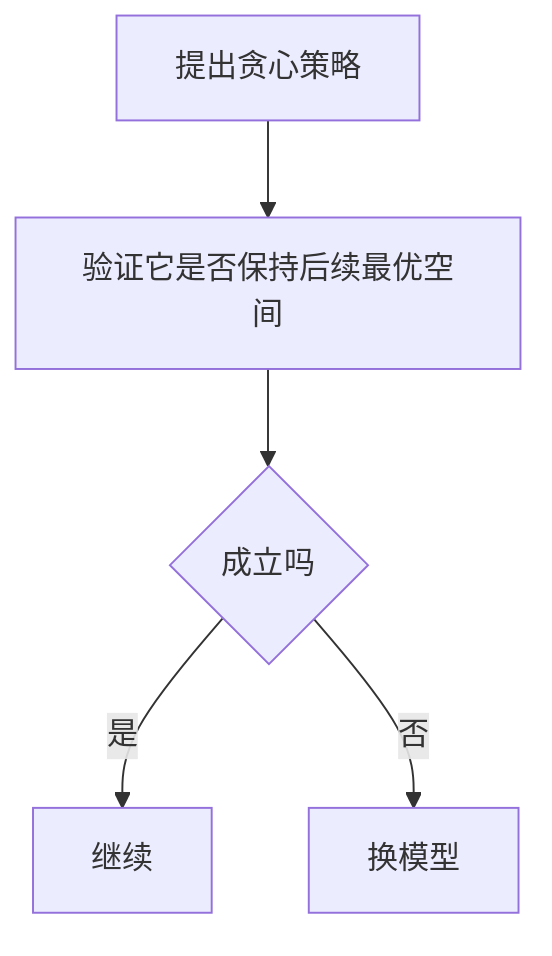
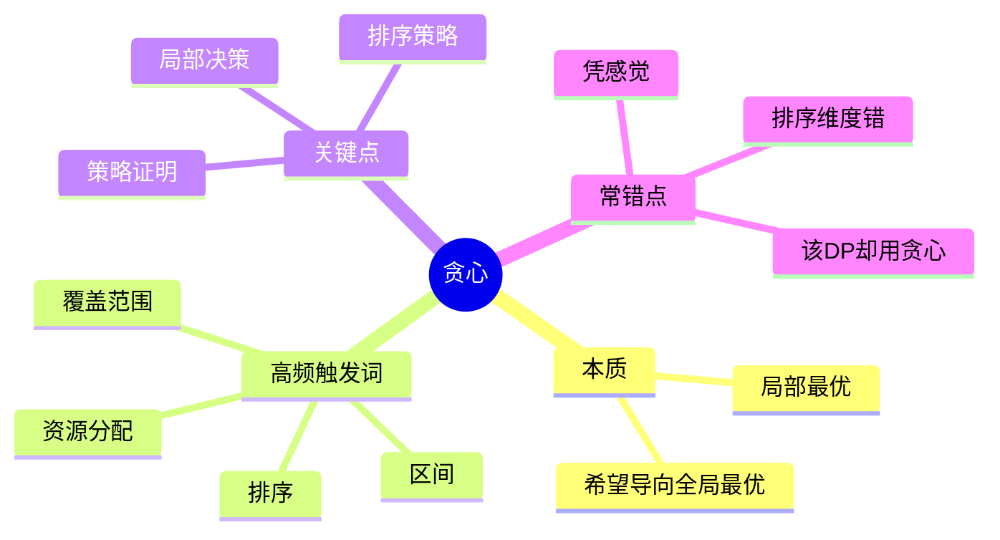

贪心算法是最容易“看起来简单，但最容易拍脑袋拍错”的专题。

它真正难的地方不是实现，而是：

- 为什么当前这一步要这么选
- 当前局部最优为什么不会破坏全局最优
- 什么时候能贪，什么时候不能贪

这篇文章继续用 Mermaid 图解的方式，把贪心里的“局部最优”思维讲清楚，再用 4 道 LeetCode 题把区间、排序、资源分配这几类高频模型串起来。

> 学习目标：
> 1. 理解贪心算法的本质：每一步都做当前最优选择。
> 2. 掌握贪心常见的排序和区间策略。
> 3. 理解贪心为什么需要策略证明。
> 4. 用 4 道 LeetCode 题覆盖贪心高频模型。
> 5. 用一张知识卡片形成贪心题的判断框架。

---

## 一、贪心的本质：每一步都做当前看来最优的选择

贪心的核心不是“感觉这么选不错”，而是：

**在当前状态下做局部最优选择，并希望最终导向全局最优。**



贪心的关键难点在于：

- 不是所有题都能贪
- 不是所有“看起来合理”的策略都对

---

## 二、什么时候应该考虑贪心

如果一个问题满足下面的感觉，很可能适合贪心：

- 每一步决策之后，不需要回头
- 当前最优选择不会破坏后续可行性
- 题目带有明显的排序、区间、资源分配特征



---

## 三、贪心为什么常配合排序

很多贪心题本质上都是：

**先排序，再线性扫描做局部最优选择。**

因为排序之后，局部决策的比较关系变得清晰。



例如：

- 按结束时间排序选区间
- 按大小排序分配资源
- 按左端点排序合并区间

---

## 四、贪心不是模板题，而是策略题

和 DP、二分不同，贪心真正要证明的是：

> 为什么你当前这一步选法不会让整体答案变差。

常见的证明思路有：

- 交换论证
- 局部最优推出全局最优
- 反证法



刷题时你不一定每次都写完整证明，但脑中必须有这个意识。

---

## 五、4 道 LeetCode 题目打通贪心专题

## 1）LeetCode 455. 分发饼干

题型定位：排序 + 贪心分配。

思路：

- 胃口和饼干都排序
- 用最小能满足的饼干去喂当前最小胃口

```java
class Solution {
    public int findContentChildren(int[] g, int[] s) {
        Arrays.sort(g);
        Arrays.sort(s);
        int i = 0, j = 0;
        while (i < g.length && j < s.length) {
            if (s[j] >= g[i]) i++;
            j++;
        }
        return i;
    }
}
```


这题练的是：

- 排序后的资源分配
- 为什么“小的先满足”是对的

## 2）LeetCode 56. 合并区间

题型定位：排序 + 区间贪心。

```java
class Solution {
    public int[][] merge(int[][] intervals) {
        Arrays.sort(intervals, (a, b) -> a[0] - b[0]);
        List<int[]> res = new ArrayList<>();

        for (int[] interval : intervals) {
            if (res.isEmpty() || res.get(res.size() - 1)[1] < interval[0]) {
                res.add(interval);
            } else {
                res.get(res.size() - 1)[1] =
                    Math.max(res.get(res.size() - 1)[1], interval[1]);
            }
        }
        return res.toArray(new int[res.size()][]);
    }
}
```



这题练的是：

- 排序后线性合并
- 区间处理的局部决策

## 3）LeetCode 435. 无重叠区间

题型定位：区间选择贪心。

核心策略：

- 按右端点排序
- 每次优先选结束最早的区间

```java
class Solution {
    public int eraseOverlapIntervals(int[][] intervals) {
        Arrays.sort(intervals, (a, b) -> a[1] - b[1]);
        int count = 1;
        int end = intervals[0][1];

        for (int i = 1; i < intervals.length; i++) {
            if (intervals[i][0] >= end) {
                count++;
                end = intervals[i][1];
            }
        }
        return intervals.length - count;
    }
}
```


这题训练的是：

- 区间调度问题
- 为什么“结束早”比“开始早”更关键

## 4）LeetCode 55. 跳跃游戏

题型定位：范围覆盖贪心。

思路：

- 维护当前能到达的最远位置 `farthest`
- 只要当前位置不超过它，就能继续扩展覆盖范围

```java
class Solution {
    public boolean canJump(int[] nums) {
        int farthest = 0;
        for (int i = 0; i < nums.length; i++) {
            if (i > farthest) return false;
            farthest = Math.max(farthest, i + nums[i]);
        }
        return true;
    }
}
```



这题训练的是：

- 不必真的跳
- 只维护“最远能覆盖到哪”

---

## 六、贪心题怎么快速判断



一个很实用的自问是：

> 我当前这样选，会不会让后续选择空间更糟？

如果不会，甚至还能让后续更容易，那么它很可能是个正确的贪心方向。

---

## 七、贪心常见错误

## 1）没有策略证明，只是“感觉这样对”

贪心最怕拍脑袋。

## 2）排序关键字选错

例如区间题里，按左端点和按右端点，结论可能完全不同。

## 3）把贪心题硬写成模拟

很多贪心题真正关键是“维护某个最优量”，不是把过程逐步演一遍。

## 4）局部最优并不成立却强行贪

不是所有题都适合贪心，很多题实际应该用 DP。



---

## 八、贪心知识卡片



复习版要点：

- 贪心的核心不是实现，而是策略是否正确
- 很多贪心题都要先排序
- 区间题里，结束时间常常比开始时间更关键
- 资源分配题常用“小的先满足”
- 如果局部最优无法证明，就不要强行贪

---

## 九、最后总结

如果只记一句话，请记这个：

**贪心不是“每次随便选一个看起来不错的”，而是“每次都选那个经过证明不会让整体变差的局部最优”。**

做题时先判断：

- 题目是否带有区间、排序、资源分配特征
- 当前策略是否能用交换论证或直觉证明支撑
- 这题是不是其实更适合 DP

把这篇里的 4 道题做透，贪心高频题的框架就会稳定下来。
