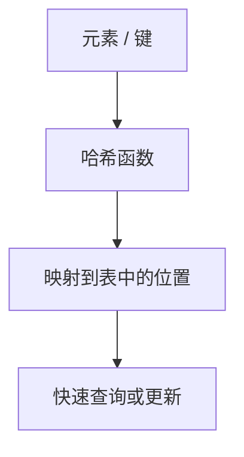
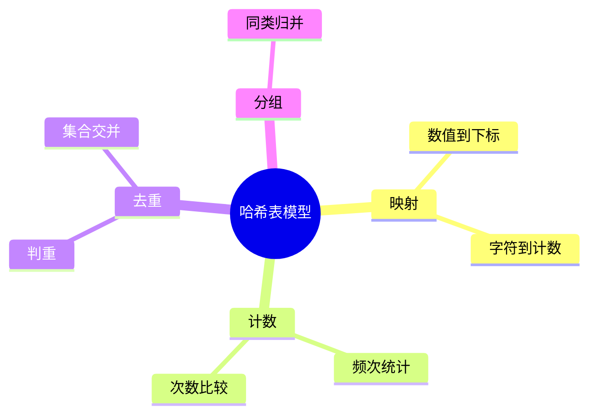
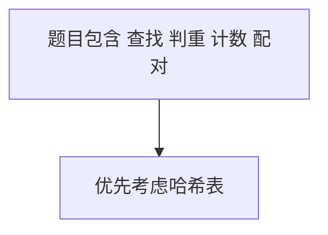
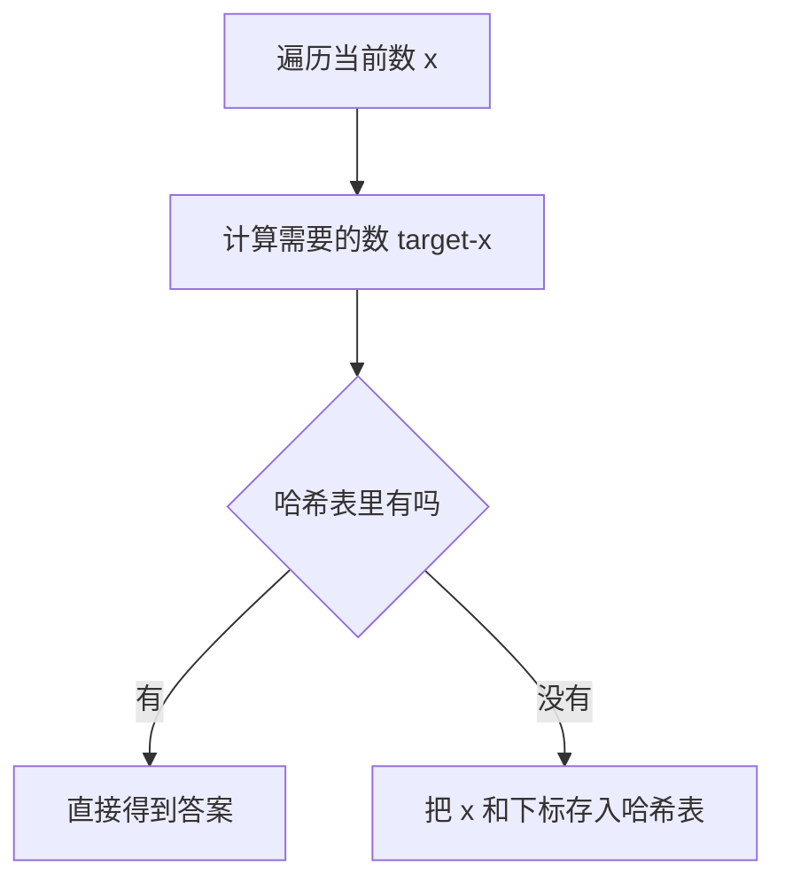
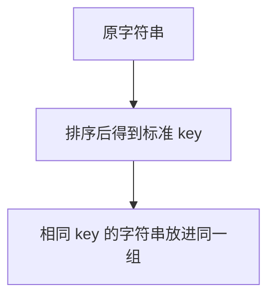
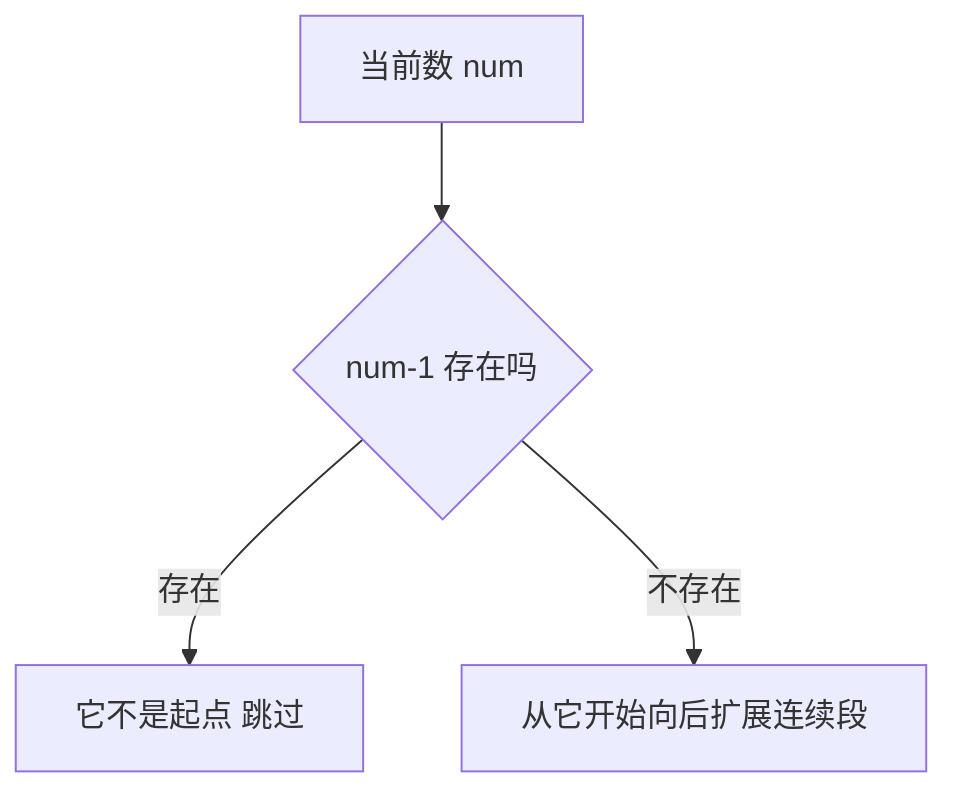
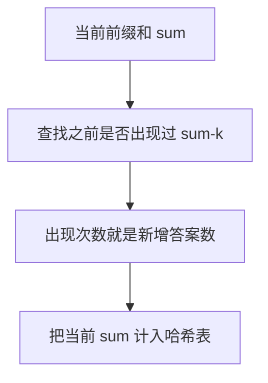
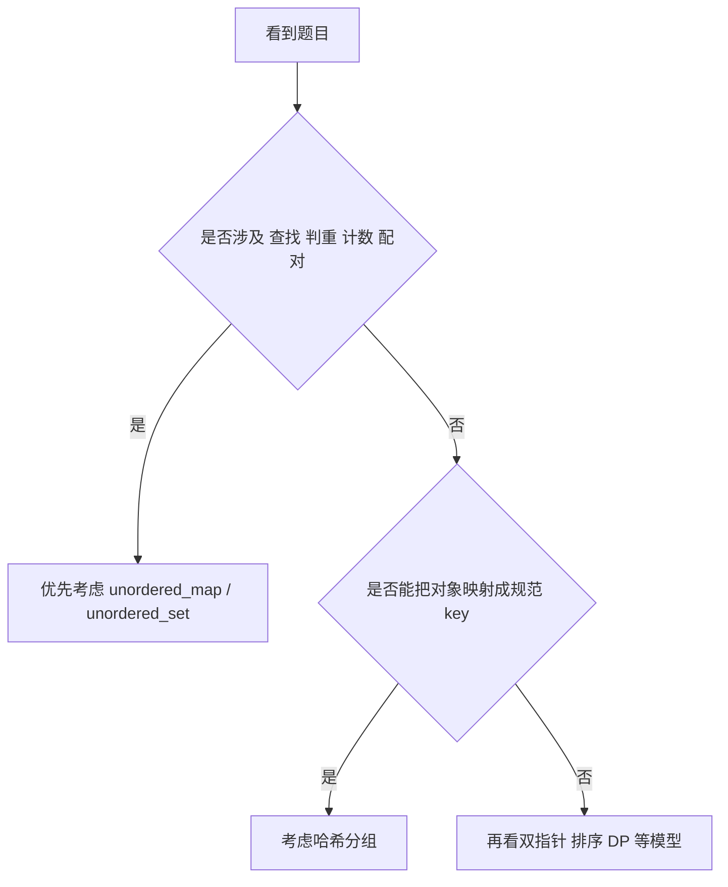
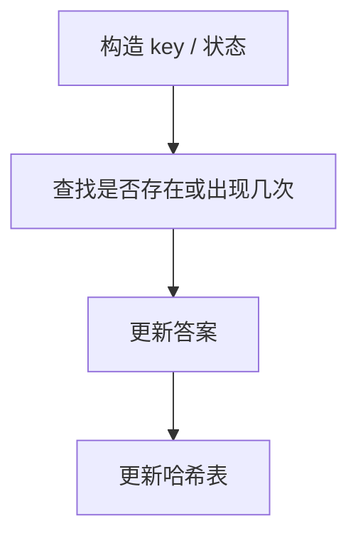
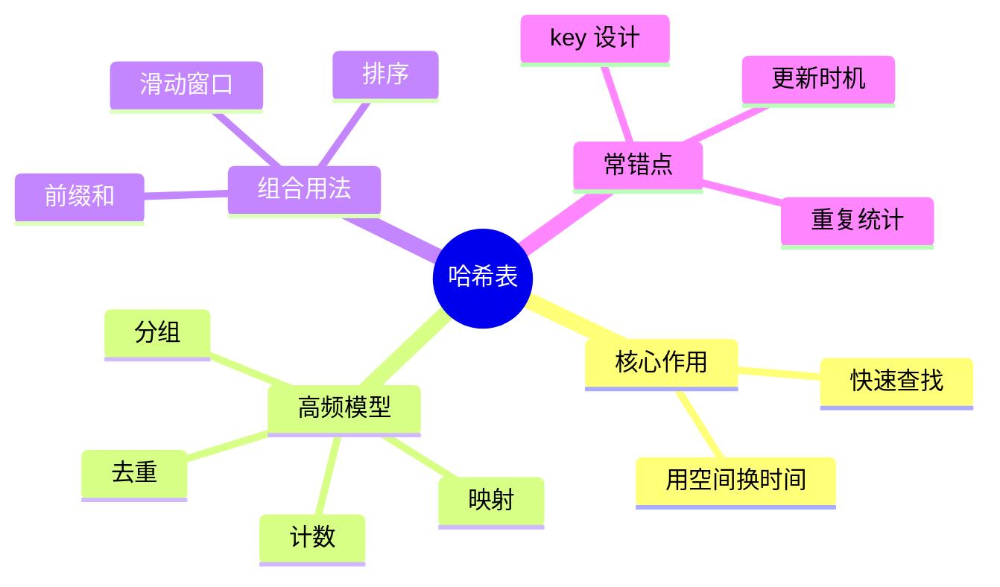

哈希表是算法题里最容易被低估的一类结构。

很多题看起来像暴力、双层循环，真正的突破点其实只有一句话：

**把“找过没有、出现几次、对应关系是什么”从 O(n) 查找变成 O(1) 级别查询。**

这篇文章继续用 Mermaid 图解的方式，把哈希表最常见的映射、计数、去重和频次统计模型讲清楚，再用 4 道 LeetCode 题把高频套路串起来。

> 学习目标：
> 1. 理解哈希表在算法题中的核心作用。
> 2. 掌握映射、计数、去重、分组等高频模型。
> 3. 理解什么时候应该优先想到哈希表。
> 4. 用 4 道 LeetCode 题覆盖哈希表高频题型。
> 5. 用一张知识卡片形成哈希表题的判断框架。

---

## 一、哈希表的本质：用空间换时间

哈希表的核心价值是：

**把“查找某个元素是否存在”的代价，从线性扫描降到近似常数时间。**



这意味着它特别适合解决：

- 是否存在
- 出现次数
- 值到位置的映射
- 分类分组

---

## 二、哈希表高频模型



### 1. 映射

例如“两数之和”里，把数值映射到下标。

### 2. 计数

例如字符串字符频次、数组元素出现次数。

### 3. 去重

用 `Set` 判断元素是否已出现。

### 4. 分组

把某种“规范化后的 key”映射到一个集合。

---

## 三、什么时候该第一时间想到哈希表

如果题目里出现下面这些信号，哈希表通常都值得优先考虑：

- 是否出现过
- 是否重复
- 出现次数
- 配对关系
- 分组归类



很多暴力题之所以慢，就是因为把“查找”写成了重复扫描。

---

## 四、4 道 LeetCode 题目打通哈希表专题

## 1）LeetCode 1. 两数之和

题型定位：值到下标映射。

```cpp
class Solution {
public:
    vector<int> twoSum(vector<int>& nums, int target) {
        unordered_map<int, int> pos;
        for (int i = 0; i < static_cast<int>(nums.size()); ++i) {
            int need = target - nums[i];
            if (pos.count(need)) return {pos[need], i};
            pos[nums[i]] = i;
        }
        return {};
    }
};
```



这题练的是：

- 映射关系建模
- 为什么能从 O(n^2) 降到 O(n)

## 2）LeetCode 49. 字母异位词分组

题型定位：哈希分组。

```cpp
class Solution {
public:
    vector<vector<string>> groupAnagrams(vector<string>& strs) {
        unordered_map<string, vector<string>> groups;
        for (const string& s : strs) {
            string key = s;
            sort(key.begin(), key.end());
            groups[key].push_back(s);
        }
        vector<vector<string>> res;
        for (auto& [_, bucket] : groups) res.push_back(bucket);
        return res;
    }
};
```



这题训练的是：

- 如何构造“等价类”的 key
- 哈希表分组思路

## 3）LeetCode 128. 最长连续序列

题型定位：哈希集合判存在。

```cpp
class Solution {
public:
    int longestConsecutive(vector<int>& nums) {
        unordered_set<int> st(nums.begin(), nums.end());
        int ans = 0;
        for (int num : st) {
            if (st.count(num - 1)) continue;
            int cur = num, len = 1;
            while (st.count(cur + 1)) {
                ++cur;
                ++len;
            }
            ans = max(ans, len);
        }
        return ans;
    }
};
```



这题训练的是：

- 哈希集合判存在
- 如何避免重复扩展

## 4）LeetCode 560. 和为 K 的子数组

题型定位：前缀和 + 哈希计数。

```cpp
class Solution {
public:
    int subarraySum(vector<int>& nums, int k) {
        unordered_map<int, int> cnt;
        cnt[0] = 1;
        int sum = 0, ans = 0;
        for (int x : nums) {
            sum += x;
            if (cnt.count(sum - k)) ans += cnt[sum - k];
            ++cnt[sum];
        }
        return ans;
    }
};
```



这题最重要的是理解：

- 哈希表有时不是直接存元素
- 也可以存“某种中间状态”的出现次数

---

## 五、哈希表题怎么快速判断



---

## 六、哈希表常见错误

## 1）key 设计不合理

分组类题里，key 设计是成败关键。

## 2）更新时机写错

例如前缀和题，先查还是先放入哈希表，顺序可能影响答案。

## 3）重复统计

尤其是在计数和组合类问题里。

## 4）只会用哈希表，不会结合别的结构

很多题其实是：

- 哈希 + 前缀和
- 哈希 + 滑动窗口
- 哈希 + 排序



---

## 七、哈希表知识卡片



复习版要点：

- 哈希表最核心的价值是快速查找
- 查找、判重、计数、配对题优先考虑哈希
- 分组题往往关键在于构造规范 key
- 哈希表经常和前缀和、滑动窗口联用
- 更新顺序写错很容易导致答案偏差

---

## 八、最后总结

如果只记一句话，请记这个：

**哈希表不是“一个容器”，而是一种把重复查找成本打掉的建模方式。**

做题时先判断：

- 我要不要快速判断存在性
- 我是不是在统计频次
- 我能不能把对象映射成统一 key

把这篇里的 4 道题做透，哈希表高频题会非常稳。
