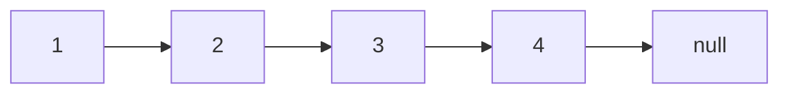
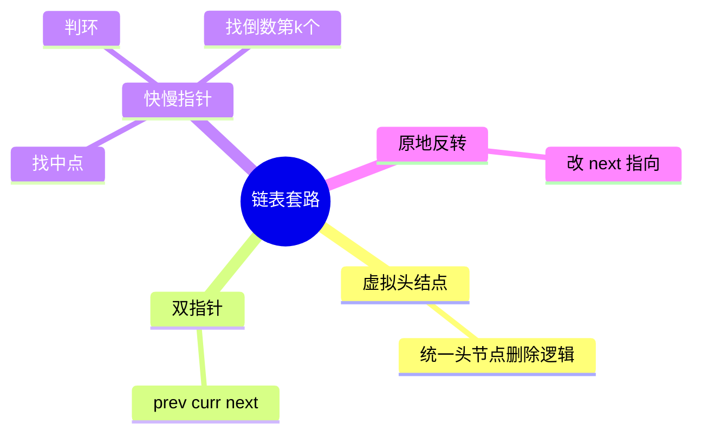
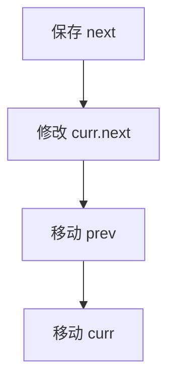
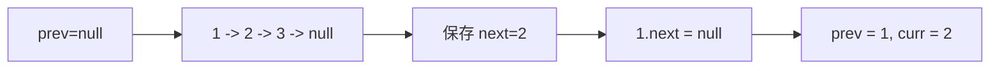
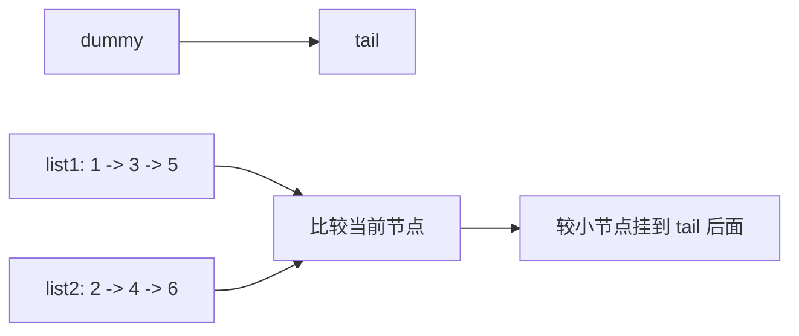
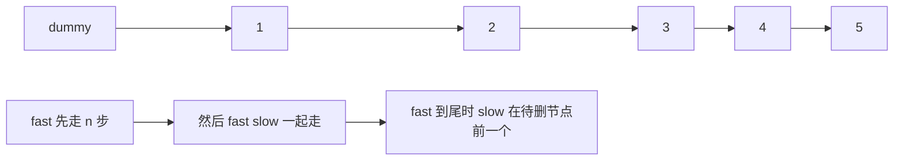
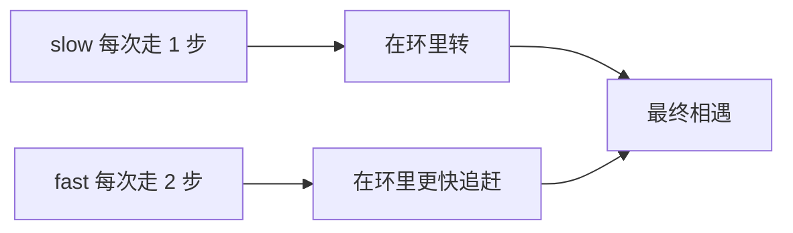
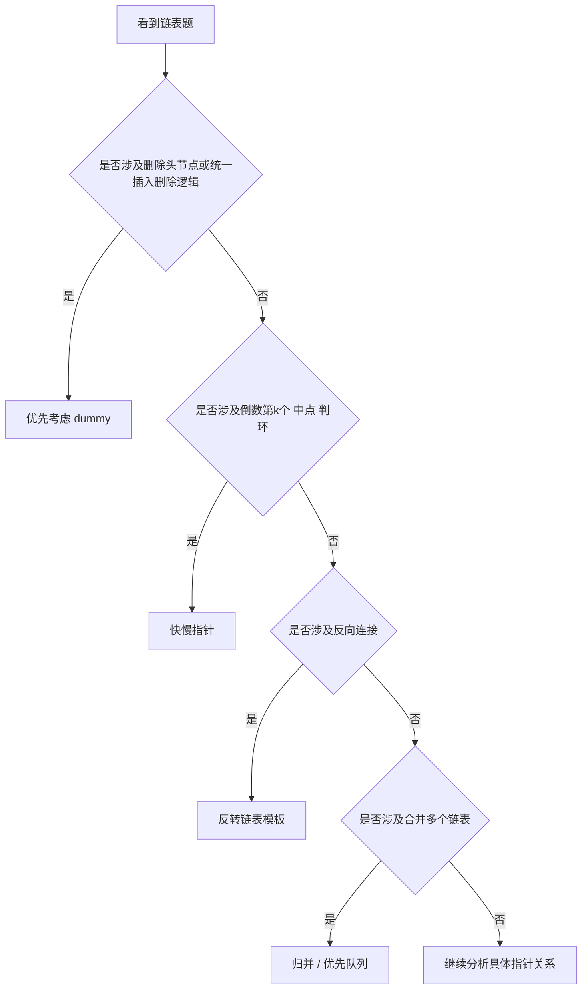
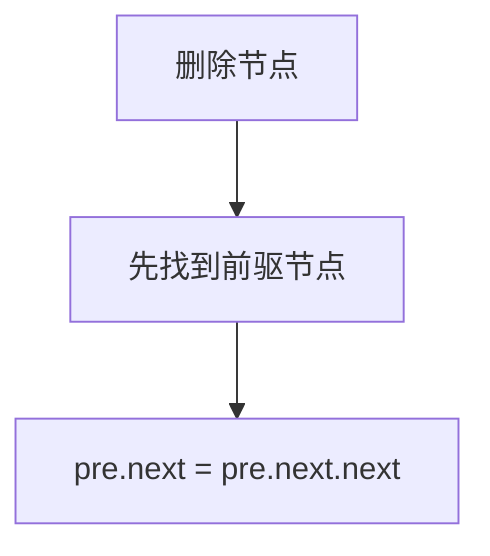
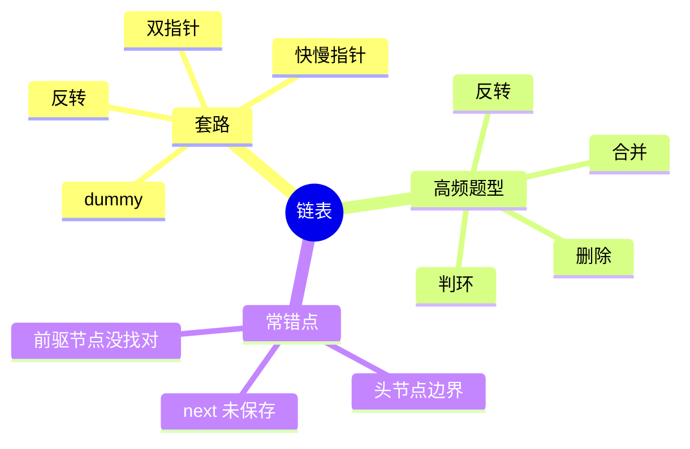

链表题的代码通常不长，但非常容易写出 bug。

原因通常不是思路完全不会，而是指针关系一旦没在脑中画清楚，几行代码就可能把链断掉、形成环、或者丢节点。

这篇文章继续用 Mermaid 图解的方式，把链表题最核心的几种操作讲清楚，再用 4 道 LeetCode 题把反转、合并、删除和快慢指针这几类高频模型串起来。

> 学习目标：
> 1. 理解链表和数组在结构上的根本差别。
> 2. 掌握链表题的几种固定套路：虚拟头结点、双指针、快慢指针、原地反转。
> 3. 理解链表为什么更强调指针修改顺序。
> 4. 用 4 道 LeetCode 题覆盖链表高频模型。
> 5. 用一张知识卡片形成链表题的稳定判断框架。

---

## 一、链表的本质：节点通过指针串起来

和数组最大的不同在于，链表中的元素不是连续存放的，而是通过 `next` 指针连接。



这意味着：

- 查找某个位置，需要顺着指针走
- 插入和删除节点，本质是修改指针关系

所以链表题最重要的不是“值怎么变”，而是：

**指针先改谁，后改谁。**

---

## 二、链表题最常见的 4 个套路



### 1. 虚拟头结点

当题目涉及“删除头节点”或“插入到头部”时，虚拟头结点能显著简化边界处理。

### 2. 双指针

常见于反转链表，需要同时保存：

- 当前节点 `curr`
- 前驱节点 `prev`
- 下一个节点 `next`

### 3. 快慢指针

适合：

- 找中点
- 判环
- 找倒数第 `k` 个节点

### 4. 原地反转

反转链表的本质是把每个节点的 `next` 指回前驱。

---

## 三、链表为什么最怕“修改顺序错了”

看一个最经典的例子：反转链表。


如果当前在节点 `1`：

1. 先保存 `next = curr.next`
2. 再执行 `curr.next = prev`
3. 然后整体向前推进

如果你第 1 步没先保存 `next`，链表后半段就可能直接丢失。



这就是为什么链表题要特别强调“操作顺序”。

---

## 四、4 道 LeetCode 题目打通链表专题

## 1）LeetCode 206. 反转链表

题型定位：链表原地反转。

```cpp
class Solution {
public:
    ListNode* reverseList(ListNode* head) {
        ListNode* prev = nullptr;
        ListNode* curr = head;
        while (curr != nullptr) {
            ListNode* next = curr->next;
            curr->next = prev;
            prev = curr;
            curr = next;
        }
        return prev;
    }
};
```



这题练的是：

- 指针修改顺序
- `prev/curr/next` 三指针模板

## 2）LeetCode 21. 合并两个有序链表

题型定位：链表归并。

```cpp
class Solution {
public:
    ListNode* mergeTwoLists(ListNode* list1, ListNode* list2) {
        ListNode dummy(-1);
        ListNode* tail = &dummy;
        while (list1 != nullptr && list2 != nullptr) {
            if (list1->val < list2->val) {
                tail->next = list1;
                list1 = list1->next;
            } else {
                tail->next = list2;
                list2 = list2->next;
            }
            tail = tail->next;
        }
        tail->next = (list1 != nullptr) ? list1 : list2;
        return dummy.next;
    }
};
```



这题训练的是：

- 虚拟头结点
- 尾指针推进
- 合并两个链式结构

## 3）LeetCode 19. 删除链表的倒数第 N 个结点

题型定位：快慢指针。

```cpp
class Solution {
public:
    ListNode* removeNthFromEnd(ListNode* head, int n) {
        ListNode dummy(0, head);
        ListNode* fast = &dummy;
        ListNode* slow = &dummy;
        for (int i = 0; i < n; ++i) fast = fast->next;
        while (fast->next != nullptr) {
            fast = fast->next;
            slow = slow->next;
        }
        slow->next = slow->next->next;
        return dummy.next;
    }
};
```



这题练的是：

- 为什么要加 `dummy`
- 快慢指针的相对距离控制

## 4）LeetCode 141. 环形链表

题型定位：判环 / Floyd 快慢指针。

```cpp
class Solution {
public:
    bool hasCycle(ListNode* head) {
        if (head == nullptr || head->next == nullptr) return false;
        ListNode* slow = head;
        ListNode* fast = head;
        while (fast != nullptr && fast->next != nullptr) {
            slow = slow->next;
            fast = fast->next->next;
            if (slow == fast) return true;
        }
        return false;
    }
};
```



这题最重要的是理解：

- 有环时快指针一定会追上慢指针
- 无环时快指针会先走到 `null`

---

## 五、链表题怎么快速判断套路



---

## 六、链表常见错误

## 1）没有先保存 `next`

一旦改了 `curr.next`，后面的链可能就找不到了。

## 2）头节点边界没统一

这类题通常用 `dummy` 最稳。

## 3）快慢指针起点放错

不同题里快慢指针起点和间距不一样，不能机械照抄。

## 4）删除节点时没有站到前一个位置

很多删除题真正要找的是“待删节点的前驱”。



---

## 七、链表知识卡片



复习版要点：

- 链表题本质是操作指针关系
- 反转题优先想到 `prev/curr/next`
- 删除头节点类题优先想到 `dummy`
- 快慢指针是链表里的超级高频套路
- 修改指针前，先想清楚链会不会断

---

## 八、最后总结

如果只记一句话，请记这个：

**链表题不是在操作值，而是在维护指针关系。**

做题时先想清：

- 这题要不要 `dummy`
- 我当前需要的是哪个节点，是当前节点还是它的前驱
- 修改 `next` 之前，后续链路有没有保存

把这篇里的 4 道题做透，链表题的主干套路就基本齐了。
