单调栈和单调队列属于那种“第一次看很绕，一旦想通就特别稳定”的题型。

它们真正难的地方，不在代码，而在于你要先想明白：

- 栈或队列里到底维护什么
- 为什么某些元素可以被提前弹掉
- 什么叫“最近更大 / 更小”
- 滑动窗口为什么要维护下标而不是值

这篇文章就把这些核心画成 Mermaid 图，再用 4 道 LeetCode 题把单调栈和单调队列的典型模型串起来。

> 学习目标：
> 1. 理解单调栈和单调队列的维护逻辑。
> 2. 掌握“最近更大 / 更小元素”模型。
> 3. 理解滑动窗口最值为什么适合单调队列。
> 4. 用 4 道 LeetCode 题覆盖单调结构高频模型。
> 5. 用一张知识卡片形成单调结构题的判断框架。

---

## 一、单调结构的本质：维护“有用候选人”

无论是单调栈还是单调队列，本质都是：

**把未来不可能再有用的元素提前淘汰掉，只保留可能成为答案的候选人。**

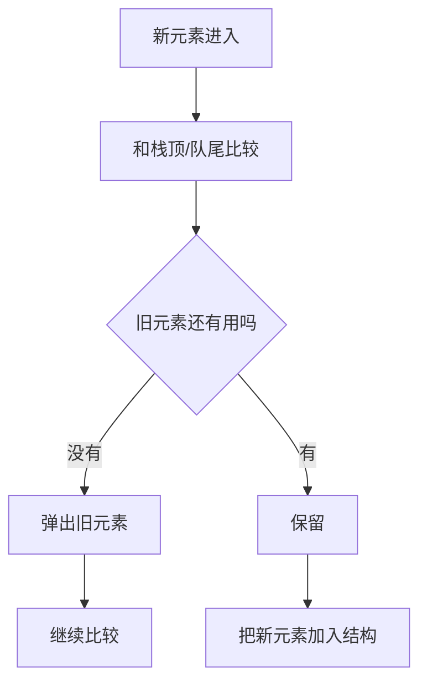

这就是“单调”两个字的真正意义：

- 栈或队列中的元素按照某种顺序保持单调
- 一旦新元素更优，旧元素就可以淘汰

---

## 二、单调栈：处理最近更大 / 更小元素

单调栈最常见的用途是：

- 下一个更大元素
- 下一个更小元素
- 左边第一个更大 / 更小元素
- 柱状图面积

### 以“下一个更大元素”为例

维护一个**递减栈**：

- 栈内从栈底到栈顶递减
- 当新元素更大时，说明它就是栈顶元素的“下一个更大值”

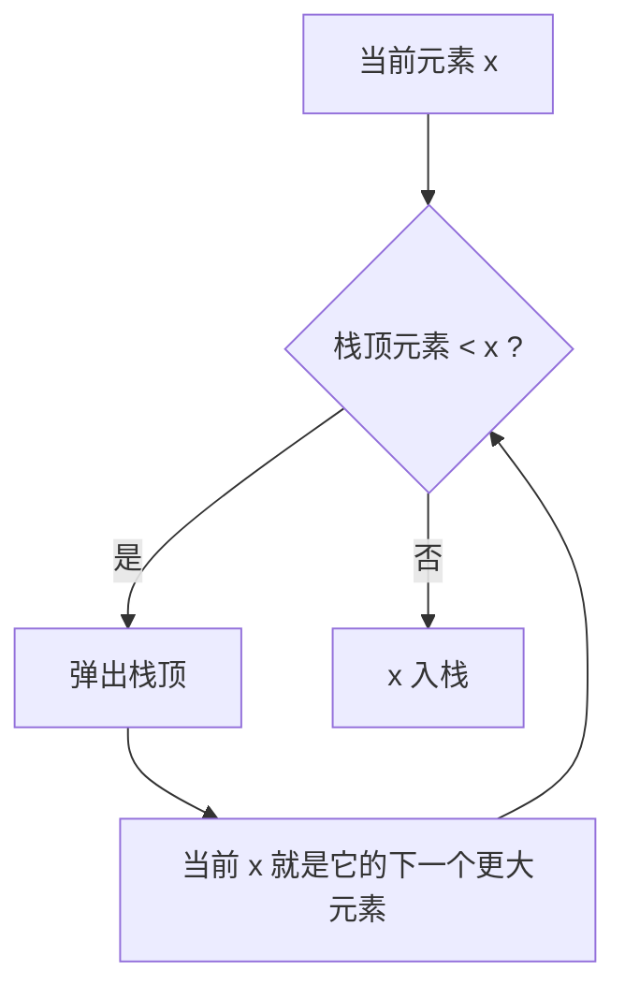

---

## 三、单调队列：处理滑动窗口最值

单调队列最经典的用途是滑动窗口最大值 / 最小值。

核心思想：

- 队列里存的是“可能成为窗口最值”的下标
- 队头永远是当前窗口答案

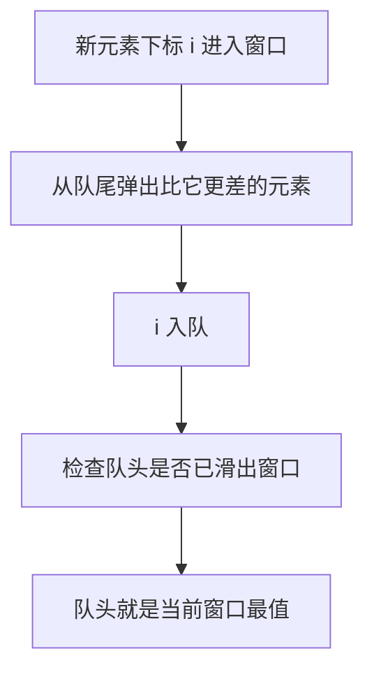

为什么通常存下标而不是值？

因为窗口会移动，你必须知道某个元素有没有过期。

---

## 四、为什么“旧元素可以放心弹掉”

这一步是理解单调结构的关键。

### 单调栈

如果当前元素已经比栈顶更优，那么栈顶以后再也不可能成为当前方向上的答案。

### 单调队列

如果一个更大的新元素进入窗口，那么队尾更小的旧元素只会更早过期、值还更差，因此没有保留意义。

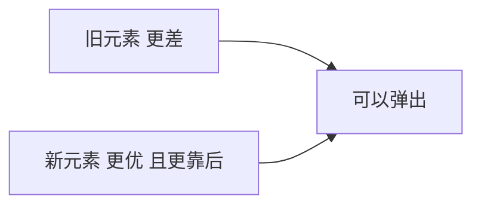

---

## 五、4 道 LeetCode 题目打通单调结构专题

## 1）LeetCode 496. 下一个更大元素 I

题型定位：单调栈基础题。

```java
class Solution {
    public int[] nextGreaterElement(int[] nums1, int[] nums2) {
        Map<Integer, Integer> map = new HashMap<>();
        Deque<Integer> stack = new ArrayDeque<>();

        for (int num : nums2) {
            while (!stack.isEmpty() && stack.peek() < num) {
                map.put(stack.pop(), num);
            }
            stack.push(num);
        }

        int[] res = new int[nums1.length];
        for (int i = 0; i < nums1.length; i++) {
            res[i] = map.getOrDefault(nums1[i], -1);
        }
        return res;
    }
}
```

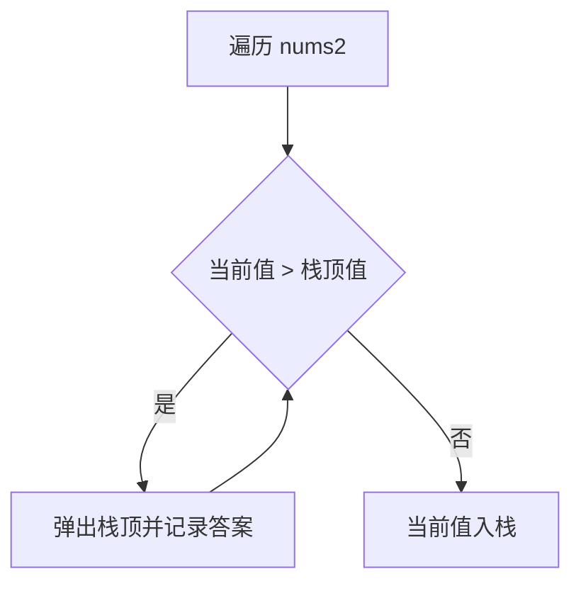

这题练的是：

- 单调栈维护逻辑
- 为什么弹出时可以立即确定答案

## 2）LeetCode 739. 每日温度

题型定位：单调栈 + 下标。

```java
class Solution {
    public int[] dailyTemperatures(int[] temperatures) {
        int n = temperatures.length;
        int[] res = new int[n];
        Deque<Integer> stack = new ArrayDeque<>();

        for (int i = 0; i < n; i++) {
            while (!stack.isEmpty() && temperatures[stack.peek()] < temperatures[i]) {
                int idx = stack.pop();
                res[idx] = i - idx;
            }
            stack.push(i);
        }
        return res;
    }
}
```

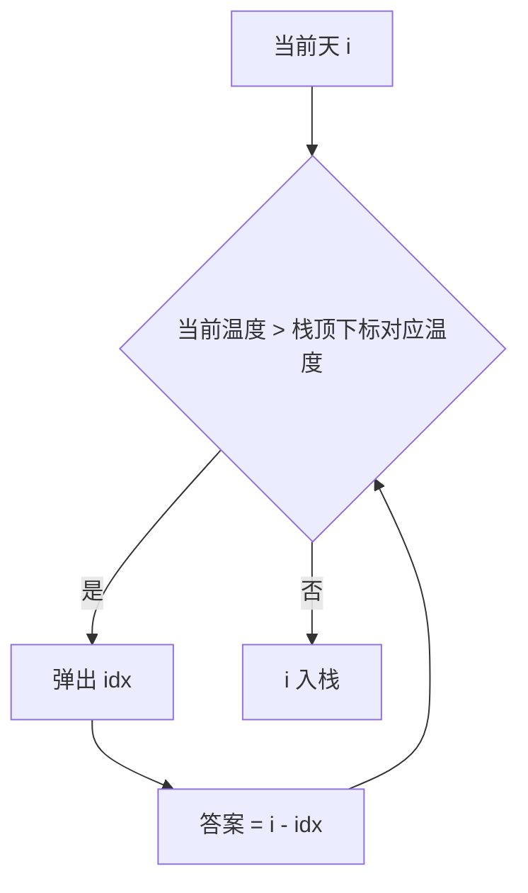

这题训练的是：

- 为什么栈里要放下标
- 距离类问题如何由下标差得到答案

## 3）LeetCode 84. 柱状图中最大的矩形

题型定位：单调栈进阶题。

核心：当某根柱子出栈时，说明它左右两侧第一个更小元素已经确定，于是可以计算以它为高的最大矩形面积。

```java
class Solution {
    public int largestRectangleArea(int[] heights) {
        int n = heights.length;
        int[] newHeights = new int[n + 2];
        System.arraycopy(heights, 0, newHeights, 1, n);
        Deque<Integer> stack = new ArrayDeque<>();
        int ans = 0;

        for (int i = 0; i < newHeights.length; i++) {
            while (!stack.isEmpty() && newHeights[stack.peek()] > newHeights[i]) {
                int h = newHeights[stack.pop()];
                int left = stack.peek();
                int width = i - left - 1;
                ans = Math.max(ans, h * width);
            }
            stack.push(i);
        }
        return ans;
    }
}
```

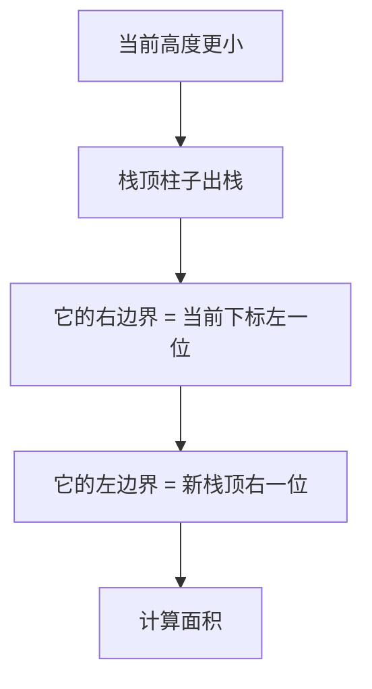

这题训练的是：

- 单调栈不只是找下一个更大元素
- 出栈时机就是答案确定时机

## 4）LeetCode 239. 滑动窗口最大值

题型定位：单调队列。

```java
class Solution {
    public int[] maxSlidingWindow(int[] nums, int k) {
        Deque<Integer> deque = new ArrayDeque<>();
        int[] res = new int[nums.length - k + 1];
        int idx = 0;

        for (int i = 0; i < nums.length; i++) {
            while (!deque.isEmpty() && nums[deque.peekLast()] <= nums[i]) {
                deque.pollLast();
            }
            deque.offerLast(i);

            if (deque.peekFirst() <= i - k) {
                deque.pollFirst();
            }

            if (i >= k - 1) {
                res[idx++] = nums[deque.peekFirst()];
            }
        }
        return res;
    }
}
```

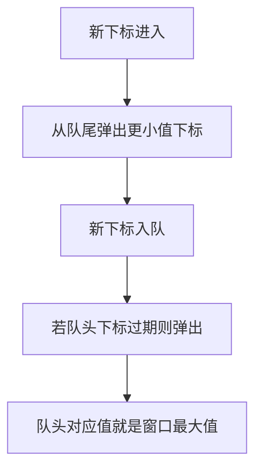

这题训练的是：

- 单调队列维护窗口最大值
- 为什么要同时处理“更差元素淘汰”和“过期元素淘汰”

---

## 六、单调栈和单调队列怎么快速判断

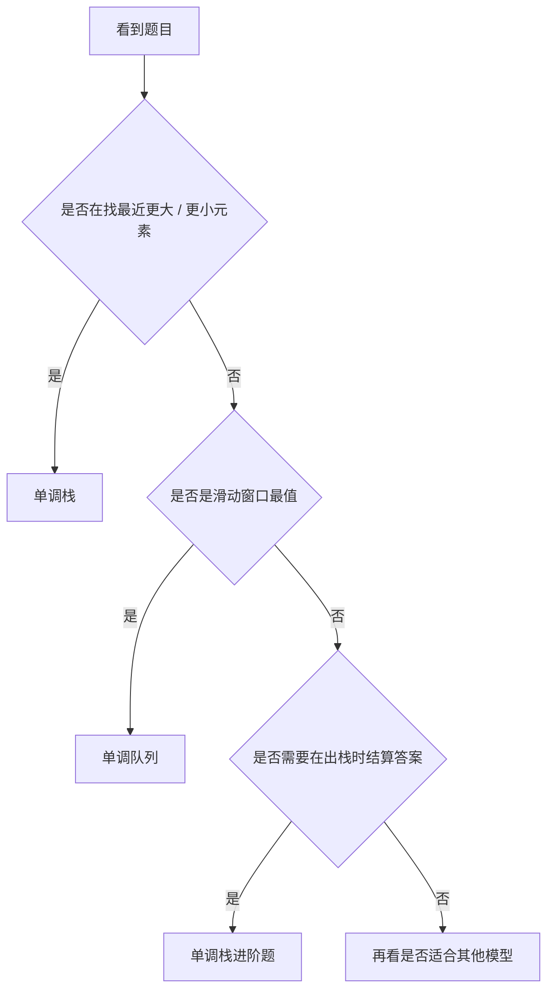

---

## 七、单调结构常见错误

## 1）分不清维护递增还是递减

这取决于你要找“更大”还是“更小”。

## 2）该存下标却只存值

涉及距离或窗口过期时，通常必须存下标。

## 3）弹出条件写反

单调结构的核心就在比较条件，一旦反了，整题都会错。

## 4）窗口过期条件写错

滑动窗口题必须判断队头下标是否已经离开窗口。

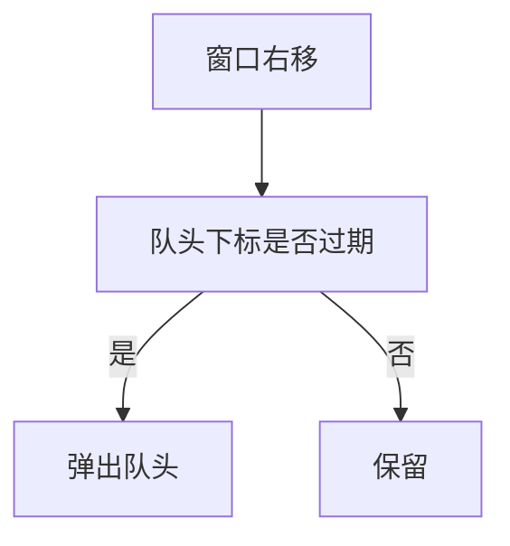

---

## 八、单调结构知识卡片

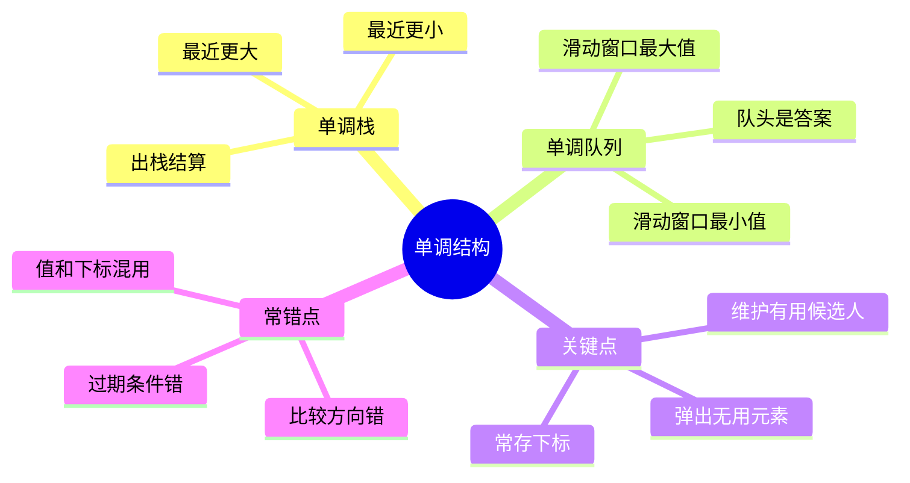

复习版要点：

- 单调结构的本质是“保留有用候选人”
- 最近更大 / 更小元素，优先想到单调栈
- 滑动窗口最值，优先想到单调队列
- 距离和过期问题通常都要存下标
- 弹出条件和维护顺序是整题核心

---

## 九、最后总结

如果只记一句话，请记这个：

**单调栈和单调队列，不是在机械维护顺序，而是在主动淘汰未来不可能有用的元素。**

做题时先判断：

- 我要找的是最近更大 / 更小，还是窗口最值
- 结构里该存值还是存下标
- 元素什么时候应该被弹掉

把这篇里的 4 道题做透，单调结构题的主干套路就基本建立起来了。
