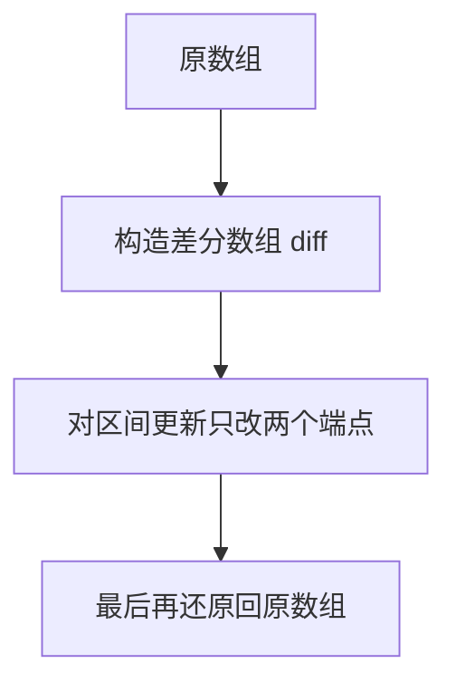
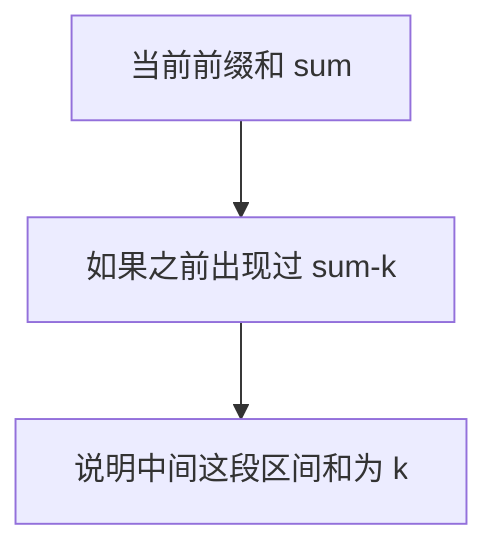
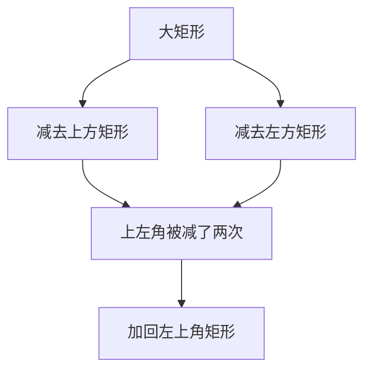
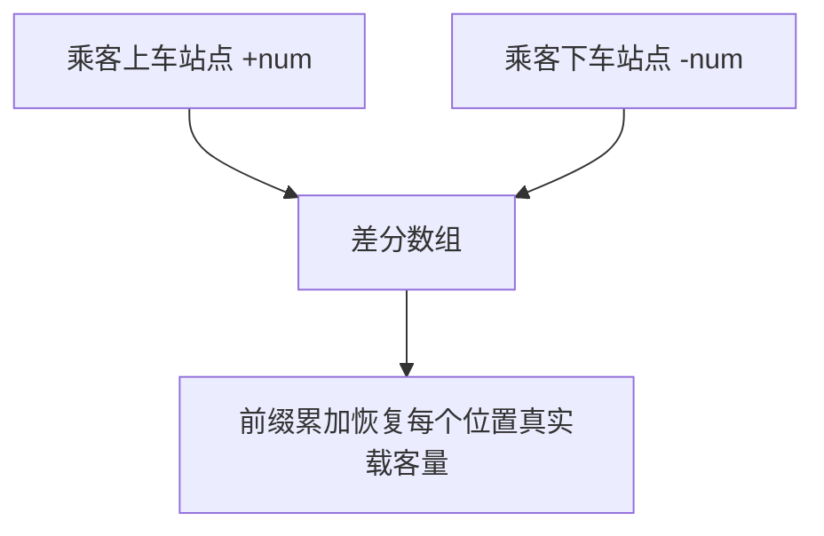
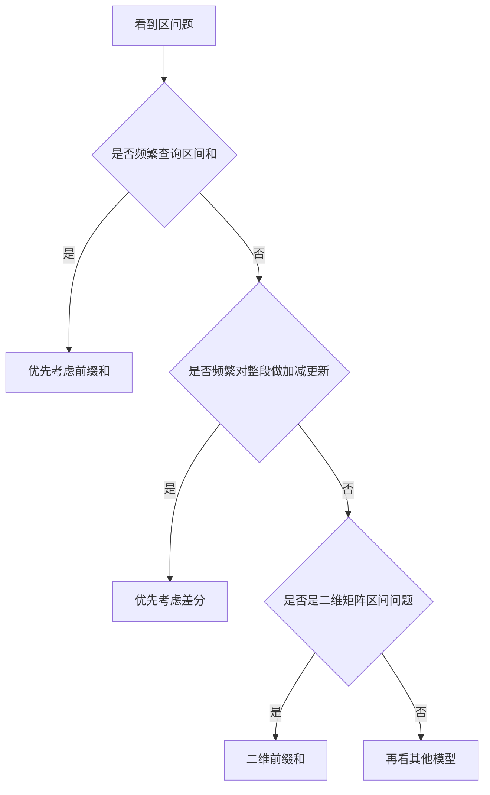
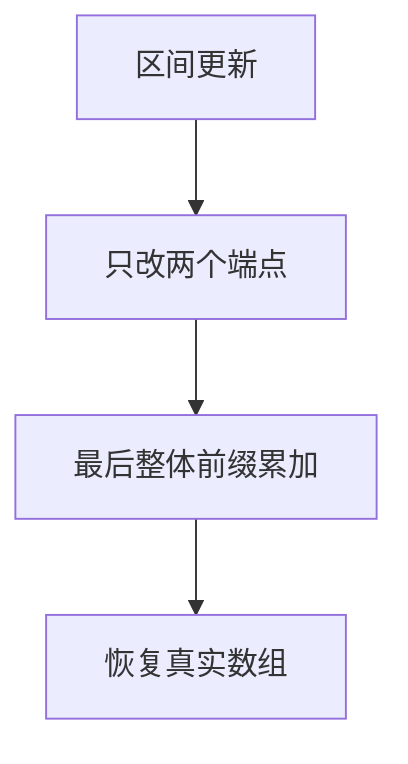
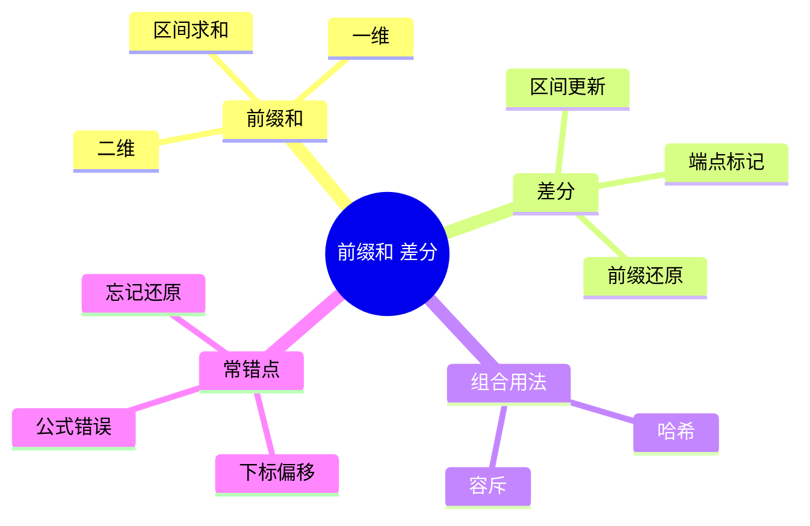

前缀和和差分是那种“公式不复杂，但一旦掌握就能大幅降维打击区间题”的专题。

它们的价值在于：

- 前缀和把区间求和从 O(n) 降到 O(1)
- 差分把区间更新从 O(n) 降到 O(1)

这篇文章继续用 Mermaid 图解的方式，把前缀和和差分的核心思维讲清楚，再用 4 道 LeetCode 题把一维、二维和区间更新模型串起来。

> 学习目标：
> 1. 理解前缀和的本质：预处理累积信息。
> 2. 理解差分的本质：把区间更新转成端点更新。
> 3. 掌握一维和二维前缀和的常见写法。
> 4. 用 4 道 LeetCode 题覆盖前缀和/差分高频模型。
> 5. 用一张知识卡片形成区间题的判断框架。

---

## 一、前缀和的本质：提前把累积结果算好

如果你频繁被问：

> 区间 `[l, r]` 的和是多少？

最直接的想法是每次都循环累加，但这样会重复计算很多次。

前缀和的思路是：

```mermaid
flowchart TD
    A[原数组] --> B[预处理前缀和]
    B --> C[区间和 = prefix[r] - prefix[l-1]]
```

也就是：

- `prefix[i]` 表示前 `i` 个元素的累计和

这样区间和就能常数时间求出。

---

## 二、差分的本质：把整段修改变成端点标记

如果你频繁被问：

> 把区间 `[l, r]` 所有元素都加上 `x`

直接更新整段会很慢。

差分的思路是：



区间 `[l, r]` 加 `x` 的操作变成：

- `diff[l] += x`
- `diff[r + 1] -= x`

最后做一遍前缀和还原即可。

---

## 三、前缀和和差分其实是一对“正反操作”


可以这样理解：

- 前缀和：从原数组得到累积数组
- 差分：从变化量角度描述数组更新

一个负责高效查询，一个负责高效更新。

---

## 四、4 道 LeetCode 题目打通前缀和 / 差分专题

## 1）LeetCode 303. 区域和检索 - 数组不可变

题型定位：一维前缀和基础。

```cpp
class NumArray {
public:
    vector<int> prefix;

    explicit NumArray(vector<int>& nums) : prefix(nums.size() + 1, 0) {
        for (int i = 0; i < static_cast<int>(nums.size()); ++i) {
            prefix[i + 1] = prefix[i] + nums[i];
        }
    }

    int sumRange(int left, int right) {
        return prefix[right + 1] - prefix[left];
    }
};
```

```mermaid
flowchart TD
    A[prefix[left]] --> C[区间和]
    B[prefix[right+1]] --> C
```

这题练的是：

- 前缀和数组定义
- 为什么多开一位能统一边界

## 2）LeetCode 560. 和为 K 的子数组

题型定位：前缀和 + 哈希。

```cpp
class Solution {
public:
    int subarraySum(vector<int>& nums, int k) {
        unordered_map<int, int> cnt;
        cnt[0] = 1;
        int sum = 0, ans = 0;
        for (int num : nums) {
            sum += num;
            if (cnt.count(sum - k)) ans += cnt[sum - k];
            ++cnt[sum];
        }
        return ans;
    }
};
```



这题训练的是：

- 前缀和不只是求区间和
- 还可以结合哈希统计区间个数

## 3）LeetCode 304. 二维区域和检索 - 矩阵不可变

题型定位：二维前缀和。

二维前缀和公式核心是：

```text
sum(x1,y1,x2,y2)
= pre[x2][y2]
- pre[x1-1][y2]
- pre[x2][y1-1]
+ pre[x1-1][y1-1]
```



这题训练的是：

- 二维前缀和容斥思想

## 4）LeetCode 1094. 拼车

题型定位：差分数组。

```cpp
class Solution {
public:
    bool carPooling(vector<vector<int>>& trips, int capacity) {
        vector<int> diff(1001, 0);
        for (const auto& trip : trips) {
            int num = trip[0], from = trip[1], to = trip[2];
            diff[from] += num;
            diff[to] -= num;
        }
        int cur = 0;
        for (int x : diff) {
            cur += x;
            if (cur > capacity) return false;
        }
        return true;
    }
};
```



这题最重要的是理解：

- 区间人数变化不是逐站更新
- 而是用两个端点标记变化

---

## 五、前缀和 / 差分题怎么快速判断



---

## 六、前缀和 / 差分常见错误

## 1）前缀和下标偏移写错

很多人忘了 `prefix` 往往多开一位。

## 2）区间公式左右端点混乱

特别是一维 `[l, r]` 和二维容斥公式。

## 3）差分更新忘记处理 `r+1`

这是差分最常见错误。

## 4）差分做完忘了还原

差分数组本身不是答案，必须前缀累加恢复。



---

## 七、前缀和 / 差分知识卡片



复习版要点：

- 前缀和适合高频区间查询
- 差分适合高频区间更新
- 二维前缀和核心是容斥
- 差分更新只改端点，最后统一还原
- 这类题最怕公式和下标偏移写错

---

## 八、最后总结

如果只记一句话，请记这个：

**前缀和负责“快查”，差分负责“快改”。**

做题时先判断：

- 我是要频繁查询区间结果
- 还是要频繁修改整段区间
- 是一维问题还是二维问题

把这篇里的 4 道题做透，区间题会清晰很多。
