很多人学递归，问题不在代码，而在脑中没有结构图。

你知道递归是“函数调用自己”，也知道分治是“分解、解决、合并”，但做题还是容易乱，原因通常是这几点没想清：

- 当前层到底做什么
- 子问题是如何缩小的
- 返回值如何沿调用栈回传
- 分治中的“合并”到底在合并什么

这篇文章直接用 Mermaid 图把这些画出来，并用 4 道 LeetCode 题把核心考点串起来。

> 学习目标：
> 1. 掌握递归三要素与调用栈机制。
> 2. 理解分治算法的“分解-解决-合并”范式。
> 3. 掌握递归转迭代的本质与尾递归优化原理。
> 4. 做透 4 道 LeetCode 题，覆盖递归与分治核心题型。
> 5. 用一张递归栈帧知识卡片复习内存布局与性能影响。

---

## 一、递归的本质：问题规模缩小

递归真正的重点不是“自己调自己”，而是：

**把原问题改写成更小规模的同类问题。**

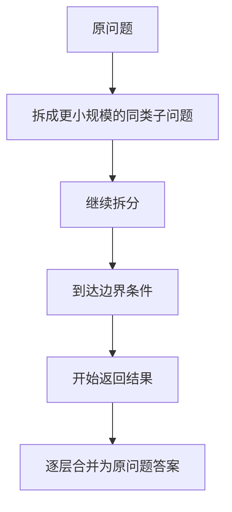

例如：

- 阶乘：`n! = n * (n - 1)!`
- 树高：`depth(root) = max(depth(left), depth(right)) + 1`
- 归并排序：先排左边，再排右边，最后合并

如果一个问题没有这种“同类缩小”的结构，强行递归往往只会把代码写复杂。

---

## 二、递归三要素

递归是否写得稳，取决于三件事是否同时清楚。

### 1. 终止条件

没有终止条件，递归就不会停。

```cpp
int factorial(int n) {
    if (n == 0) return 1;
    return n * factorial(n - 1);
}
```

### 2. 当前层任务

递归的核心思维是：

**当前层只处理当前层，剩下的交给下一层。**

### 3. 返回关系

要明确子问题的结果如何回到当前层，再组成最终答案。

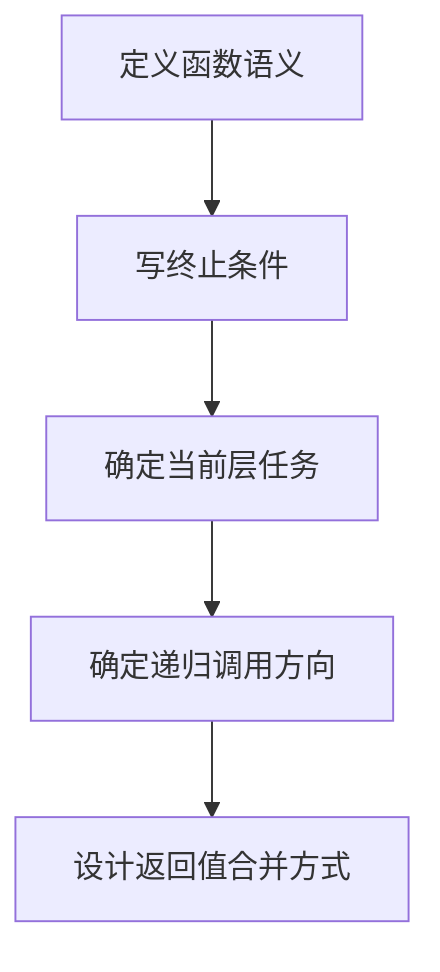

一个常见错误是上来就写调用，而不是先定义函数到底“表示什么”。

---

## 三、调用栈机制：递归为什么能工作

递归依赖的是系统调用栈。每调用一次函数，都会创建一个新的栈帧，保存：

- 参数
- 局部变量
- 返回地址
- 临时状态

以 `factorial(4)` 为例。

### 1. 向下调用

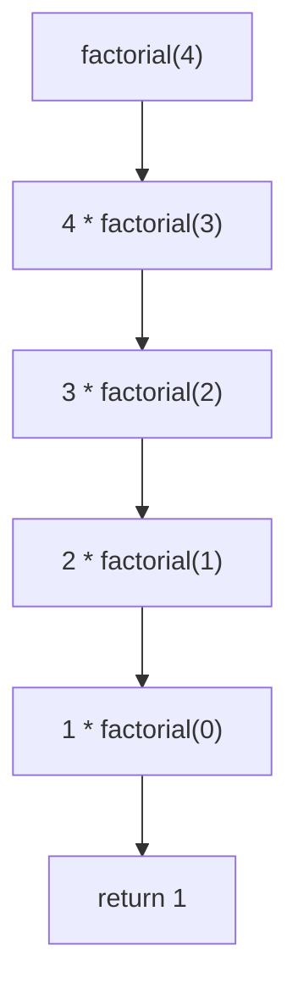

### 2. 压栈过程

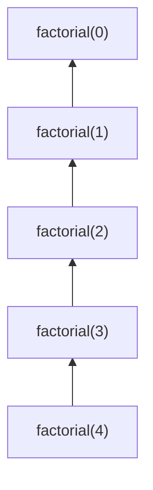

### 3. 回栈过程

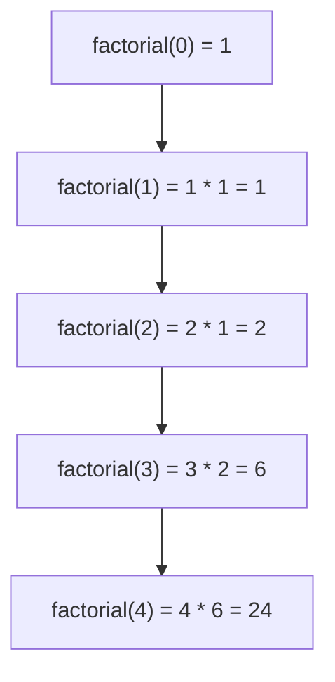

这也是为什么递归天然适合：

- 树形结构
- 分叉结构
- 后序汇总结果

同时也解释了为什么递归会占额外栈空间。

---

## 四、什么时候适合用递归

看到题目时，可以先过一遍这个判断流程。

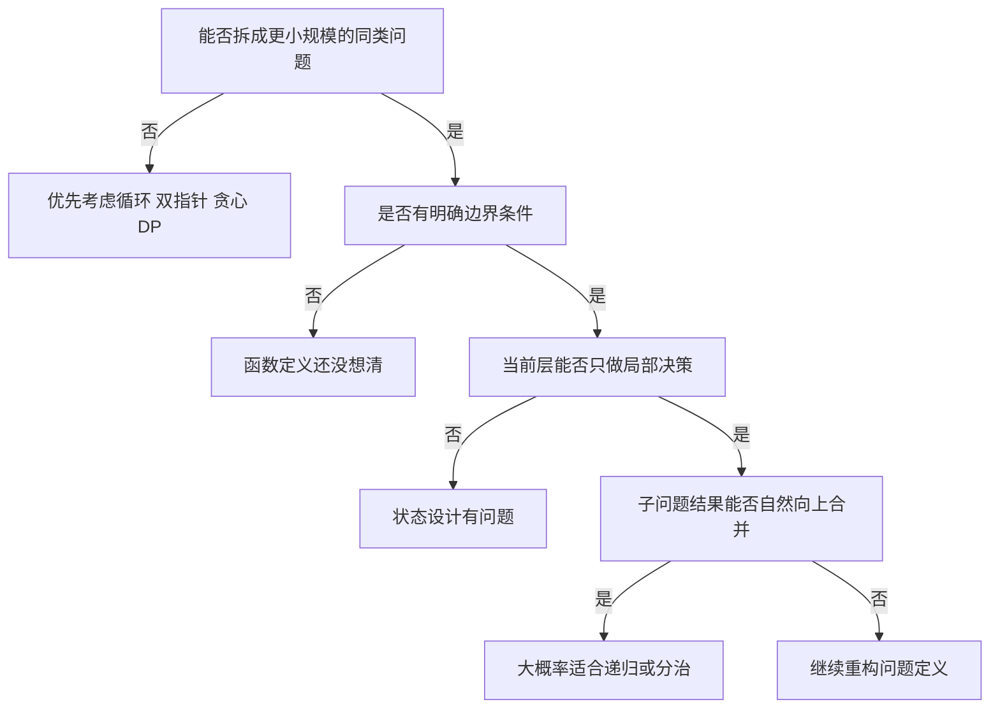

---

## 五、分治算法：分解、解决、合并

分治是比递归更高一层的算法思想。它的标准范式是：

1. 分解：拆成多个更小、相互独立的子问题。
2. 解决：递归求解子问题。
3. 合并：把子问题结果组合为原问题答案。

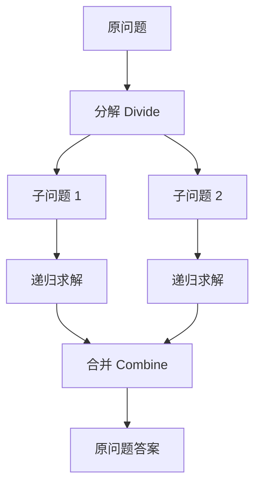

要注意：

- 递归是实现形式
- 分治是解题思想

所以：

- 阶乘是递归，但不是典型分治
- 归并排序是典型分治，也通常用递归实现

---

## 六、归并排序：最标准的分治模板

归并排序几乎是理解分治最好的例子。

### 拆分过程

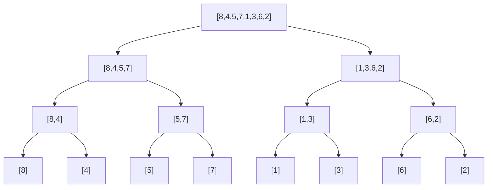

### 合并过程

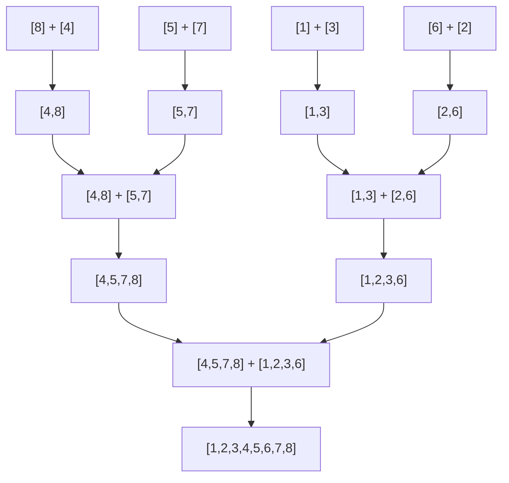

```cpp
void mergeSort(vector<int>& nums, int left, int right, vector<int>& temp) {
    if (left >= right) return;
    int mid = left + (right - left) / 2;
    mergeSort(nums, left, mid, temp);
    mergeSort(nums, mid + 1, right, temp);
    merge(nums, left, mid, right, temp);
}
```

这题你要真正看到的是：

- 分解：一分为二
- 解决：左右分别递归
- 合并：两个有序段归并

---

## 七、递归转迭代：本质是手动维护栈

很多递归都可以改写成迭代。关键不是语法转换，而是：

**把系统自动维护的调用栈，改成你自己维护。**

### 二叉树前序遍历

递归版：

```cpp
void preorder(TreeNode* root) {
    if (root == nullptr) return;
    visit(root);
    preorder(root->left);
    preorder(root->right);
}
```

迭代版：

```cpp
void preorder(TreeNode* root) {
    if (root == nullptr) return;
    stack<TreeNode*> st;
    st.push(root);
    while (!st.empty()) {
        TreeNode* node = st.top(); st.pop();
        visit(node);
        if (node->right != nullptr) st.push(node->right);
        if (node->left != nullptr) st.push(node->left);
    }
}
```

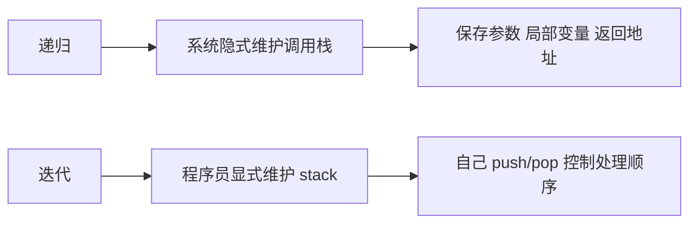

递归改迭代时，优先问自己两个问题：

1. 递归每层保存了哪些状态？
2. 这些状态能否用一个栈结构显式表示？

---

## 八、尾递归优化：理论与实践要分开看

尾递归指的是：

**函数最后一步就是递归调用自身。**

```cpp
int factorialTail(int n, int acc) {
    if (n == 0) return acc;
    return factorialTail(n - 1, acc * n);
}
```

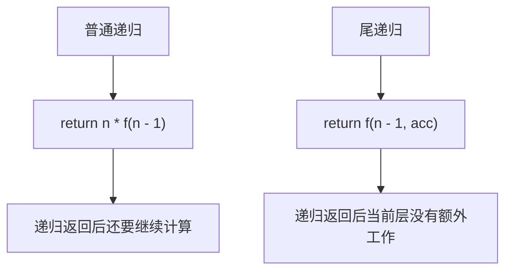

尾递归理论上更容易做尾调用优化，因为当前栈帧可以被复用。

但实践里要注意：

- 不是所有语言都保证 TCO
- 刷题时不要默认尾递归就不会爆栈

更稳妥的理解是：

**尾递归是一种更容易转换成迭代的递归形式。**

---

## 九、4 道 LeetCode 题目打通核心考点

## 1）LeetCode 104. 二叉树的最大深度

题型定位：树的递归定义。

```cpp
class Solution {
public:
    int maxDepth(TreeNode* root) {
        if (root == nullptr) return 0;
        return max(maxDepth(root->left), maxDepth(root->right)) + 1;
    }
};
```

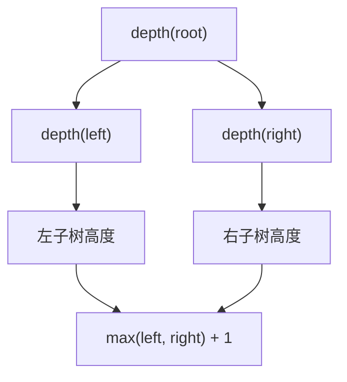

这题练的是：

- 函数定义
- 终止条件
- 子问题结果如何向上合并

## 2）LeetCode 206. 反转链表

题型定位：线性结构递归。

```cpp
class Solution {
public:
    ListNode* reverseList(ListNode* head) {
        if (head == nullptr || head->next == nullptr) return head;
        ListNode* newHead = reverseList(head->next);
        head->next->next = head;
        head->next = nullptr;
        return newHead;
    }
};
```

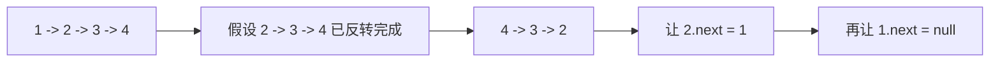

这题重点不在代码量，而在于是否想清楚：

- 子问题返回值是什么
- 当前节点如何接回去

## 3）LeetCode 21. 合并两个有序链表

题型定位：用递归定义问题结构。

```cpp
class Solution {
public:
    ListNode* mergeTwoLists(ListNode* list1, ListNode* list2) {
        if (list1 == nullptr) return list2;
        if (list2 == nullptr) return list1;
        if (list1->val < list2->val) {
            list1->next = mergeTwoLists(list1->next, list2);
            return list1;
        }
        list2->next = mergeTwoLists(list1, list2->next);
        return list2;
    }
};
```

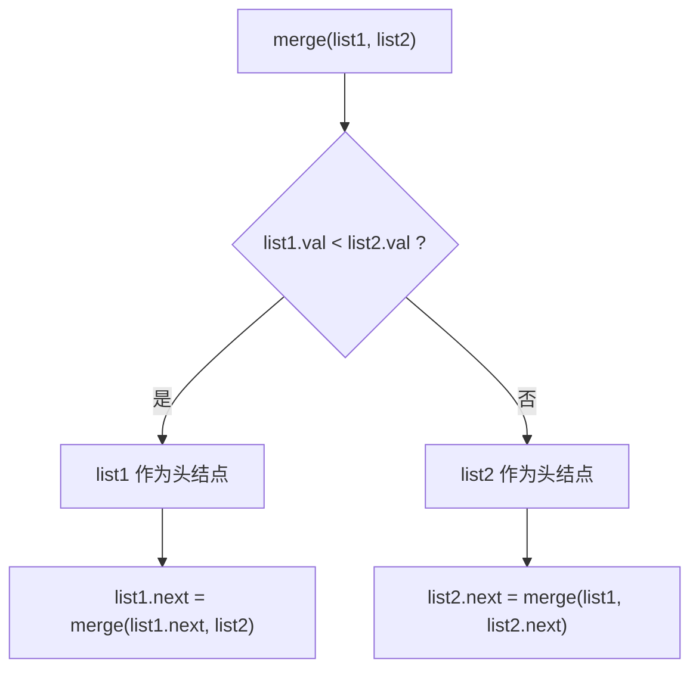

这题训练的是：

- “当前节点 + 剩余问题”的递归建模能力

## 4）LeetCode 169. 多数元素

题型定位：分治。

```cpp
class Solution {
public:
    int majorityElement(vector<int>& nums) {
        return divide(nums, 0, static_cast<int>(nums.size()) - 1);
    }

private:
    int divide(vector<int>& nums, int left, int right) {
        if (left == right) return nums[left];
        int mid = left + (right - left) / 2;
        int leftMajor = divide(nums, left, mid);
        int rightMajor = divide(nums, mid + 1, right);
        if (leftMajor == rightMajor) return leftMajor;
        int leftCount = count(nums, leftMajor, left, right);
        int rightCount = count(nums, rightMajor, left, right);
        return leftCount > rightCount ? leftMajor : rightMajor;
    }

    int count(const vector<int>& nums, int target, int left, int right) {
        int cnt = 0;
        for (int i = left; i <= right; ++i) {
            if (nums[i] == target) ++cnt;
        }
        return cnt;
    }
};
```

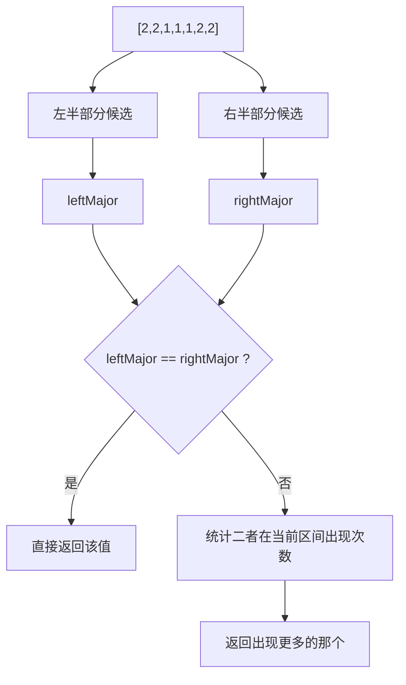

这题最适合用来理解：

- 分治不只是排序
- 合并阶段有时是比较候选答案，而不是拼接结构

---

## 十、递归常见错误

## 1）只会调用，不会定义函数含义

先定义函数返回什么，再写递归关系。

## 2）终止条件不完整

树题、链表题最常见的是漏掉 `null`。

## 3）重复子问题太多

例如裸递归斐波那契：

```cpp
int fib(int n) {
    if (n <= 1) return n;
    return fib(n - 1) + fib(n - 2);
}
```

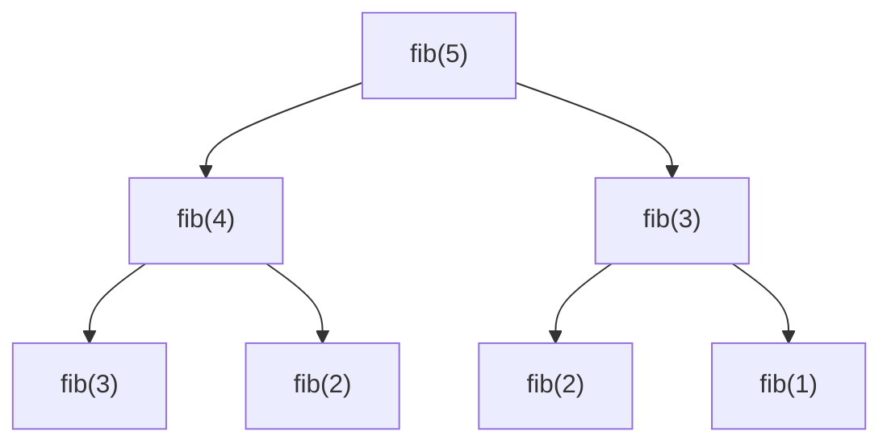

你会发现 `fib(3)`、`fib(2)` 被大量重复计算。这时应该考虑：

- 记忆化搜索
- 动态规划
- 迭代优化

## 4）误以为递归一定优雅、一定高效

递归很适合表达结构，但在工程里如果深度不可控，优先考虑迭代更稳。

---

## 十一、递归栈帧知识卡片

下面这张卡片适合单独复习。

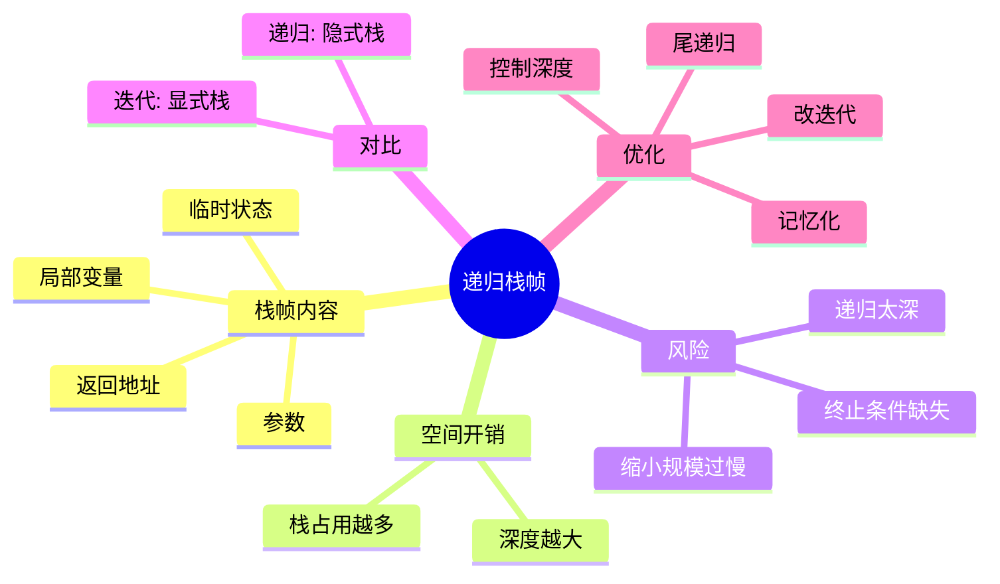

复习版要点：

- 一次函数调用对应一个栈帧
- 递归层数越深，栈空间越大
- 没有出口或深度太深，容易栈溢出
- 递归是系统隐式维护栈，迭代是程序员显式维护栈
- 尾递归理论上更容易优化，但不应默认一定生效

---

## 十二、最后总结

如果只记一句话，请记这个：

**递归是“定义问题”的能力，分治是“拆解问题”的能力。**

刷题时真正需要训练的是：

- 能不能把问题定义成更小规模的同类问题
- 能不能准确写出边界条件
- 能不能说清楚当前层做什么
- 能不能把子问题的结果向上合并

把这篇里的 4 道题真正做透，再把“递归栈帧知识卡片”反复复习，递归与分治这一专题就算真正入门了。
