字符串题表面上看像“细节题”，实际上是算法面试里的绝对高频。

它们真正考的通常不是字符串 API，而是：

- 双指针怎么移动
- 窗口什么时候扩、什么时候缩
- 子串和子序列有什么区别
- 如何把字符问题转成计数、下标和区间问题

这篇文章继续用 Mermaid 图解的方式，把字符串题中最常见的双指针、滑动窗口、回文和计数模型讲清楚，再用 4 道 LeetCode 题把高频套路串起来。

> 学习目标：
> 1. 理解字符串题的常见建模方式。
> 2. 掌握双指针和滑动窗口的核心逻辑。
> 3. 理解子串、子序列、回文问题的区别。
> 4. 用 4 道 LeetCode 题覆盖字符串高频模型。
> 5. 用一张知识卡片形成字符串题的判断框架。

---

## 一、字符串题的本质：在字符序列上做区间和状态管理

字符串本质上是字符数组，因此很多题的核心不是“字符串”，而是：

- 区间 `[l, r]`
- 计数表
- 匹配关系
- 顺序约束

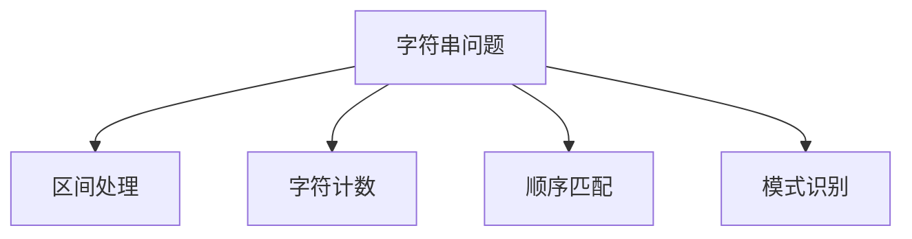

所以字符串题很常见的第一反应应该是：

- 双指针
- 滑动窗口
- 哈希计数
- 动态规划

---

## 二、双指针：维护两个边界

双指针最常见的形式有两类：

- 左右夹逼
- 同向滑动

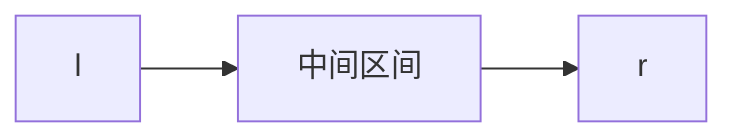

### 左右夹逼

适合：

- 回文判断
- 有序数组两端逼近

### 同向双指针

适合：

- 去重
- 原地压缩
- 滑动窗口

---

## 三、滑动窗口：可变长度区间的统一模型

滑动窗口本质是：

**维护一个满足某种条件的连续子串区间。**

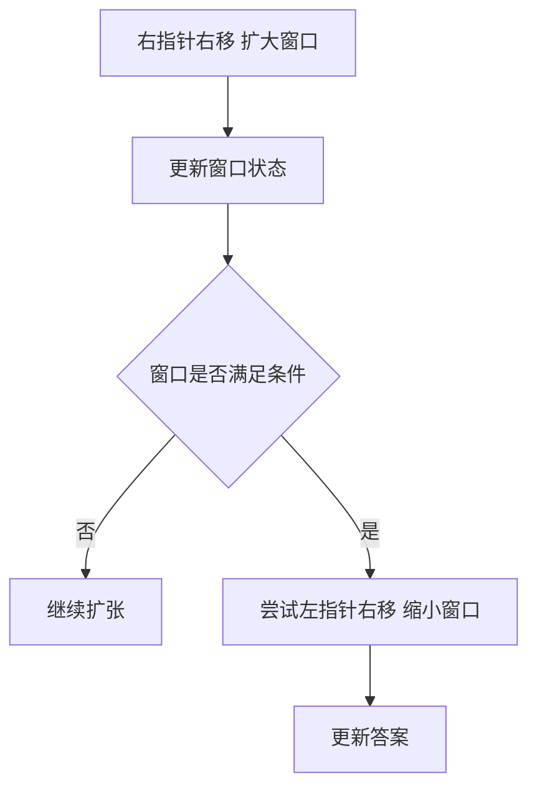

这类题的关键不是模板，而是两件事：

- 窗口状态用什么维护
- 什么时候应该收缩左边界

---

## 四、子串、子序列、回文，容易混但其实不同

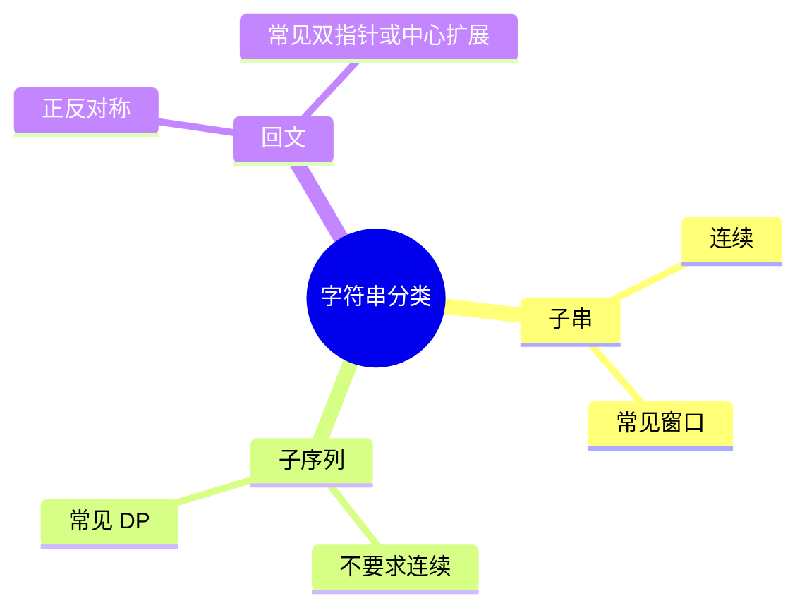

### 子串

必须连续。

### 子序列

不要求连续，只要求相对顺序不变。

### 回文

关注正反是否一致。

你先分清这三类，很多题型判断会快很多。

---

## 五、4 道 LeetCode 题目打通字符串专题

## 1）LeetCode 125. 验证回文串

题型定位：左右双指针。

```java
class Solution {
    public boolean isPalindrome(String s) {
        int l = 0, r = s.length() - 1;
        while (l < r) {
            while (l < r && !Character.isLetterOrDigit(s.charAt(l))) l++;
            while (l < r && !Character.isLetterOrDigit(s.charAt(r))) r--;
            if (Character.toLowerCase(s.charAt(l)) != Character.toLowerCase(s.charAt(r))) {
                return false;
            }
            l++;
            r--;
        }
        return true;
    }
}
```

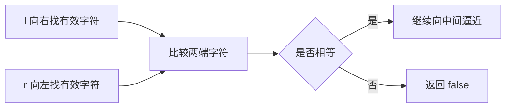

这题练的是：

- 左右双指针
- 非字母数字过滤

## 2）LeetCode 3. 无重复字符的最长子串

题型定位：滑动窗口。

```java
class Solution {
    public int lengthOfLongestSubstring(String s) {
        Set<Character> set = new HashSet<>();
        int l = 0, ans = 0;

        for (int r = 0; r < s.length(); r++) {
            while (set.contains(s.charAt(r))) {
                set.remove(s.charAt(l++));
            }
            set.add(s.charAt(r));
            ans = Math.max(ans, r - l + 1);
        }
        return ans;
    }
}
```

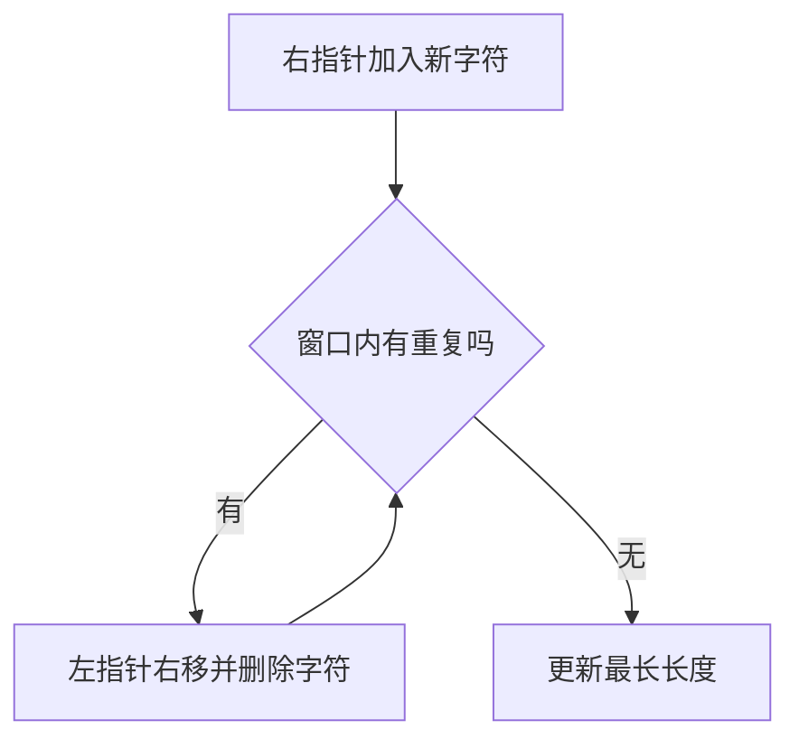

这题训练的是：

- 窗口状态维护
- 什么时候扩、什么时候缩

## 3）LeetCode 438. 找到字符串中所有字母异位词

题型定位：固定长度滑动窗口。

```java
class Solution {
    public List<Integer> findAnagrams(String s, String p) {
        List<Integer> res = new ArrayList<>();
        if (s.length() < p.length()) return res;

        int[] need = new int[26];
        int[] win = new int[26];
        for (char c : p.toCharArray()) need[c - 'a']++;

        int k = p.length();
        for (int i = 0; i < s.length(); i++) {
            win[s.charAt(i) - 'a']++;
            if (i >= k) {
                win[s.charAt(i - k) - 'a']--;
            }
            if (Arrays.equals(need, win)) {
                res.add(i - k + 1);
            }
        }
        return res;
    }
}
```

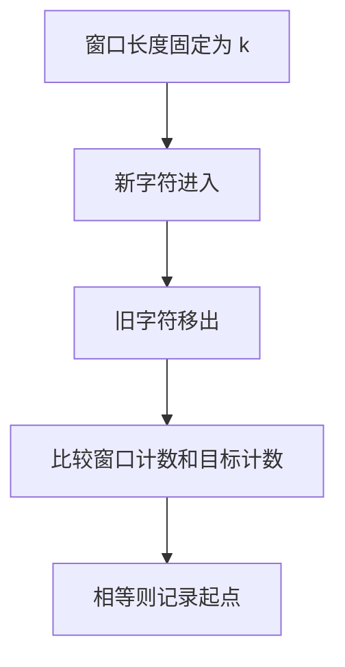

这题练的是：

- 固定窗口
- 计数数组建模

## 4）LeetCode 5. 最长回文子串

题型定位：中心扩展。

```java
class Solution {
    public String longestPalindrome(String s) {
        if (s == null || s.length() < 2) return s;
        int start = 0, maxLen = 1;

        for (int i = 0; i < s.length(); i++) {
            int len1 = expand(s, i, i);
            int len2 = expand(s, i, i + 1);
            int len = Math.max(len1, len2);
            if (len > maxLen) {
                maxLen = len;
                start = i - (len - 1) / 2;
            }
        }
        return s.substring(start, start + maxLen);
    }

    private int expand(String s, int l, int r) {
        while (l >= 0 && r < s.length() && s.charAt(l) == s.charAt(r)) {
            l--;
            r++;
        }
        return r - l - 1;
    }
}
```

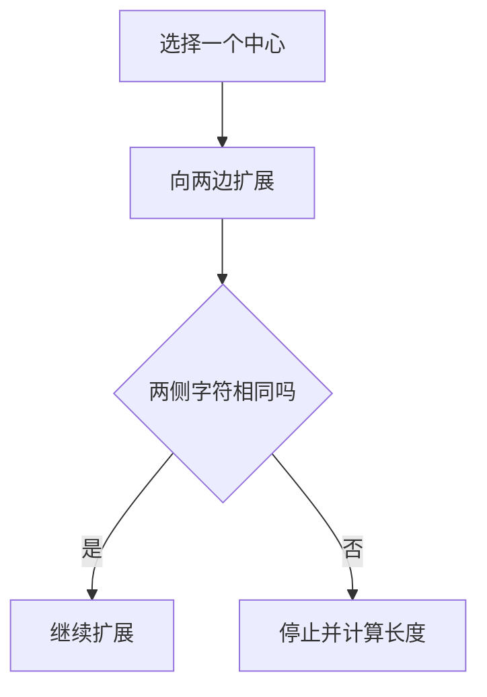

这题训练的是：

- 回文的中心性质
- 奇数长度和偶数长度中心

---

## 六、字符串题怎么快速判断模型

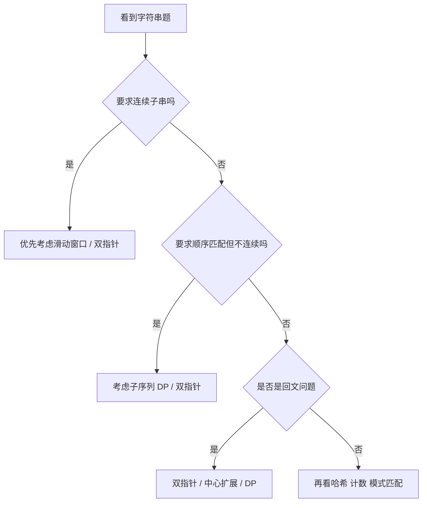

---

## 七、字符串常见错误

## 1）子串和子序列混淆

子串连续，子序列不连续。

## 2）窗口收缩条件写错

滑动窗口题，最容易错的就是“什么时候开始缩左边”。

## 3）字符大小写和非法字符没处理

尤其是回文串类题。

## 4）窗口状态更新顺序错

先加还是先删，会直接影响答案。

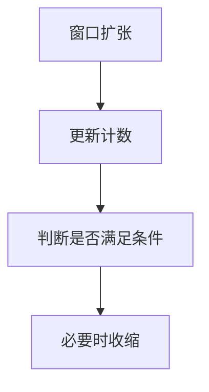

---

## 八、字符串知识卡片

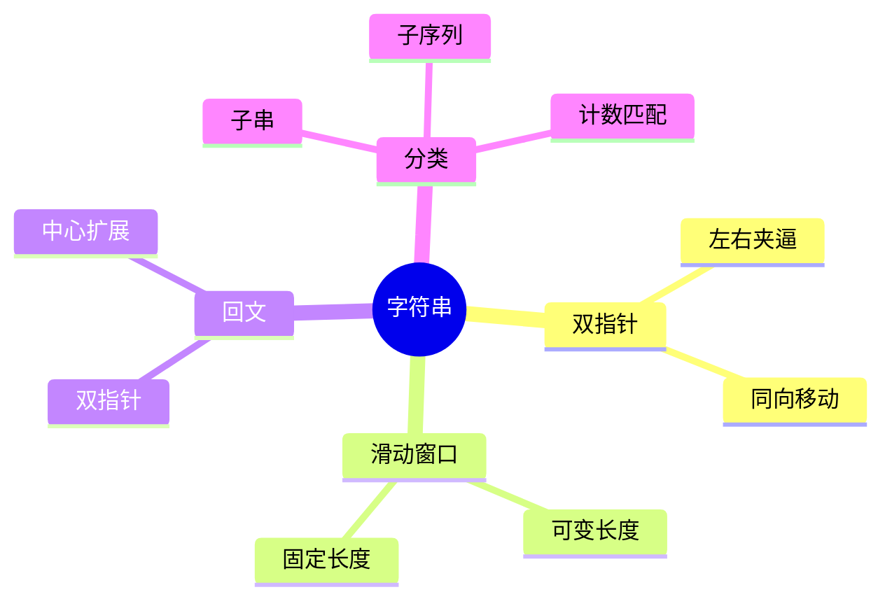

复习版要点：

- 字符串题常被转成区间、计数和顺序问题
- 连续子串优先想到滑动窗口
- 回文问题优先想到双指针或中心扩展
- 固定窗口常用计数数组
- 先分清子串、子序列、回文三类题

---

## 九、最后总结

如果只记一句话，请记这个：

**字符串题的关键，不是字符本身，而是“区间、计数和顺序”怎么维护。**

做题时先判断：

- 是连续子串还是非连续子序列
- 是窗口问题还是回文问题
- 窗口状态该用什么维护

把这篇里的 4 道题做透，字符串高频题型就会非常稳。
