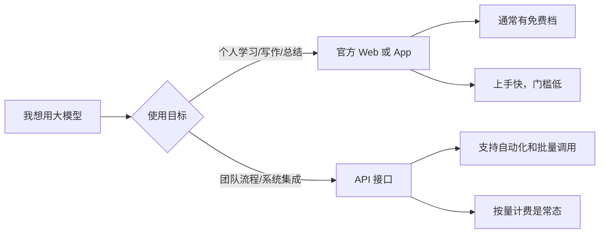
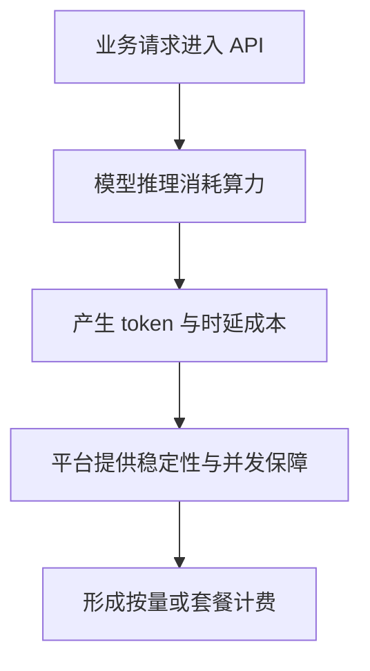
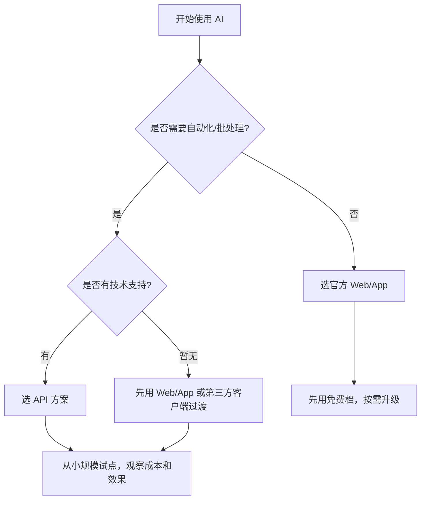

很多人第一次接触大模型（LLM）时，都会有几个非常实际的问题：

- “我只是想写写文案、查查资料，怎么开始最省钱？”
- “为什么官网网页和手机 App 看起来能免费用，但 API 一接入就收费？”
- “现在到底有哪些常见厂商，分别适合什么人？”

这篇文章就用**尽量少术语、尽量讲人话**的方式，带你快速建立一套可执行的认知。

---

## 1. 先讲结论：普通用户最常见的 3 种使用方式

把大模型想象成“电力系统”，你有三种接电方式：

1. **官方 Web 页面**（浏览器打开就能聊）
2. **官方 App**（手机端直接用）
3. **API 接口**（给软件“接电”，让程序自动调用）

对于非程序员来说，前两种通常就够了：

- 上手快
- 学习成本低
- 很多厂商都有免费额度或免费档

而 API 更像“企业级用电”：

- 可批量
- 可自动化
- 可嵌入你自己的系统
- 但几乎都按量计费

### 1.1 三种方式一图看懂（Mermaid）

---

## 2. Web 与 App 为什么“基本免费”？

先明确一点：**“免费”通常指有免费档，不代表无限制、无门槛、无上限。**

常见的免费策略包括：

- 每天可用次数限制
- 高峰期排队或限速
- 部分高级模型只对付费会员开放
- 高级功能（更长上下文、联网增强、文件分析等）可能收费

那厂商为什么还愿意给免费档？

### 2.1 用户增长需要“低门槛入口”

Web 和 App 是最好的获客入口。先让你用起来，才有后续留存与转化。

### 2.2 免费档是“试用 + 教育市场”

大模型对很多人还是新工具，免费能降低尝试成本，培养使用习惯。

### 2.3 商业模式是“分层变现”

常见路径是：

- 免费用户：基础能力
- 会员用户：更快、更强、更稳定
- 企业/API 用户：按量或套餐付费

所以你看到“官网和 App 能免费”，本质上是产品增长策略，而不是算力没有成本。

### 2.4 免费档与付费档对比表

| 维度 | 免费档（常见） | 付费档（常见） |
|---|---|---|
| 使用次数 | 有每日/每月限制 | 更高额度或近似不限 |
| 响应速度 | 高峰期可能降速 | 一般更快更稳定 |
| 模型能力 | 基础或标准模型 | 高级模型优先可用 |
| 高级功能 | 可能受限 | 更完整（长上下文、文件分析等） |
| 适用人群 | 轻度、尝鲜用户 | 高频、专业或商业用户 |

---

## 3. API 为什么普遍收费？

一句话：**API 的价值在于可规模化调用，而规模化就意味着可量化成本。**

### 3.1 API 会被“程序自动高频调用”

Web/App 大多是人手动用，一次问一个问题；
API 可以每秒几十、几百次请求，这对算力消耗是指数级差异。

### 3.2 API 需要更明确的服务承诺

企业接入后，会关心：

- 稳定性（成功率、延迟）
- 并发能力
- 账单可追踪
- 权限与密钥管理

这些都需要更完整的基础设施和运维成本。

### 3.3 API 是“生产工具”，不是“体验工具”

Web/App 偏体验，API 偏生产。只要进入生产环节，计费几乎是行业共识。

### 3.4 API 计费逻辑示意图（Mermaid）

---

## 4. 非程序员怎么选：一张决策图就够了

如果你只想：

- 写作润色
- 总结资料
- 翻译改写
- 头脑风暴

👉 **优先选官方 Web 或 App 免费档**。

如果你需要：

- 把 AI 接进企业流程（客服、知识库、报表、审核）
- 批量处理文本
- 做自己的 AI 产品

👉 **才需要考虑 API**（通常需要技术同学或服务商协助）。

### 4.1 选型决策流程（Mermaid）

---

## 5. 常见大模型厂商（按“你可能见过”的维度整理）

> 说明：以下为常见厂商与产品方向梳理，不代表功能完全一致，实际以官方最新发布为准。

### 5.1 国际常见厂商（表格版）

| 厂商 | 代表产品 | 官方入口 | 特点（简要） |
|---|---|---|---|
| OpenAI | ChatGPT、GPT 系列 | https://openai.com/ | 生态成熟，开发资料丰富，用户基数大 |
| Anthropic | Claude 系列 | https://www.anthropic.com/ | 长文本与写作体验口碑较好 |
| Google | Gemini 系列 | https://gemini.google.com/ | 与 Google 生态结合紧密，多模态布局完整 |
| Meta | Llama 系列 | https://www.llama.com/ | 开源生态影响力大，二次开发活跃 |
| Mistral AI | Mistral 系列 | https://mistral.ai/ | 轻量与高效路线突出 |

### 5.2 国内常见厂商（附官方入口表格）

| 厂商 | 代表产品 | 官方入口 | 备注 |
|---|---|---|---|
| DeepSeek | DeepSeek 系列 | https://www.deepseek.com/ | 技术迭代快，关注度高 |
| 阿里云 | 通义千问 Qwen | https://tongyi.aliyun.com/ | 开发者入口：https://dashscope.aliyun.com/ |
| 百度 | 文心大模型 | https://yiyan.baidu.com/ | 搜索与内容生态基础深 |
| 字节跳动 | 豆包等 | https://www.doubao.com/ | 大众产品普及快 |
| 智谱 AI | GLM 系列 | https://www.zhipuai.cn/ | 开发者与企业场景活跃 |
| 月之暗面 | Kimi | https://kimi.moonshot.cn/ | 长文本阅读与整理知名 |
| 腾讯 | 混元 | https://hunyuan.tencent.com/ | ToB 生态推进较多 |
| 科大讯飞 | 讯飞星火 | https://xinghuo.xfyun.cn/ | 教育与办公场景结合深 |

### 5.3 常见“模型聚合平台”与“客户端工具”

除了直接在各家官网使用，你还可能会接触到第三方聚合平台和通用客户端。

| 工具 | 类型 | 官方入口 | 适合人群 | 使用建议 |
|---|---|---|---|---|
| 硅基流动（SiliconFlow） | 模型聚合/API 平台 | https://siliconflow.cn/ | 想一站式体验多家模型并测试 API 的用户 | 关注计费、模型版本、限流策略与数据合规 |
| Cherry Studio | 桌面 AI 客户端 | https://github.com/CherryHQ/cherry-studio | 希望统一管理多模型、多账号的进阶用户 | 妥善管理 API Key，优先处理非敏感内容 |

---

## 6. 给非程序员的实操建议：先“会用”，再“用好”

### 6.1 第一步：固定一个主力工具

不要一上来装 6 个 App。先选 1 个主力平台，用 1～2 周形成自己的提问习惯。

### 6.2 第二步：建立 3 个高频模板

例如：

- 会议纪要整理模板
- 文案润色模板
- 资料总结模板

模板比“灵感式提问”更稳定。

### 6.3 第三步：识别“免费档边界”

当你经常遇到以下情况时，再考虑付费：

- 次数不够
- 速度太慢
- 需要更强模型或更长上下文

### 6.4 第四步：涉及企业数据时先做安全分级

无论哪个厂商，都建议遵守这条底线：

- 不上传敏感个人信息
- 不上传未脱敏客户数据
- 合同、财务、法务类内容先做权限审查

---

## 7. 一个常见误区：API 不等于“更聪明”

很多人会误以为：

“我用了 API，模型就会自动更厉害。”

其实不一定。

API 的核心价值是“可集成、可自动化、可规模化”，不是自动提升智商。模型效果还取决于：

- 你选的模型版本
- 提示词质量
- 业务流程设计
- 数据质量

---

## 8. 总结

如果你是非程序员，可以先记住这三句话：

1. **日常个人使用：先用官方 Web / App 免费档。**
2. **需要系统集成和批量处理：再考虑 API（通常收费）。**
3. **选厂商不必一步到位，先找到最适合你场景的“一个主力”。**

先把 AI 用起来，再逐步升级工具链，往往比“一开始就追最强模型”更有效。
