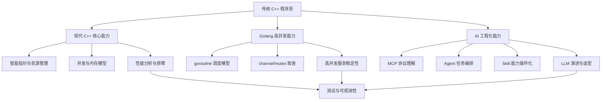
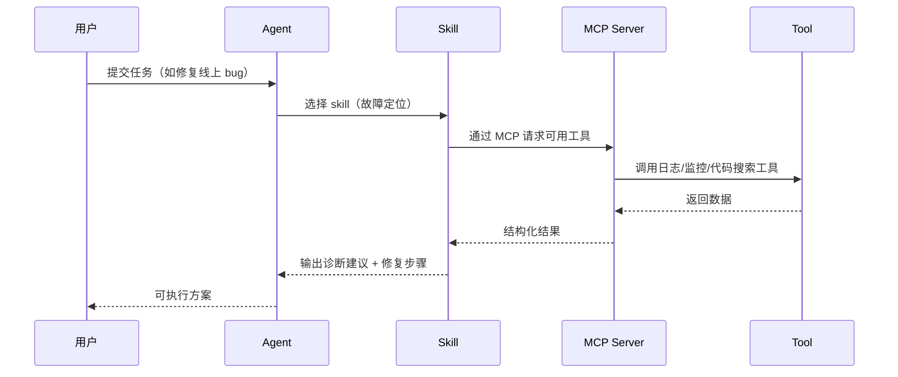
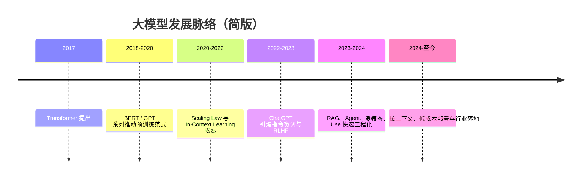
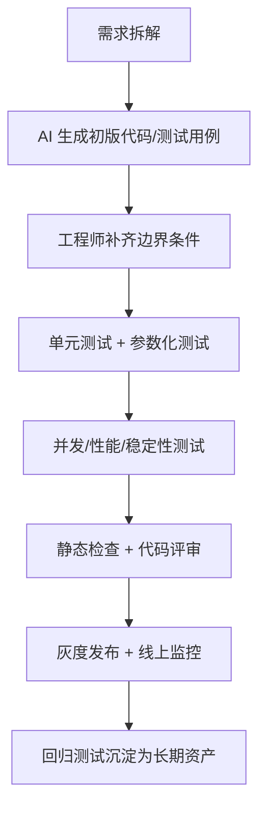

很多传统 C++ 程序员在面试时会遇到一个新现实：

- 面试官不再只问 STL 和八股；
- 会追问你对 **Golang 高并发** 的理解；
- 会追问你是否理解 **AI 工程化（MCP、Agent、Skill）**；
- 还会问：你怎么把 AI 真正落地到研发流程里。

这篇文章按「**初级 / 中级 / 高级回答范式**」来讲，并且每个部分都给出：

1. 正确写法；
2. 常见错误写法；
3. 错误点解释；
4. 可以直接用于面试回答的话术。

---

## 一、面试全景图：你到底该准备什么？



### 面试回答模板（建议背下来）

> 我会把准备分成三层：
> 第一层是现代 C++ 基础（ptr、并发、性能）；
> 第二层是 Go 的高并发与工程稳定性；
> 第三层是 AI 工程化（MCP/Agent/Skill + LLM 演进）。
> 最后我会强调测试策略，因为 AI 参与研发后，研发重心从“纯手写代码”转向“高质量验证与回归保障”。

---

## 二、现代 C++ 面试点（重点：ptr + 并发）

## 2.1 智能指针：不仅是“会用”，而是“会选型”

### 面试题
`std::unique_ptr`、`std::shared_ptr`、`std::weak_ptr` 的区别和使用场景？

### 初级回答（及格）
- `unique_ptr`：独占所有权，不能拷贝，可移动。
- `shared_ptr`：引用计数，共享所有权。
- `weak_ptr`：弱引用，打破循环引用。

### 中级回答（加分）
- 默认优先 `unique_ptr`，只有确实需要共享生命周期时才用 `shared_ptr`。
- `shared_ptr` 的引用计数有原子开销，不应滥用。
- `weak_ptr` 不增加引用计数，访问前需 `lock()` 判空。

### 高级回答（亮点）
- 把“所有权”作为设计维度：
  - 资源所有者：`unique_ptr`；
  - 观察者：裸指针/引用或 `weak_ptr`；
  - 跨线程共享对象才考虑 `shared_ptr`，并评估计数竞争热点。
- 对性能敏感路径，考虑对象池与生命周期分层，减少频繁引用计数变动。

### 正确写法

```cpp
#include <iostream>
#include <memory>

struct Node {
    int value;
    std::weak_ptr<Node> parent;
    explicit Node(int v) : value(v) {}
};

int main() {
    auto root = std::make_shared<Node>(1);
    auto child = std::make_shared<Node>(2);

    child->parent = root; // 使用 weak_ptr 避免循环引用

    if (auto p = child->parent.lock()) {
        std::cout << "parent=" << p->value << "\n";
    }
}
```

### 错误写法

```cpp
#include <memory>

struct Node {
    std::shared_ptr<Node> parent; // 错误：双向都 shared_ptr 极易循环引用
    std::shared_ptr<Node> child;
};
```

**错误点**：双向共享所有权会导致对象无法释放，形成内存泄漏。

---

## 2.2 并发：线程安全不等于性能正确

### 面试题
C++ 并发里你最关注什么？

### 初级回答（及格）
- 用 `std::mutex` 保护共享数据，避免数据竞争。

### 中级回答（加分）
- 减少锁粒度，避免长临界区。
- 用 RAII（`std::lock_guard` / `std::scoped_lock`）管理加解锁。
- 对读多写少场景考虑 `std::shared_mutex`。

### 高级回答（亮点）
- 按场景选模型：无共享（消息传递） > 细粒度锁 > lock-free。
- 结合 perf/火焰图定位锁竞争，关注 P99 延迟而非只看平均值。
- 对并发代码先设计“可测性”：确定性测试、压力测试、竞态检测（TSAN）。

### 正确写法

```cpp
#include <mutex>
#include <thread>
#include <vector>
#include <iostream>

class Counter {
public:
    void Inc() {
        std::lock_guard<std::mutex> lock(mu_);
        ++value_;
    }

    int Get() const {
        std::lock_guard<std::mutex> lock(mu_);
        return value_;
    }

private:
    mutable std::mutex mu_;
    int value_{0};
};

int main() {
    Counter c;
    std::vector<std::thread> ts;
    for (int i = 0; i < 4; ++i) {
        ts.emplace_back([&]() {
            for (int j = 0; j < 10000; ++j) c.Inc();
        });
    }
    for (auto& t : ts) t.join();
    std::cout << c.Get() << "\n";
}
```

### 错误写法

```cpp
int value = 0;

void worker() {
    for (int i = 0; i < 10000; ++i) {
        value++; // 错误：数据竞争，结果不确定
    }
}
```

**错误点**：`value++` 不是原子操作，多线程下会发生竞争。

---

## 三、Golang 面试点（重点：高并发优势 + 性能/bug 追踪）

## 3.1 Go 为什么适合高并发后端？

### 面试题
你如何向 C++ 背景的团队解释 Go 的高并发价值？

### 初级回答（及格）
- goroutine 轻量，写并发简单。
- channel 便于协程通信。

### 中级回答（加分）
- Go runtime 的调度器（GMP）降低线程管理复杂度。
- 网络 I/O + 大量任务编排场景中，Go 的开发效率和性能平衡较好。
- 适合做 API 网关、任务编排、推理任务调度服务。

### 高级回答（亮点）
- Go 的核心优势是“**高并发可维护性**”：
  - 代码可读性高，团队协作成本低；
  - 故障定位链路清晰（pprof、trace、metrics）；
  - 在中高并发 I/O 服务里通常能达成性价比最优。

### 正确写法：有超时、可取消、可收敛

```go
package main

import (
    "context"
    "fmt"
    "sync"
    "time"
)

func worker(ctx context.Context, id int, jobs <-chan int, wg *sync.WaitGroup) {
    defer wg.Done()
    for {
        select {
        case <-ctx.Done():
            return
        case j, ok := <-jobs:
            if !ok {
                return
            }
            _ = j
            time.Sleep(10 * time.Millisecond)
            fmt.Printf("worker %d done\n", id)
        }
    }
}

func main() {
    ctx, cancel := context.WithTimeout(context.Background(), 300*time.Millisecond)
    defer cancel()

    jobs := make(chan int, 100)
    for i := 0; i < 50; i++ {
        jobs <- i
    }
    close(jobs)

    var wg sync.WaitGroup
    for i := 0; i < 4; i++ {
        wg.Add(1)
        go worker(ctx, i, jobs, &wg)
    }
    wg.Wait()
}
```

### 错误写法：goroutine 泄漏

```go
for i := 0; i < 1000000; i++ {
    go func() {
        // 错误：没有退出机制，没有并发上限
        doTask()
    }()
}
```

**错误点**：无限制创建 goroutine，可能导致内存暴涨、调度压力过大、系统雪崩。

---

## 3.2 Go 性能与 bug 追踪：面试要讲“方法论”


### 可复用回答

> 我排查 Go 性能问题会分四步：先看业务指标，再看 runtime profile，再做最小变更修复，最后用压测和回归测试证明收益。面试里我会重点讲证据链，而不是只报术语。

---

## 四、AI 技术面试点：MCP、Agent、Skill 是什么关系？

## 4.1 一句话理解

- **MCP（Model Context Protocol）**：让模型与工具/数据源标准化通信的协议层。
- **Agent**：有目标、有规划、会调用工具执行任务的智能体。
- **Skill**：可复用的能力模块（流程、提示词、脚本、工具组合）。

可以类比传统后端：

- MCP 像“统一 RPC 协议”；
- Agent 像“任务编排服务”；
- Skill 像“可插拔业务插件”。

## 4.2 典型调用链



## 4.3 面试追问：为什么需要 Skill，而不是只靠 Prompt？

### 初级回答（及格）
- Skill 复用更强，不用每次重写 prompt。

### 中级回答（加分）
- Skill 能固化最佳实践（输入约束、步骤、输出格式）。
- 能做权限控制、审计、版本管理。

### 高级回答（亮点）
- Skill 让 AI 系统从“对话能力”升级到“工程能力”：
  - 可测试（有固定 I/O 结构）；
  - 可回归（版本可比对）；
  - 可观测（知道哪一步失败）。

---

## 五、大模型发展历程（面试高频叙事）

## 5.1 你可以这样讲（2 分钟版）



### 面试亮点回答

> 我理解大模型演进有三条线：
> 一是模型能力线（从补全到对话再到多模态）；
> 二是工程能力线（从单模型调用到 Agent + Tool + Workflow）；
> 三是成本能力线（从“能用”到“可规模化交付”）。

---

## 六、传统 C++ 程序员如何更好应用 AI：核心是“加强测试”

你这个观点非常对，而且是区分“会用 AI”与“能把 AI 用好”的关键。

## 6.1 AI 时代研发重心转移

- 过去：主要时间在“从 0 到 1 写代码”；
- 现在：越来越多时间在“验证 AI 产物是否正确、稳定、可维护”。

所以工程师价值不会下降，而是向这三点集中：

1. 测试设计能力；
2. 故障分析与回归能力；
3. 系统级权衡能力（性能、成本、可靠性）。

## 6.2 推荐落地流程（可直接用于团队）



## 6.3 C++ 示例：先写测试再接入 AI 代码

### 正确思路（示意）

```cpp
// 先定义你真正关心的行为：边界、异常、并发一致性。
// 再让 AI 生成实现代码，最后用测试证明其正确性。

// 例如：线程安全队列必须满足
// 1) 并发 push/pop 不崩溃
// 2) 数据不丢失
// 3) 关闭后消费者可退出
```

### 错误思路

```text
直接让 AI 生成 500 行“看起来很完整”的并发代码，
没有测试就上线，线上出错再靠日志猜测。
```

**错误点**：并发 bug、生命周期 bug 往往低概率复现，缺乏测试会导致问题定位成本指数级上升。

---

## 七、面试实战：分层回答模板（可直接复述）

## 7.1 现代 C++（ptr + 并发）

- **初级**：我会用智能指针管理资源，避免裸 `new/delete`。
- **中级**：默认 `unique_ptr`，仅在共享生命周期场景用 `shared_ptr`，通过 `weak_ptr` 避免环。
- **高级**：我把所有权、线程模型、测试策略一起设计，并用性能数据验证方案。

## 7.2 Golang（高并发 + 性能追踪）

- **初级**：goroutine + channel 实现并发。
- **中级**：加上 context 超时、并发上限、错误处理与指标监控。
- **高级**：形成完整故障闭环（监控 -> profile -> 修复 -> 回归），并能讲业务 SLA 改善。

## 7.3 AI（MCP + Agent + Skill + LLM）

- **初级**：知道概念。
- **中级**：知道它们如何协同工作。
- **高级**：能把它们做成可测试、可审计、可回归的工程系统。

---

## 八、最后给 C++ 程序员的建议

1. **别焦虑语言之争**：C++ 仍是高性能核心；Go 是高并发工程利器；AI 是效率杠杆。
2. **把测试当第一生产力**：尤其是并发、边界、异常、回归。
3. **面试时讲证据链**：你如何定位问题、如何验证修复，而不只是“我会某技术”。
4. **把 AI 当队友，不当替代者**：你负责约束、验证、决策，AI 负责提速。

如果你愿意，我下一篇可以继续写：

- 「C++/Go/AI 混合技术栈的 30 道高频追问 + 参考回答」；
- 或者「针对简历项目，如何把普通项目包装成高级面试表达」。
