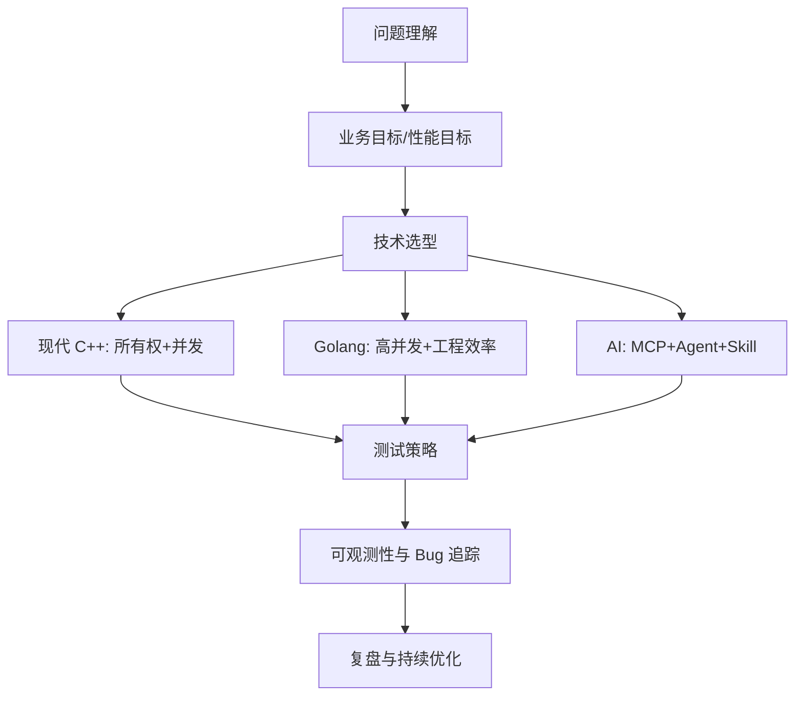
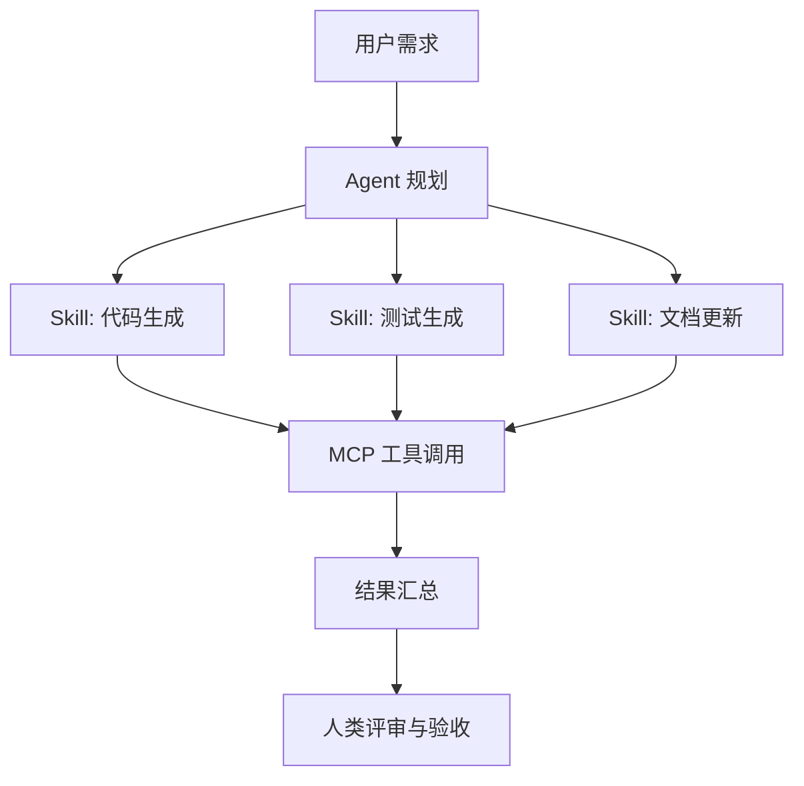
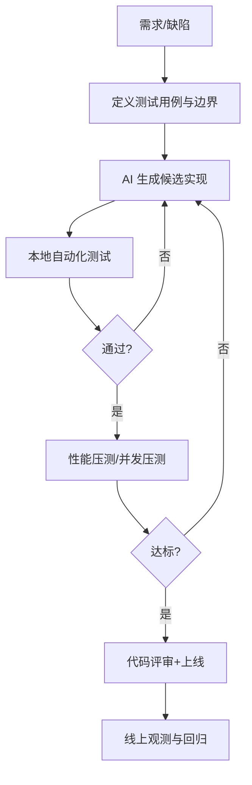

很多传统 C++ 程序员在面试时会遇到一个尴尬点：

- 你在底层、性能、稳定性上很强；
- 但面试官会继续追问现代 C++、Golang、AI 工程化；
- 回答如果只停留在概念层，会被判定为“知识面广，但落地不足”。

这篇文章给你一个“可直接复用”的面试答题框架：

1. 现代 C++：重点放在 **智能指针 + 并发模型**；
2. Golang：重点放在 **高并发优势 + 性能与 Bug 追踪**；
3. AI 技术：重点放在 **MCP / Agent / Skill 的工程化认知**；
4. 大模型历程：重点放在 **为什么今天需要 Agent 化开发**；
5. 传统 C++ 如何更好用 AI：核心观点是 **“AI 负责提速，人类负责测试与验收闭环”**。

---

## 一、面试总答题框架（先给全局，再下钻）

如果你只剩 2 分钟，可先用这个总结构回答：



一句话版本：

> 我会把语言与框架选择放到统一工程闭环中：设计、实现、测试、观测、复盘。AI 可以提速开发，但质量最终由测试与可观测性兜底。

---

## 二、现代 C++ 面试点：从“会写”到“写对”

## 2.1 初级回答：先把所有权讲清楚

面试可答：

- 默认 `std::unique_ptr` 表达独占所有权；
- 只有在“确实多方共享生命周期”时才用 `std::shared_ptr`；
- `std::weak_ptr` 用来打破循环引用；
- 原始指针主要表达“借用关系（non-owning）”。

### 错误写法：滥用 `shared_ptr`

```cpp
#include <memory>

struct Node {
    std::shared_ptr<Node> next;
    std::shared_ptr<Node> prev;
};

void bad_cycle() {
    auto a = std::make_shared<Node>();
    auto b = std::make_shared<Node>();
    a->next = b;
    b->prev = a; // 循环引用，引用计数无法归零
}
```

错误点：

1. 双向关系都用 `shared_ptr`，生命周期图形成环；
2. 作用域结束后对象不会释放，造成隐蔽泄漏。

### 正确写法：一边拥有，一边弱引用

```cpp
#include <memory>

struct Node {
    std::shared_ptr<Node> next;
    std::weak_ptr<Node> prev; // 反向弱引用
};
```

---

## 2.2 进阶回答：并发不只是“加锁”，而是“减少共享”

面试可答：

- 优先 **消息传递 / 任务队列**，减少共享可变状态；
- 必须共享时，用 `std::mutex` + RAII（`std::lock_guard` / `std::scoped_lock`）；
- 读多写少场景可考虑 `std::shared_mutex`；
- 对性能敏感路径再考虑无锁结构与原子操作。

### 错误写法：手动 `lock/unlock`，异常路径泄锁

```cpp
#include <mutex>
#include <vector>

std::mutex g_mtx;
std::vector<int> g_data;

void bad_push(int x) {
    g_mtx.lock();
    if (x < 0) return; // 提前返回，忘记 unlock
    g_data.push_back(x);
    g_mtx.unlock();
}
```

错误点：

1. 提前返回导致死锁风险；
2. 异常抛出也会导致锁未释放。

### 正确写法：RAII 自动释放锁

```cpp
#include <mutex>
#include <vector>

std::mutex g_mtx;
std::vector<int> g_data;

void good_push(int x) {
    std::lock_guard<std::mutex> lk(g_mtx);
    if (x < 0) return;
    g_data.push_back(x);
}
```

---

## 2.3 高阶回答：现代 C++ 的面试加分点

你可以补充以下关键词：

- 移动语义与完美转发（减少拷贝开销）；
- `std::jthread` + `stop_token`（可取消线程）；
- `std::span` / `string_view`（零拷贝视图，但注意生命周期）；
- `constexpr` 与编译期计算（性能与安全边界）。

---

## 三、Golang 面试点：高并发优势 + 性能/故障定位

## 3.1 初级回答：并发模型优势

面试可答：

- Goroutine 成本低，调度由运行时管理；
- Channel 让协程通信更直接，天然支持 CSP 风格；
- 工程交付速度快，适合中台、网关、微服务与工具链。

### 错误写法：Goroutine 泄漏

```go
package main

import "time"

func badWorker(ch <-chan int) {
	for {
		x := <-ch // 如果没人再写入，永久阻塞
		_ = x
	}
}

func main() {
	ch := make(chan int)
	go badWorker(ch)
	time.Sleep(10 * time.Millisecond)
}
```

错误点：

1. Worker 没有退出条件；
2. 主流程结束条件与协程生命周期未绑定；
3. 在线上会形成 goroutine 泄漏与资源浪费。

### 正确写法：`context` + `select` 可控退出

```go
package main

import (
	"context"
	"fmt"
	"time"
)

func worker(ctx context.Context, ch <-chan int) {
	for {
		select {
		case <-ctx.Done():
			return
		case x, ok := <-ch:
			if !ok {
				return
			}
			fmt.Println("recv", x)
		}
	}
}

func main() {
	ctx, cancel := context.WithCancel(context.Background())
	defer cancel()

	ch := make(chan int)
	go worker(ctx, ch)

	ch <- 42
	close(ch)
	time.Sleep(10 * time.Millisecond)
}
```

---

## 3.2 进阶回答：性能优化与 Bug 追踪

面试可答：

- 性能：`pprof` 看 CPU / memory / goroutine / block；
- 竞态：`go test -race` 先跑起来；
- 延迟：分位数（P95/P99）比平均值更关键；
- 追踪：日志 + 指标 + trace 三件套（可观测性闭环）。

一个可复述的流程：


---

## 四、AI 面试点：MCP、Agent、Skill 到底是什么

## 4.1 初级回答（定义层）

- **MCP（Model Context Protocol）**：给模型提供“可控上下文与工具访问”的协议层；
- **Agent**：以“目标驱动”方式调用模型、工具、记忆与执行器来完成任务；
- **Skill**：可复用的任务能力单元（流程、提示词、工具组合、模板）。

你可以用这个类比：

- MCP 像“标准化 USB 接口”；
- Agent 像“会规划并执行任务的操作系统进程”；
- Skill 像“可安装的插件能力包”。

## 4.2 进阶回答（工程层）

一个常见链路：



面试加分回答：

1. Agent 不是“自动化脚本替代品”，而是“带反馈的任务执行系统”；
2. Skill 的价值是稳定复用，不是一次性 Prompt；
3. MCP 的价值是让工具接入规范化、可审计、可管控。

---

## 五、大模型发展历程：你可以怎么讲（面试友好版）

建议按“能力跃迁”来讲，而不是背年份：

1. **统计语言模型时代**：关注 n-gram 与局部概率；
2. **深度学习语言模型时代**：RNN/LSTM 能处理更长上下文，但训练与并行受限；
3. **Transformer 时代**：自注意力带来大规模并行训练能力；
4. **预训练 + 指令微调时代**：模型从“会续写”到“会执行任务”；
5. **工具增强 Agent 时代**：模型与外部系统协作，进入工程生产环节。

面试可落地一句话：

> 大模型本身是概率生成器，真正的生产力来自“模型 + 工具 + 测试 + 观测”的系统化工程。

---

## 六、传统 C++ 程序员如何更好应用 AI（核心观点）

你的观点非常好：**AI 开发要更强调测试**。这在面试中是加分项。

## 6.1 实战原则

1. **先写验收标准，再让 AI 生成代码**（避免“看起来对”）；
2. **必须补测试**：单元测试、并发场景测试、回归测试；
3. **引入可观测性**：日志、指标、追踪要与代码一起交付；
4. **复杂问题分层**：AI 先给草案，人类做架构与边界把控；
5. **把 Bug 复盘沉淀成 Skill**：让组织能力可复用。

## 6.2 一个推荐工作流



---

## 七、面试“由浅入深”答题模板（可直接背）

## 7.1 当被问“你怎么理解现代 C++？”

- 浅层：我会先用智能指针把所有权表达清楚，减少内存与生命周期错误；
- 中层：并发场景尽量减少共享状态，用 RAII 管锁并建立线程退出语义；
- 深层：在性能敏感路径结合移动语义、原子操作与 profiling 做定量优化。

## 7.2 当被问“为什么学 Golang？”

- 浅层：Golang 在高并发网络服务中交付效率高；
- 中层：通过 `context`、`pprof`、`race detector` 做可控并发与性能定位；
- 深层：与 C++ 形成互补——Go 做服务编排，C++ 做性能核心模块。

## 7.3 当被问“AI 会不会替代程序员？”

- 浅层：AI 会替代一部分重复编码；
- 中层：不会替代对架构、边界、测试与验收负责的人；
- 深层：未来竞争力在于“把 AI 纳入工程闭环”的能力，而不是只会写 Prompt。

---

## 八、总结：面试官真正想听什么

如果用一句话收尾：

> 我不是把 C++、Go、AI 当成孤立技术点，而是把它们放进统一工程方法里：用现代 C++ 保证底层质量，用 Go 提升并发交付效率，用 AI 提升研发速度，再用测试与观测确保最终可信。

这句话能同时体现：

- 你有底层功底；
- 你有工程思维；
- 你对 AI 的态度是“务实落地，而非盲目神化”。

这通常就是面试官最希望看到的成熟度。
