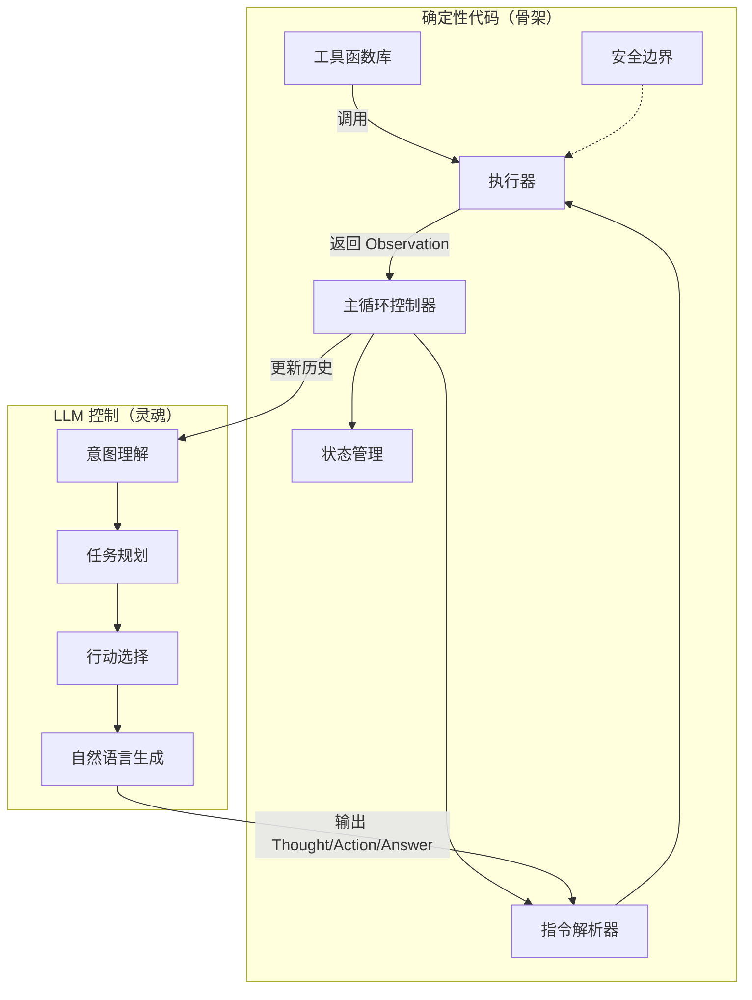
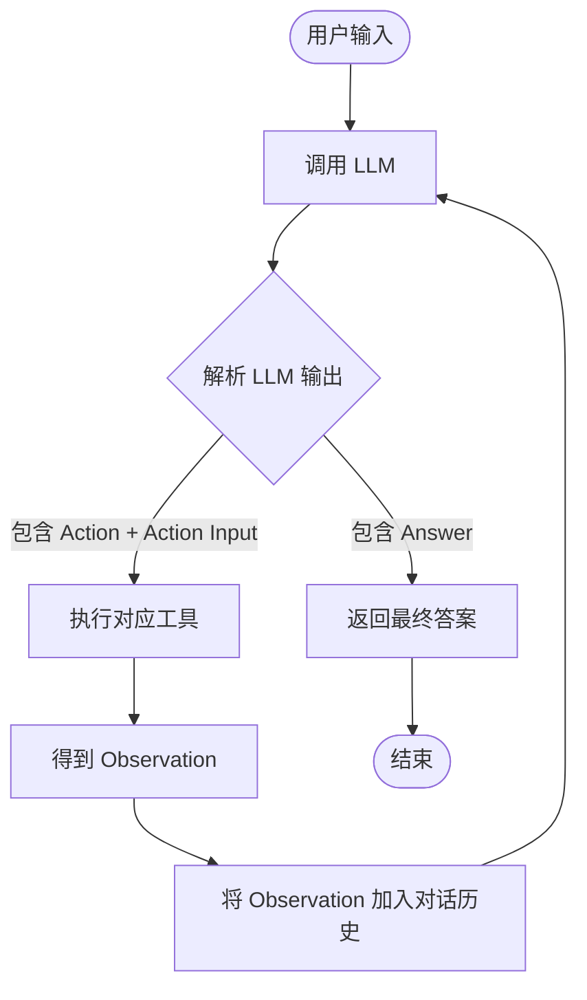
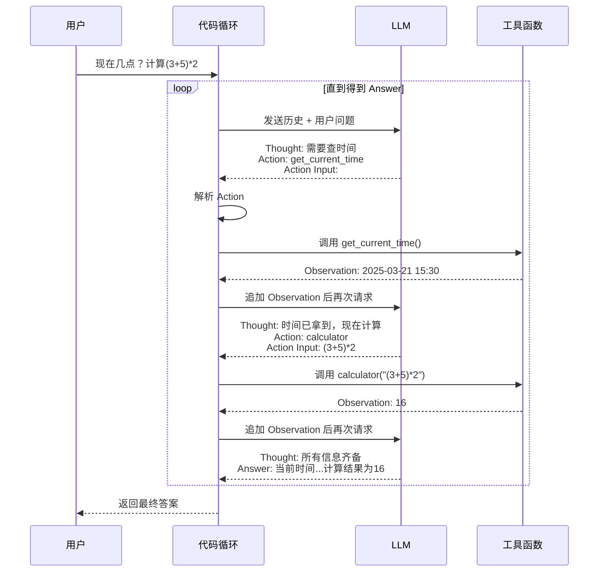
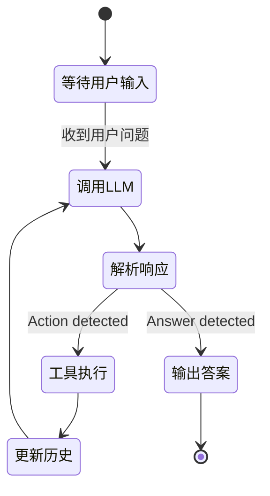

# AI Agent 设计哲学：确定性代码与 LLM 自由控制的协奏

> 构建一个智能体（Agent），就像组建一支交响乐队——代码是指挥的**骨架**与乐谱，LLM 则是即兴演奏的**灵魂**。两者必须默契配合，才能奏出既稳定又富有创造力的乐章。

## 1. 为什么会有"写死的代码"和"LLM 控制"的困惑？

当我们开始编写 AI Agent 时，常常陷入两难：

- 如果**全部用代码写死**，那么面对用户千变万化的表达和复杂组合任务，代码将变得臃肿不堪，难以维护，且永远无法穷尽所有可能性。
- 如果**全部交给 LLM**，LLM 虽然聪明，但它无法直接执行实际操作（如查时间、发邮件），而且输出格式不稳定，容易失控。

因此，一个健壮的 AI Agent 必须巧妙结合 **确定性代码** 和 **LLM 的自由生成**。本文将带你深入理解这种设计哲学，并用 Mermaid 图可视化整个协作流程。

## 2. 角色划分：谁负责什么？

我们把 Agent 拆解为两个层次：

| 层次     | 角色         | 职责                                                         | 示例                                            |
| -------- | ------------ | ------------------------------------------------------------ | ----------------------------------------------- |
| **大脑** | LLM（自由）  | 理解用户意图、任务拆解、决定调用什么工具、生成自然语言回复   | Thought: 需要先查时间；Action: get_current_time |
| **身体** | 代码（确定） | 提供工具函数、解析 LLM 指令、执行工具、维护状态、控制循环、保障安全 | `execute_tool("get_current_time")` 返回 "15:30" |

**Mermaid 组件图：Agent 内部角色划分**



## 3. ReAct 模式：两者沟通的桥梁

LLM 和代码如何对话？最经典的模式是 **ReAct（Reason + Act）**。LLM 输出固定的格式，代码按格式解析：

- **Thought**：LLM 的内部推理（供调试/可读性，代码通常忽略但保留）
- **Action**：要调用的工具名称
- **Action Input**：调用工具所需的参数
- **Answer**：最终答案（当 LLM 认为任务完成时输出）

代码则负责：
1. 解析 `Action` 和 `Action Input`
2. 执行对应工具，得到 `Observation`
3. 将 `Observation` 附加到对话历史
4. 将新历史再次交给 LLM，循环直至出现 `Answer`

**Mermaid 流程图：ReAct 主循环**



## 4. 一个完整的 Python 示例解剖

让我们通过一个简化但可运行的 Python 代码，看 ReAct 如何落地。代码包含三个核心部分：

1. **工具函数**（确定性）
2. **解析器与执行器**（确定性）
3. **LLM 模拟**（实际为 API 调用，此处展示自由度）

**Mermaid 序列图：一次带工具的对话流程**



## 5. 设计哲学：为什么必须这样划分？

### 5.1 可靠性保障
- **代码确保工具正确执行**：数据库查询、文件读写、API 调用等必须精确无误，不能依赖 LLM 的"幻觉"。
- **安全边界**：代码可以限制 LLM 能调用的工具，过滤危险参数，防止注入攻击。

### 5.2 灵活性与通用性
- LLM 负责**规划**：用户问题千变万化，只有 LLM 能理解深层意图并拆解步骤。
- **组合能力**：面对复合任务（如"先查天气再定闹钟"），LLM 可以动态决定调用顺序，代码无需事先编写所有组合逻辑。

### 5.3 可维护性
- 工具函数独立于 LLM，可以单独测试、优化、增加新功能而不影响决策逻辑。
- 主循环和解析逻辑通用，新增工具只需注册到工具库。

## 6. 进阶：状态管理与记忆

实际 Agent 往往需要记忆上下文。代码负责维护一个**消息列表**，类似 OpenAI 的 Chat 格式：

```json
[
  {"role": "system", "content": "你是一个助手，可用工具: ..."},
  {"role": "user", "content": "现在几点？"},
  {"role": "assistant", "content": "Thought: ...\nAction: get_current_time\nAction Input: "},
  {"role": "user", "content": "Observation: 15:30"}
]
```

每次循环，代码将历史完整发送给 LLM，使其能基于前序 Observation 继续推理。

**Mermaid 状态图：Agent 内部状态流转**



## 7. 总结：代码即骨架，LLM 即灵魂

AI Agent 并非将全部智能托付给 LLM，也不是用代码穷举所有逻辑。**确定性代码构建了可靠的"身体"**——工具、解析、循环、安全，**LLM 则提供了灵动的"大脑"**——规划、决策、语言生成。两者通过 ReAct 格式紧密耦合，既保证了系统的鲁棒性，又赋予了无限的扩展可能。

当你下次设计 Agent 时，不妨先画出这张分工图：哪些部分必须写死？哪些部分留给 LLM 自由发挥？界限清晰，你的 Agent 才能既聪明又可靠。

## 8. 交互式演示

下方是一个 **ReAct 工作流**的交互式动画演示，直观展示 LLM 与代码的协作过程：

[点击查看交互式演示](/techlearn/assets/html/ai-agent-react-demo.html)

---

> **进一步探索**：你可以用 HTML+CSS 动画模拟这一流程（如对话气泡逐步出现），让用户直观感受每一轮中 LLM 与代码的交替。这能帮助团队理解 ReAct 的运转，也是很好的教学工具。

## 8. 交互式演示

下方是一个 **ReAct 工作流**的交互式动画演示，直观展示 LLM 与代码的协作过程：

<iframe 
    src="/techlearn/assets/html/ai-agent-react-demo.html" 
    width="100%" 
    height="600" 
    style="border:none; border-radius:12px; box-shadow:0 4px 20px rgba(0,0,0,0.1);"
    loading="lazy">
</iframe>

---

> **进一步探索**：你可以用 HTML+CSS 动画模拟这一流程（如对话气泡逐步出现），让用户直观感受每一轮中 LLM 与代码的交替。这能帮助团队理解 ReAct 的运转，也是很好的教学工具。
