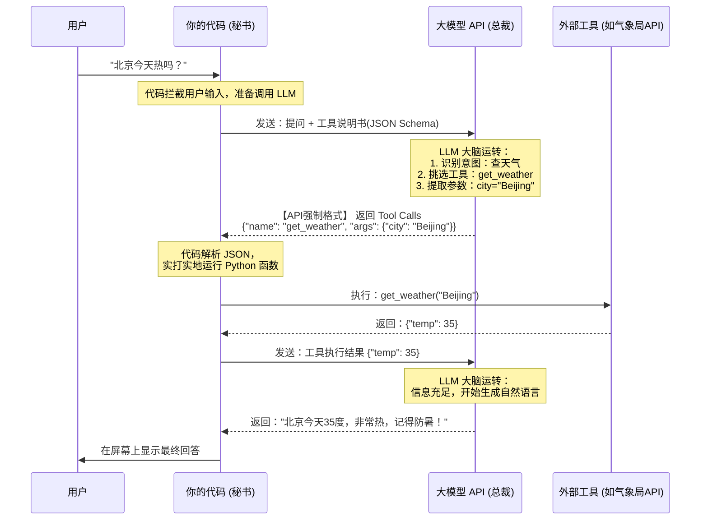
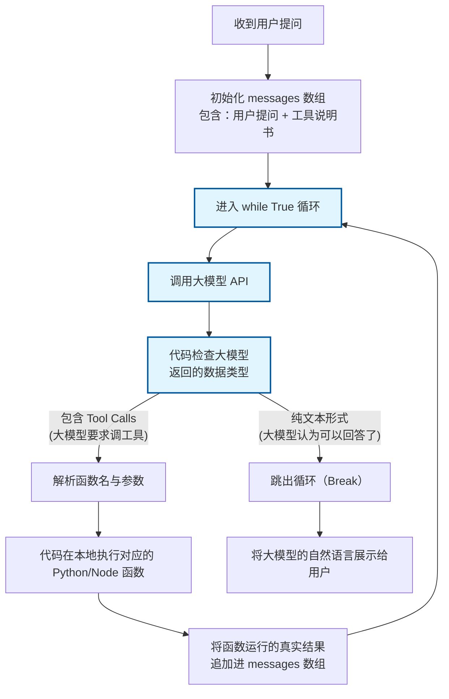
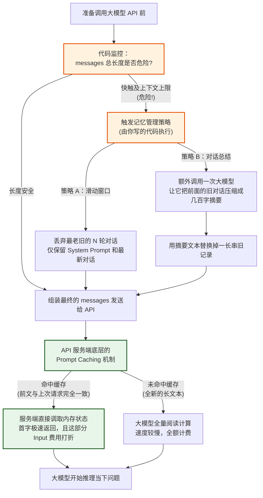

# 写给开发者的 AI Agent 底层逻辑：当“写死的代码”遇上“非确定性的大模型”

> 由浅入深解析 AI Agent 底层逻辑，通俗易懂的语言和详尽的 Mermaid 流程图

很多习惯了传统编程（100% 规定死）的开发者，在刚接触 AI Agent 开发时都会产生一种强烈的“割裂感”：
**既然代码能控制逻辑，为什么还要用 Prompt？既然 LLM 那么聪明，为什么不能让它全权接管？我到底该用代码写死，还是用语言让大模型去猜？**

如果你也有这样的困惑，恭喜你，你察觉到了当前 AI Agent 开发最核心的本质：**它是“确定性代码”与“非确定性自然语言”的混合体。**

在这篇文章中，我们将由浅入深，一步步拆解 AI Agent 的底层运转逻辑。

---

## 第一层认知：厘清边界 —— “手脚”与“大脑”

要消除割裂感，首先要把 Agent 想象成一个“虚拟员工”：
*   **你写的死代码 = 骨骼、神经系统和手脚（秘书）：** 负责执行具体的动作，且绝对不能出错（确定性）。
*   **大语言模型 (LLM) = 大脑（总裁）：** 负责理解、思考、规划和做决定（灵活性）。

**绝对不能让大模型直接操纵数据库，也不能指望无数个 if-else 能涵盖用户的千奇百怪的意图。** 
正确的做法是：**信任大模型的“智商”，防范大模型的“手残”。** 把意图理解和任务编排交给 LLM（Prompt），把工具调用和流程控制交给你的代码。

---

## 第二层架构：核心桥梁 —— Function Calling（函数调用）

“代码”和“大模型”是如何沟通的？关键在于各大模型厂商（如 OpenAI、Anthropic）在底层提供的 **Function Calling** 机制。

你不需要在提示词里苦口婆心地求大模型输出 JSON。你只需要在代码里定义好工具的“说明书”（JSON Schema），大模型在决定使用工具时，会自动通过官方 API 的标准结构，吐出一个特定格式的调用请求。

我们来看一个经典的**“查天气”**流程：

在这个过程中：
*   **格式的“壳”**（如必须包含 `name` 和 `args`）是**代码规定死**的。
*   **格式的“核”**（如决定调哪个工具，把北京翻译成 `Beijing`）是**大模型算出来**的。

---

## 第三层架构：Agent 的灵魂引擎 —— ReAct 核心死循环

传统代码是直线型或树状的，而 Agent 的核心其实是一个**巨大的 `while True` 死循环**。

因为大模型（总裁）可能需要思考好几个回合，调用好几个不同的工具，才能给用户最终的答案。代码（秘书）的职责就是不断地跑腿、汇报，直到大模型说“可以结束了”。

下面是 Agent 最经典的 **ReAct (Reason + Act) 循环架构图**：

**理解这个循环，你就彻底懂了 Agent 的控制流：**
大模型充当“路由器”，决定走向“执行工具分支”还是“结束对话分支”；而你的代码就是那个不知疲倦的“永动机”。

---

## 第四层进阶：突破瓶颈 —— 记忆管理与 Prompt Caching

当这个循环跑了很多轮，或者用户一直聊下去时，`messages` 数组会变得极其庞大。这里有两个必须要区分的概念：**Context Window（上下文上限）** 和 **Prompt Caching（提示词缓存）**。

1. **Context Window 爆炸（硬限制）：** 每个模型都有最大 Token 限制（如 128K 或 200K）。超过这个字数，API 会直接报错崩溃。
2. **长文本带来的高成本与高延迟：** 即便没有超限，每次让大模型重读前面的几万字对话，不仅速度极慢，而且 API 费用惊人。

因此，真正的成熟 Agent 必须在调用 API 前，加入**代码级的记忆管理（Memory Management）**。同时，利用底层 API 提供的 **Prompt Cache** 技术来降本增效。

完整的处理流程如下：

### 总结：如何写好一个 AI Agent？

看完这些流程图，你会发现，开发一个稳定、强大的 Agent，功夫其实大都花在“大模型之外”的代码上：
1. **定义精准的 Tool Schema：** 确保大模型能完美填空（解决沟通格式问题）。
2. **构建坚固的 ReAct 循环：** 确保无论大模型需要几个步骤，代码都能稳定承接并回传结果（解决流程控制问题）。
3. **编写严密的记忆守门员：** 在传给大模型前，果断进行滑动窗口截断或摘要压缩，并贴上 Cache 标签（解决成本和长度溢出问题）。

当“确定性”的框架足够健壮时，“非确定性”的大模型才能在里面尽情发挥它的聪明才智！